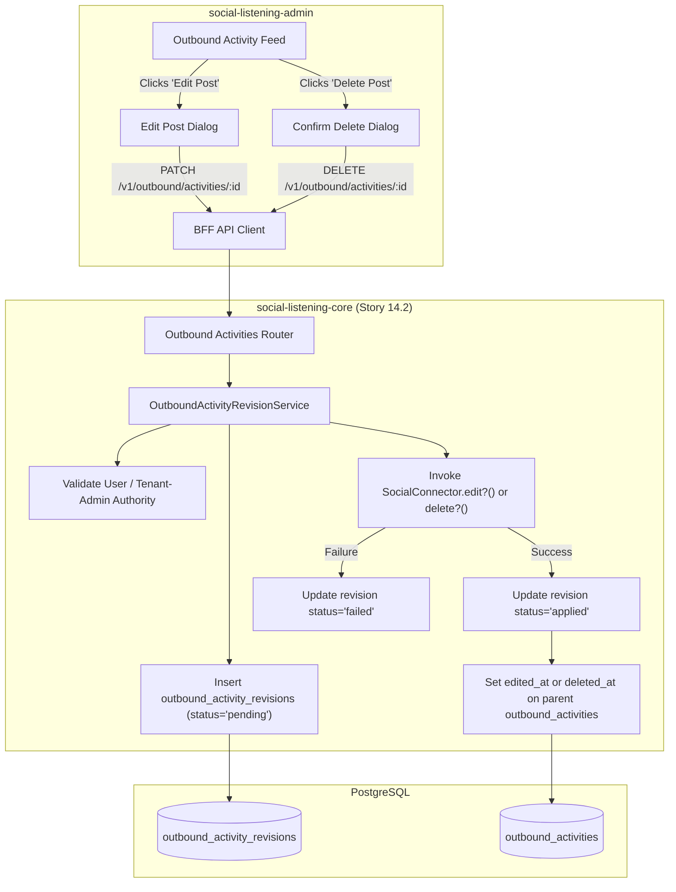
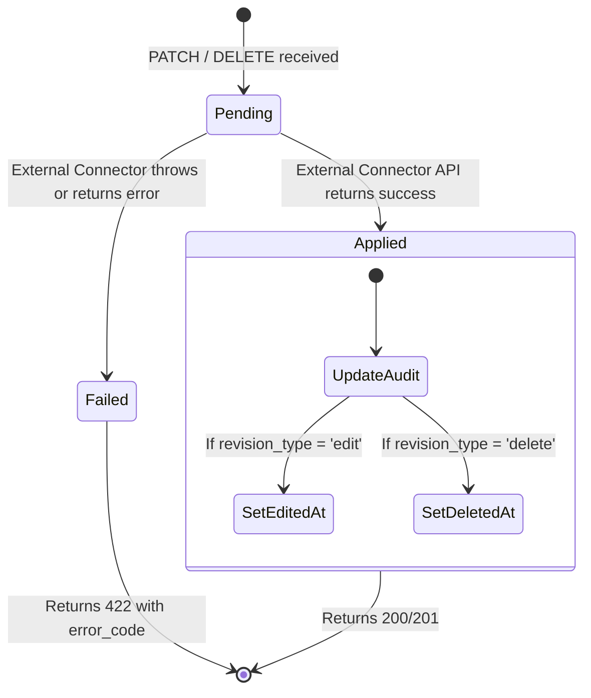

# TDS-0119: Editing and Deleting Published Outbound Posts

**Status:** Approved  
**Date:** 2026-09-05  
**Governing ADR:** [ADR-0119](../../adr/0119-editing-and-deleting-published-outbound-posts.md)  
**Related Epics/Stories:** [Epic 14 / Story 14.2](../../user-stories/epic-14-adr-0118-to-0122.md), [Epic 3 / Story 3.15](../../user-stories/epic-3-data-model-storage-and-archival.md), [Epic 6 / Story 6.39](../../user-stories/epic-6-tenant-admin-ui.md)  
**Target Repositories:** `social-listening-core`  
**Contract Test Citations:**  
- `social-listening-core/contracts/epic-14/story-14.2.editing-and-deleting-published-outbound-posts.contract.test.ts`  

---

## 1. Architectural Context & Problem Statement

Initial outbound publishing (ADR-0075) scoped operations to immediate post creation and strictly excluded post-publishing mutations. However, in enterprise brand communications, errors occur: typos need correction, broken URLs must be updated, or posts published in error during an emerging crisis must be deleted immediately.

Allowing post mutations directly in place introduces severe architectural risks:
1. **Audit Ledger Corruption:** Overwriting the original text in `outbound_activities` destroys regulatory compliance records of what was actually visible to the public at dispatch time.
2. **Platform Mutation Asymmetry:** Some networks (Facebook, LinkedIn) permit in-place editing of text; others (Bluesky, X standard) disallow edits or create a completely new post ID upon revision; others permit deletion but forbid edits.
3. **Authorization Boundaries:** Post mutations must be restricted to the authoring agent or tenant administrator, preventing unauthorized tampering.

This specification formalizes:
1. The append-only child ledger `outbound_activity_revisions` tracking every edit and deletion with full audit lineage.
2. The `edit?()` and `delete?()` optional methods on `SocialConnector`.
3. The mutation endpoints `PATCH /v1/outbound/activities/:id` and `DELETE /v1/outbound/activities/:id`.
4. Graceful handling for platforms lacking edit or delete capabilities (`edit_not_supported`, `delete_not_supported`).



---

## 2. Governing ADRs & Decision Log Reference

- [ADR-0119: Editing and Deleting Published Outbound Posts](../../adr/0119-editing-and-deleting-published-outbound-posts.md) — Authorizes revision schema, connector mutation methods, and API routes.
- [ADR-0075: Outbound Social Post Publishing via Platform APIs](../../adr/0075-outbound-social-post-publishing.md) — Foundation `outbound_activities` schema.
- [ADR-0073: Outbound Reply to Ingested Posts via Platform APIs](../../adr/0073-outbound-reply-to-ingested-posts.md) — Outbound activity logging precedent.
- [ADR-0118: Additional Social Platform Publishing](../../adr/0118-additional-social-platform-publishing.md) — Multi-network publishing roadmap.

---

## 3. Scope, Precedence & Anti-Goals

### In Scope
- Append-only revision ledger `outbound_activity_revisions` tracking edits and deletions.
- Audit timestamp columns `edited_at` and `deleted_at` added to `outbound_activities`.
- Optional connector methods `edit?()` and `delete?()`.
- Pre-dispatch mutation: editing or cancelling a post that is still `pending` in the queue without invoking external network APIs.
- Post-dispatch mutation: invoking external platform APIs to edit or delete live posts.
- Revision history endpoint (`GET /v1/outbound/activities/:id/revisions`).

### Precedence Invariant
$$\text{Immutable Historical Publish Record} \land \text{Append-Only Child Revisions}$$
The parent `outbound_activities` row text is never overwritten. The current visible text of an edited post is resolved from the latest `applied` revision record.

### Anti-Goals
- Changing target accounts, platforms, or asset targeting during an edit (an edit modifies body text only; retargeting requires a new post).
- Automatic deletion cascades that wipe audit records.

---

## 4. Data Architecture & Storage Schema

```sql
-- Migration: 0119_create_outbound_activity_revisions.sql

CREATE TABLE IF NOT EXISTS outbound_activity_revisions (
    id UUID PRIMARY KEY DEFAULT gen_random_uuid(),
    tenant_id UUID NOT NULL REFERENCES tenants(id) ON DELETE CASCADE,
    activity_id UUID NOT NULL, -- App-enforced reference to outbound_activities.id
    user_id UUID NOT NULL REFERENCES users(id) ON DELETE CASCADE,
    revision_type TEXT NOT NULL CHECK (revision_type IN ('edit', 'delete')),
    body TEXT,                 -- New text for 'edit'; NULL for 'delete'
    payload JSONB,             -- Link card / media references
    status TEXT NOT NULL DEFAULT 'pending'
        CHECK (status IN ('pending', 'applied', 'failed', 'cancelled')),
    error_code TEXT,
    external_id TEXT,          -- Returned post ID if platform creates new ID on edit
    external_url TEXT,         -- Deep link after successful edit
    created_at TIMESTAMPTZ NOT NULL DEFAULT NOW()
);

-- Indexing Strategy
CREATE INDEX IF NOT EXISTS idx_outbound_revisions_activity 
    ON outbound_activity_revisions(tenant_id, activity_id, created_at DESC);

-- Additive audit columns to outbound_activities
ALTER TABLE outbound_activities 
    ADD COLUMN IF NOT EXISTS edited_at TIMESTAMPTZ,
    ADD COLUMN IF NOT EXISTS deleted_at TIMESTAMPTZ;

-- Row Level Security
ALTER TABLE outbound_activity_revisions ENABLE ROW LEVEL SECURITY;

CREATE POLICY outbound_activity_revisions_tenant_isolation ON outbound_activity_revisions
    AS RESTRICTIVE
    USING (tenant_id = NULLIF(current_setting('app.current_tenant_id', true), '')::uuid)
    WITH CHECK (tenant_id = NULLIF(current_setting('app.current_tenant_id', true), '')::uuid);
```

---

## 5. Component & Interface Contracts

### 5.1 Connector Mutation Methods (`social-listening-core`)

```typescript
export interface OutboundActivitySummary {
  id: string;
  tenantId: string;
  connectorId: string;
  externalId: string;
  externalUrl?: string;
  publishedAt: string;
}

export interface SocialConnector {
  // Existing connector properties...
  edit?(
    activity: OutboundActivitySummary,
    body: string,
    payload?: OutboundPostPayload,
    credential?: Credential
  ): Promise<{ externalId?: string; externalUrl?: string }>;

  delete?(
    activity: OutboundActivitySummary,
    credential?: Credential
  ): Promise<{ externalId?: string; externalUrl?: string }>;
}
```

### 5.2 API Route Specification

#### `PATCH /v1/outbound/activities/:id`
- **Authentication:** JWT Bearer (author of post or `Tenant-Admin`).
- **Body:** `{ "body": "Corrected post text..." }`
- **Response (201 Created):** Returns created `outbound_activity_revisions` record with `status = 'applied'`.

#### `DELETE /v1/outbound/activities/:id`
- **Authentication:** JWT Bearer (author of post or `Tenant-Admin`).
- **Response (200 OK):** Deletes post from social platform and returns updated activity status with `deleted_at` timestamp.

#### `GET /v1/outbound/activities/:id/revisions`
Returns full revision history in descending chronological order.

---

## 6. State Machine & Lifecycle Transitions



---

## 7. Security, Tenant Isolation & Authentication

1. **Strict Ownership Enforcement:** Only the specific `user_id` who originally posted or an authorized `Tenant-Admin` can execute mutations. Other `Tenant-User` accounts receive `403 Forbidden`.
2. **Platform Admin Shield:** Platform administrators have zero access to mutate tenant outbound content.

---

## 8. Performance, Scalability & Resource Boundaries

1. **Asynchronous Execution for Slow Deletes:** Synchronous operations return within 2 seconds; platforms with slow delete processing return `202 Accepted` while background workers poll completion.
2. **Non-Blocking Ingestion:** Mutations touch only outbound activity tables, completely avoiding post ingestion locking.

---

## 9. Error Handling, Retries & Fallback Strategies

| Error Condition | Response Code | Description |
|---|---|---|
| Platform does not support editing | `422 Unprocessable Entity` | Code `edit_not_supported`; UI disables edit action |
| Platform does not support deletion | `422 Unprocessable Entity` | Code `delete_not_supported`; UI alerts user |
| Edit window expired on platform | `400 Bad Request` | Code `edit_window_closed` (e.g. X 1-hour limit) |

---

## 10. Observability, Telemetry & Audit Trail

- **Audit Events:**
  - `outbound_post_edited { activityId, revisionId, userId }`
  - `outbound_post_deleted { activityId, revisionId, userId }`
- **Prometheus Metrics:**
  - `outbound_post_revisions_total{revision_type, status}` — Counter of all edit and delete operations.

---

## 11. Migration & Backward Compatibility Strategy

- **Zero Breaking Changes:** Additive table `outbound_activity_revisions` and nullable timestamp columns on `outbound_activities`.
- **Connector Graceful Degradation:** Optional methods default to unsupported codes without breaking existing connectors.

---

## 12. Executable Contract Test Citations & Verification Matrix

### 12.1 Contract Test Specifications
1. `social-listening-core/contracts/epic-14/story-14.2.editing-and-deleting-published-outbound-posts.contract.test.ts`:
   - `test('creates pending revision and applies edit through connector')`
   - `test('updates edited_at on parent outbound_activities on successful edit')`
   - `test('marks post as deleted and sets deleted_at on successful DELETE')`
   - `test('returns 422 edit_not_supported when connector lacks edit capability')`
   - `test('rejects edit attempt from non-author non-admin with 403 Forbidden')`

### 12.2 Open Questions

- [x] ~~**[Q-0119-1]** Which platforms support edit and delete?~~  
  *Decision:* Facebook Pages and LinkedIn support both edit and delete. Bluesky and Mastodon support delete; edit support varies by protocol version.
- [x] ~~**[Q-0119-3]** Should deletes remove rows from outbound_activities?~~  
  *Decision:* No. Rows remain permanently in `outbound_activities` with `deleted_at` set, preserving compliance and legal audit trails.
