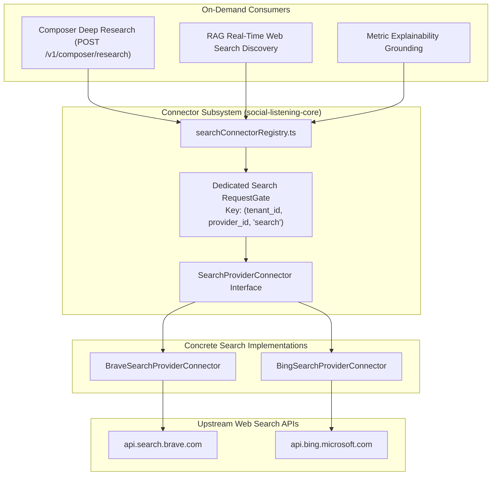

# Technical Design Specification (TDS) — SearchProviderConnector

## 1. Document Control & Traceability Linkage

### 1.1 Metadata
| Attribute | Value |
|---|---|
| **Document Title** | TDS-0120: SearchProviderConnector — Shared One-Off Web & News Search Abstraction |
| **Document ID** | `TDS-0120` |
| **Feature Name** | Unified Search Connector Interface, On-Demand Provider Registry & Dedicated Rate Gating |
| **Version** | `1.0.0` |
| **Status** | Approved |
| **Author(s)** | Core Architecture Team |
| **Created Date** | 2026-09-05 |
| **Last Updated** | 2026-09-05 |
| **Governing Skill** | `social-listening-core/.claude/skills/search-connectors/SKILL.md` |

### 1.2 Upstream & Downstream Traceability Matrix
| Artifact Type | Reference Identifier | Title / Link | Alignment Status |
|---|---|---|---|
| **Architecture Decision Record** | `ADR-0120` | [ADR-0120: SearchProviderConnector](../../adr/0120-search-provider-connector.md) | Invariant Source |
| **Business Requirements Doc** | `BRD-0120` | [BRD-0120: SearchProviderConnector](../Business-Requirements/BRD-0120-Search-Provider-Connector.md) | Fully Aligned |
| **Functional Design Doc** | `FDD-0120` | [FDD-0120: SearchProviderConnector](../Functional-Design/FDD-0120-Search-Provider-Connector.md) | Fully Aligned |
| **Governing User Story** | `Story 14.3` | [Epic 14: ADRs 0118–0122](../../user-stories/epic-14-adr-0118-to-0122.md#story-143--searchproviderconnector-abstraction-backend) | Acceptance Target |
| **Related User Stories** | `Story 2.31`, `Story 3.17`, `Story 14.4` | Brave/Bing Helpers, Composer Deep Research, Research Caching | Consumer & Precedent Flows |
| **Related Architecture Decisions** | `ADR-0002`, `ADR-0003`, `ADR-0065`, `ADR-0066`, `ADR-0076` | Connector Pattern, Rate Limiting, Brave Ingestion, Bing Ingestion, Deep Research | System Architecture |
| **Executable Contract Tests** | `Story 14.3 Contract` | `social-listening-core/contracts/epic-14/story-14.3.search-provider-connector.contract.test.ts` | Ready for Suite Execution |

---

## 2. System Context & Architecture Topology

### 2.1 Context Diagram


### 2.2 Architectural Boundaries & Invariants
- **Segregated Rate Gating Invariant:** One-off search queries execute under a dedicated `RequestGate` bucket keyed as `(tenant_id, provider_id, 'search')`. This strictly isolates on-demand user research from background ingestion polling (`poll`), ensuring that a burst of deep research queries can never starve or trigger rate limits on continuous post ingestion.
- **Dedicated Abstraction Boundary:** `SearchProviderConnector` is distinct from `SocialConnector` (polling/webhook feeds) and `AIProviderConnector` (NLP/cognitive extraction). It standardizes public web query execution across heterogeneous engines (Brave, Bing, Google).
- **Graceful Unsupported Handling:** Connectors in the registry that do not implement on-demand search throw a classified `SearchNotSupportedError` returning HTTP 422 (`SEARCH_NOT_SUPPORTED`).
- **Strict Query Ceiling:** Requests enforce a hard limit of `limit <= 10` results (default: 5) to bound memory, upstream latency, and token consumption by downstream LLMs.

---

## 3. Data Architecture & Persistence Design

### 3.1 TypeScript Interface Contracts
`social-listening-core/src/connectors/searchTypes.ts`:
```typescript
export interface SearchRequest {
  q: string;
  limit?: number; // default 5, hard ceiling 10
  freshness?: 'any' | 'day' | 'week' | 'month';
  market?: string; // e.g., 'en-US', 'nl-NL'
}

export interface SearchResultItem {
  title: string;
  url: string;
  snippet: string;
  publishedAt?: string;
  sourceDomain?: string;
}

export interface SearchResponse {
  providerId: string;
  query: string;
  results: SearchResultItem[];
  totalEstimatedMatches?: number;
  durationMs: number;
}

export interface SearchProviderConnector {
  readonly providerId: string;
  search?(ctx: ConnectorContext, request: SearchRequest): Promise<SearchResponse>;
  getSearchRateLimitConfig?(): RateLimitConfig;
}
```

---

## 4. Application Logic & Workflows

### 4.1 On-Demand Query Dispatch Flow
```typescript
export async function executeSearch(
  tenantId: string,
  providerId: string,
  request: SearchRequest,
  registry: ConnectorRegistry,
  gate: RequestGate
): Promise<SearchResponse> {
  const connector = registry.getSearchConnector(providerId);
  if (!connector || !connector.search) {
    throw new ClassifiableError('SEARCH_NOT_SUPPORTED', `Provider '${providerId}' does not support search.`);
  }

  // 1. Enforce query ceiling
  const boundedLimit = Math.min(Math.max(request.limit || 5, 1), 10);
  const boundedRequest: SearchRequest = { ...request, limit: boundedLimit };

  // 2. Evaluate dedicated search rate gate
  const gateKey = `${tenantId}:${providerId}:search`;
  await gate.acquire(gateKey);

  const ctx: ConnectorContext = {
    tenantId,
    credentials: await loadTenantCredentials(tenantId, providerId),
  };

  const startTime = Date.now();
  const response = await connector.search(ctx, boundedRequest);
  return { ...response, durationMs: Date.now() - startTime };
}
```

---

## 5. Interface & API Contracts

### 5.1 Internal Dispatch Contract
| Method | Input | Output | Error Policy |
|---|---|---|---|
| `search(ctx, req)` | `ConnectorContext`, `SearchRequest` | `Promise<SearchResponse>` | Returns standard items; 429 maps to `RATE_LIMITED` |

---

## 6. Security, Tenancy & Isolation Model
- **Tenant Credential Scoping:** Credential decryption uses `withTenant()` and tenant-specific Key Vault envelope keys.
- **SSRF Defense:** Result URLs are validated against public IP ranges before any downstream processing.

---

## 7. Performance, Scalability & Resource Caps
- **Timeout Budget:** Search calls enforce a 5-second HTTP deadline. Slow upstream search calls abort cleanly.
- **Payload Bound:** Upstream response snippets are capped at 1,000 characters per result item.

---

## 8. Resilience, Recovery & Failure Semantics
- **Provider Fallback:** If the primary configured search provider (e.g. Brave) returns 5xx or rate limit, consumers can fall back to secondary providers (e.g. Bing) without altering query syntax.

---

## 9. Observability, Telemetry & Auditability
- **Metrics Tracked:**
  - `search_provider_queries_total{provider_id, status}`
  - `search_provider_latency_ms{provider_id}`
  - `search_provider_rate_limited_total{provider_id}`

---

## 10. Migration, Compatibility & Rollback Strategy
- **Refactoring Strategy:** Replaces private `searchForResearch()` helper functions inside `BraveConnector` and `BingConnector` with the public `search()` implementation.

---

## 11. Verification, Testing & Quality Assurance
- **Contract Test Suite:** `social-listening-core/contracts/epic-14/story-14.3.search-provider-connector.contract.test.ts`:
  - (1) Proves `BraveSearchProviderConnector` and `BingSearchProviderConnector` conform to `SearchProviderConnector`.
  - (2) Verifies rate gate isolation between `search` and `poll` operations.
  - (3) Confirms query limit capping at 10 results.
  - (4) Asserts classified error when provider lacks `search()` capability.

---

## 12. Open Questions & Future Enhancements

- [ ] **[Q-0120-1]** **Unified Search vs Social Extension:** Evaluating whether `search()` should remain an independent connector family or be merged under an optional `SocialConnector.search?()` method.
- [ ] **[Q-0120-2]** **Bing Freshness Mapping:** Formalizing market localization hints across international enterprise tenants.
- [ ] **[Q-0120-3]** **Shared Query Normalization:** Introducing common query cleanup across Brave and Bing connectors.
