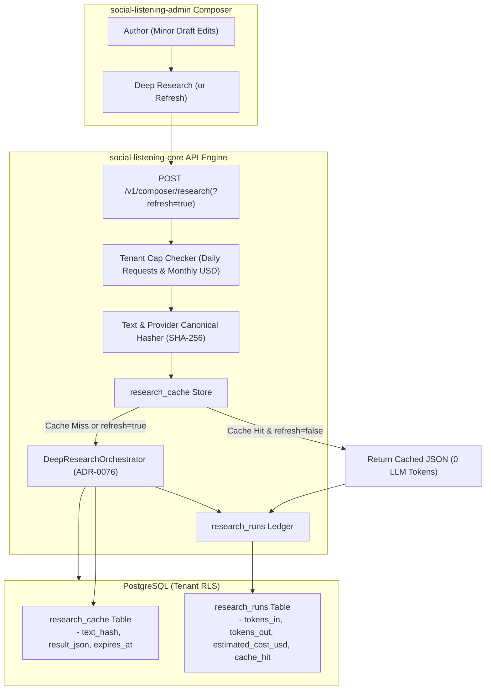

# Technical Design Specification (TDS) — Composer Deep Research Caching & Cost Telemetry

## 1. Document Control & Traceability Linkage

### 1.1 Metadata
| Attribute | Value |
|---|---|
| **Document Title** | TDS-0121: Composer Deep Research Caching, Re-Trigger & Cost Justification Architecture |
| **Document ID** | `TDS-0121` |
| **Feature Name** | Deep Research Result Caching, Token Usage Telemetry & Tenant Budget Controls |
| **Version** | `1.0.0` |
| **Status** | Approved |
| **Author(s)** | Core Architecture Team |
| **Created Date** | 2026-09-05 |
| **Last Updated** | 2026-09-05 |
| **Governing Skill** | `social-listening-core/.claude/skills/composer/SKILL.md` |

### 1.2 Upstream & Downstream Traceability Matrix
| Artifact Type | Reference Identifier | Title / Link | Alignment Status |
|---|---|---|---|
| **Architecture Decision Record** | `ADR-0121` | [ADR-0121: Composer Deep Research Caching, Re-Trigger, and Cost Justification](../../adr/0121-composer-deep-research-caching-retrigger-cost.md) | Invariant Source |
| **Business Requirements Doc** | `BRD-0121` | [BRD-0121: Composer Deep Research Caching](../Business-Requirements/BRD-0121-Composer-Deep-Research-Caching.md) | Fully Aligned |
| **Functional Design Doc** | `FDD-0121` | [FDD-0121: Composer Deep Research Caching](../Functional-Design/FDD-0121-Composer-Deep-Research-Caching.md) | Fully Aligned |
| **Governing User Story** | `Story 14.4` | [Epic 14: ADRs 0118–0122](../../user-stories/epic-14-adr-0118-to-0122.md#story-144--composer-deep-research-caching-re-trigger-and-cost-telemetry-backend) | Acceptance Target |
| **Related User Stories** | `Story 3.17`, `Story 6.41`, `Story 14.3` | Composer Research Endpoint, Research Panel UI, Search Connector | Foundation & Sibling Flows |
| **Related Architecture Decisions** | `ADR-0076`, `ADR-0027`, `ADR-0038`, `ADR-0120` | Base Deep Research, Direct Billing, AI Provider, Search Abstraction | System Architecture |
| **Executable Contract Tests** | `Story 14.4 Contract` | `social-listening-core/contracts/epic-14/story-14.4.composer-research-caching.contract.test.ts` | Ready for Suite Execution |

---

## 2. System Context & Architecture Topology

### 2.1 Context Diagram


### 2.2 Architectural Boundaries & Invariants
- **Deterministic Text Hashing:** Cache keys are generated as:
  $$\text{text\_hash} = \text{SHA-256}(\text{tenant\_id} \parallel \text{normalized\_text} \parallel \text{ai\_provider\_id} \parallel \text{search\_provider\_ids})$$
  Normalisation lowercases whitespace and trims surrounding punctuation, ensuring slight spacing alterations do not produce spurious cache misses.
- **Explicit Cache Bypass (`?refresh=true`):** Users can force an uncached live re-run by passing `refresh=true`. The updated pipeline result replaces the existing cache row for that `text_hash`.
- **Tenant Quota Hard Caps:**
  1. `research_daily_request_cap`: Default 50 requests/day. Exceeding returns HTTP 429 (`RESEARCH_DAILY_CAP_EXCEEDED`).
  2. `research_monthly_cost_cap_usd`: Optional monthly ceiling. Exceeding returns HTTP 422 (`RESEARCH_MONTHLY_COST_CAP_EXCEEDED`).
- **Telemetry Transparency Invariant:** Every request appends a record to `research_runs` capturing `tokens_in`, `tokens_out`, `estimated_cost_usd`, and `cache_hit: boolean`, giving tenant administrators auditable verification of cost savings.

---

## 3. Data Architecture & Persistence Design

### 3.1 DDL Schema Definition
Migration `0079_create_research_cache_and_runs.sql`:
```sql
CREATE TABLE IF NOT EXISTS research_cache (
    id UUID PRIMARY KEY DEFAULT gen_random_uuid(),
    tenant_id UUID NOT NULL REFERENCES tenants(id) ON DELETE CASCADE,
    text_hash TEXT NOT NULL,
    result_json JSONB NOT NULL,
    expires_at TIMESTAMPTZ NOT NULL,
    created_at TIMESTAMPTZ NOT NULL DEFAULT NOW(),
    CONSTRAINT uq_tenant_text_hash UNIQUE (tenant_id, text_hash)
);

ALTER TABLE research_cache ENABLE ROW LEVEL SECURITY;
CREATE POLICY research_cache_isolation ON research_cache
    FOR ALL USING (tenant_id = current_setting('app.current_tenant_id', true)::uuid);

CREATE INDEX IF NOT EXISTS idx_research_cache_expiry 
ON research_cache (tenant_id, expires_at);

CREATE TABLE IF NOT EXISTS research_runs (
    id UUID PRIMARY KEY DEFAULT gen_random_uuid(),
    tenant_id UUID NOT NULL REFERENCES tenants(id) ON DELETE CASCADE,
    user_id UUID NOT NULL REFERENCES users(id) ON DELETE CASCADE,
    text_hash TEXT NOT NULL,
    ai_provider_id TEXT NOT NULL,
    search_provider_ids TEXT[] NOT NULL,
    cache_hit BOOLEAN NOT NULL DEFAULT FALSE,
    tokens_in INT,
    tokens_out INT,
    estimated_cost_usd NUMERIC(10,6),
    created_at TIMESTAMPTZ NOT NULL DEFAULT NOW()
);

ALTER TABLE research_runs ENABLE ROW LEVEL SECURITY;
CREATE POLICY research_runs_isolation ON research_runs
    FOR ALL USING (tenant_id = current_setting('app.current_tenant_id', true)::uuid);

CREATE INDEX IF NOT EXISTS idx_research_runs_month_spend 
ON research_runs (tenant_id, created_at, estimated_cost_usd);
```

---

## 4. Application Logic & Workflows

### 4.1 Caching Interceptor & Cost Calculation
```typescript
export async function executeCachedComposerResearch(
  tenantId: string,
  userId: string,
  request: ComposerResearchRequest,
  refresh: boolean,
  client: PoolClient
): Promise<ComposerResearchResult> {
  const textHash = computeResearchHash(tenantId, request.text, 'azure-openai', ['brave-search']);

  // 1. Check daily request cap
  const dailyCount = await getDailyResearchCount(tenantId, client);
  if (dailyCount >= 50) {
    throw new ClassifiableError('RESEARCH_DAILY_CAP_EXCEEDED', 'Daily research limit of 50 requests reached.');
  }

  // 2. Lookup Cache
  if (!refresh) {
    const cached = await client.query(
      `SELECT result_json FROM research_cache 
       WHERE tenant_id = $1 AND text_hash = $2 AND expires_at > NOW()`,
      [tenantId, textHash]
    );

    if (cached.rows.length > 0) {
      await recordResearchRun(tenantId, userId, textHash, true, 0, 0, 0.0, client);
      return cached.rows[0].result_json as ComposerResearchResult;
    }
  }

  // 3. Live Pipeline Execution
  const result = await orchestrateLiveResearch(tenantId, request);
  const cost = estimateRunCost(result.tokensIn, result.tokensOut);

  // 4. Update Cache (TTL 24h)
  const ttlHours = 24;
  await client.query(
    `INSERT INTO research_cache (tenant_id, text_hash, result_json, expires_at)
     VALUES ($1, $2, $3, NOW() + INTERVAL '24 hours')
     ON CONFLICT (tenant_id, text_hash) 
     DO UPDATE SET result_json = EXCLUDED.result_json, expires_at = EXCLUDED.expires_at`,
    [tenantId, textHash, JSON.stringify(result)]
  );

  // 5. Record Telemetry
  await recordResearchRun(tenantId, userId, textHash, false, result.tokensIn, result.tokensOut, cost, client);

  return result;
}
```

---

## 5. Interface & API Contracts

### 5.1 Route Catalog
| Method | Endpoint | Authorization | Description |
|---|---|---|---|
| `POST` | `/v1/composer/research?refresh=true` | Tenant-User | Executes or bypasses cache for deep research request |
| `GET` | `/v1/composer/research/usage` | Tenant-Admin | Returns monthly token consumption and cache-hit ratio |

### 5.2 Usage Telemetry Contract (`GET /v1/composer/research/usage`)
**Response (200 OK):**
```json
{
  "tenantId": "c9bf9e57-1685-4c89-bafb-ff5af830be8a",
  "period": "2026-09",
  "totalRuns": 128,
  "cacheHits": 74,
  "cacheHitRatio": 0.578,
  "totalTokensIn": 68400,
  "totalTokensOut": 14200,
  "estimatedSpendUSD": 0.0886
}
```

---

## 6. Security, Tenancy & Isolation Model
- **Zero Cache Sharing:** `text_hash` includes `tenant_id` to prevent cross-tenant cache hit information disclosure.
- **Tenant Scope Enforcement:** Both `research_cache` and `research_runs` enforce row-level security using PostgreSQL RLS policies.

---

## 7. Performance, Scalability & Resource Caps
- **Instant Cache Returns:** Cache hits resolve from indexed lookups in $< 3\text{ms}$, saving ~8–12 seconds of upstream latency.
- **Auto-Pruning:** Background cron runs `DELETE FROM research_cache WHERE expires_at < NOW()` daily to prune stale rows.

---

## 8. Resilience, Recovery & Failure Semantics
- **Non-Fatal Telemetry Errors:** If logging to `research_runs` throws an error, the generated synthesis is still returned to the user without failing the request.

---

## 9. Observability, Telemetry & Auditability
- **Metrics Tracked:**
  - `composer_research_cache_hits_total{tenant_id}`
  - `composer_research_cache_misses_total{tenant_id}`
  - `composer_research_estimated_spend_total_usd{tenant_id}`

---

## 10. Migration, Compatibility & Rollback Strategy
- **Migration Plan:** `0079_create_research_cache_and_runs.sql` creates tables without altering composer core routes.
- **Rollback:** Dropping cache tables cleanly degrades system to un-cached live execution (ADR-0076 v1).

---

## 11. Verification, Testing & Quality Assurance
- **Contract Test Suite:** `social-listening-core/contracts/epic-14/story-14.4.composer-research-caching.contract.test.ts`:
  - (1) Confirms identical second request returns cached response with `cache_hit: true`.
  - (2) Verifies `?refresh=true` re-executes live pipeline and updates cache.
  - (3) Confirms `429 RESEARCH_DAILY_CAP_EXCEEDED` on 51st request.
  - (4) Asserts telemetry record insertion in `research_runs`.

---

## 12. Open Questions & Future Enhancements

- [ ] **[Q-0121-1]** **Lazy vs Cron Cache Pruning:** Evaluating whether TTL eviction should rely solely on query-time `expires_at > NOW()` filters or periodic background deletion.
- [ ] **[Q-0121-2]** **Semantic Hash Tolerance:** Normalizing minor punctuation and capitalization differences in draft text to improve cache hit rates.
- [ ] **[Q-0121-4]** **Per-User Quota Ceilings:** Adding per-seat daily research limits to prevent a single user from consuming the entire tenant daily cap.
