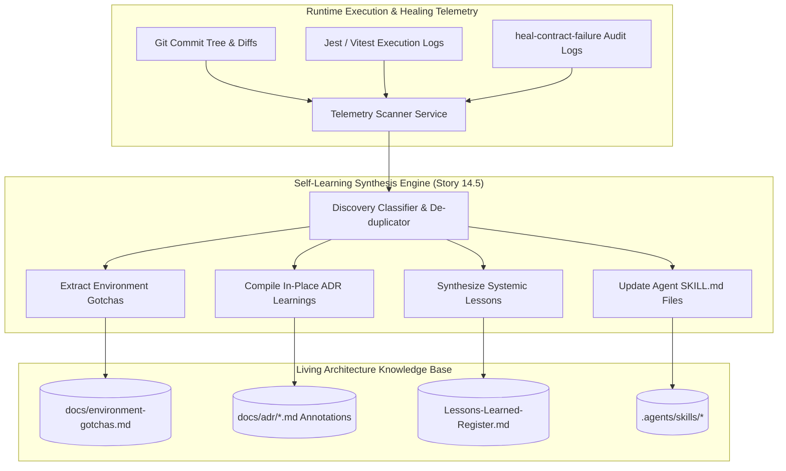
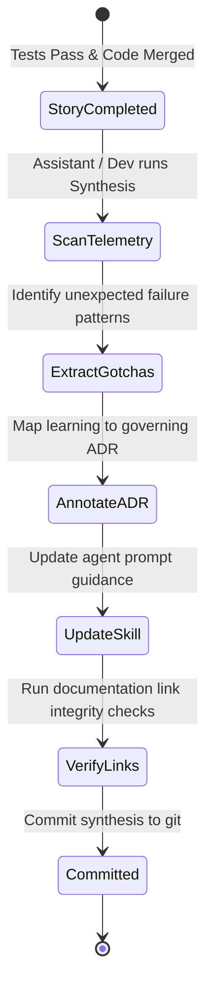

# TDS-0122: Continuous Self-Learning Synthesis and Telemetry Feedback Architecture

**Status:** Approved  
**Date:** 2026-09-05  
**Governing ADR:** [ADR-0122](../../adr/0122-continuous-self-learning-synthesis-and-telemetry-feedback-loop.md)  
**Related Epics/Stories:** [Epic 14 / Story 14.5](../../user-stories/epic-14-adr-0118-to-0122.md), [Epic 15 / Story 15.1](../../user-stories/epic-15-adr-0123-to-0124.md)  
**Target Repositories:** `social-listening-core`  
**Contract Test Citations:**  
- `social-listening-core/contracts/epic-14/story-14.5.self-learning-telemetry.contract.test.ts`  

---

## 1. Architectural Context & Problem Statement

In contract-first, test-driven development (TDD), static architecture specifications inevitably drift from the concrete operational realities discovered during implementation. Critical engineering discoveries—such as database test template locking behaviors, platform API rate-limit idiosyncrasies, cross-platform shell syntax gotchas, and bundler edge cases—frequently remain trapped in isolated git commit messages or ephemeral terminal logs.

Without a continuous synthesis mechanism:
- Subsequent engineering stories inadvertently repeat previously solved failure modes.
- Developer velocity decreases due to recurrent debugging of known environmental traps.
- Architectural documentation loses fidelity, causing team misalignment.

This specification formalizes the **Continuous Self-Learning Synthesis & Telemetry Feedback Architecture**:
1. An automated post-sprint feedback loop scanning git commit history, contract test healing runs, and execution logs.
2. Structured synthesis feeding four living operational knowledge repositories:
   - `docs/environment-gotchas.md` (runtime environment constraints).
   - In-place ADR annotations (`## Implementation Learnings & Real-World Constraints`).
   - `docs/project docs/Lessons-Learned-Register.md` (systemic patterns).
   - Component `SKILL.md` workflows.
3. Verification gates ensuring documentation updates mirror active codebase behavior.



---

## 2. Governing ADRs & Decision Log Reference

- [ADR-0122: Continuous Self-Learning Synthesis and Telemetry Feedback Architecture](../../adr/0122-continuous-self-learning-synthesis-and-telemetry-feedback-loop.md) — Authorizes synthesis loop, output surfaces, and in-place ADR annotation patterns.
- [docs/implementation-methodology.md](../../implementation-methodology.md) — Dictates the contract-first lifecycle (Intent $\rightarrow$ Contract $\rightarrow$ Skill $\rightarrow$ Implementation $\rightarrow$ Validation).
- [ADR-0048: Connector Registry and Zero-Pipeline-Change Ingestion](../../adr/0048-connector-registry-and-zero-pipeline-change-ingestion.md) — Foundational transparency pattern.

---

## 3. Scope, Precedence & Anti-Goals

### In Scope
- Systematic post-milestone telemetry scanning of commit messages, test failures, and fix diffs.
- Automatic extraction and categorization of gotchas into `docs/environment-gotchas.md`.
- In-place annotation of governing ADRs without altering historical decisions or acceptance notes.
- Updating developer and AI assistant agent skills (`.agents/skills/heal-contract-failure`).
- Automated verification scripts validating that all cataloged gotchas reference real code symbols and tests.

### Precedence Invariant
$$\text{Historical Decision Invariant} \land \text{Append-Only Implementation Learnings}$$
Original ADR problem statements, contexts, decisions, and acceptance notes are immutable. Learnings are appended exclusively inside dedicated `## Implementation Learnings & Real-World Constraints` sections.

### Anti-Goals
- Automated silent rewriting of core business rules or regulatory commitments.
- Storing transient debugging stack traces in permanent architecture registers.

---

## 4. Data Architecture & Storage Schema

The synthesis engine operates over the filesystem and git metadata rather than relational database tables.

### Synthesis Target Surfaces

| Surface | File Path | Format & Update Pattern |
|---|---|---|
| **Environment Gotchas** | `docs/environment-gotchas.md` | Categorized Markdown table with Symptom, Root Cause, Mitigation, and Verification. |
| **ADR Annotations** | `docs/adr/XXXX-*.md` | Additive section: `## Implementation Learnings & Real-World Constraints`. |
| **Lessons Learned** | `docs/project docs/Lessons-Learned-Register.md` | Chronological register of architectural patterns and anti-patterns. |
| **Agent Skills** | `.agents/skills/*/SKILL.md` | Procedural execution checklists and failure prevention steps. |

---

## 5. Component & Interface Contracts

### 5.1 Synthesis Telemetry Scanner Interface (`social-listening-core`)

```typescript
export type GotchaCategory = 'database' | 'networking' | 'bundler' | 'os_shell' | 'testing' | 'auth';

export interface TelemetryGotcha {
  id: string; // e.g. 'GOTCHA-0042'
  category: GotchaCategory;
  symptom: string;
  rootCause: string;
  mitigation: string;
  detectedInCommit: string;
  verifiedInTest: string;
}

export interface ADRLearningAnnotation {
  adrNumber: string;
  date: string;
  realWorldConstraint: string;
  codeReference: string;
}

export interface SynthesisSummary {
  milestone: string;
  commitsAnalyzed: number;
  newGotchasExtracted: TelemetryGotcha[];
  adrAnnotationsApplied: ADRLearningAnnotation[];
  skillsUpdated: string[];
}
```

### 5.2 Synthesis CLI Utility

```bash
# Executed at milestone or post-sprint completion:
node scripts/self-learning-synthesis.mjs --from-commit <sha> --to-commit <sha>
```

---

## 6. State Machine & Lifecycle Transitions



---

## 7. Security, Tenant Isolation & Authentication

1. **Sanitization of Internal Secrets:** Synthesis pipelines strip all private API keys, connection strings, tenant UUIDs, and credentials before writing documentation artifacts.
2. **Repository Integrity:** Document mutations are subject to standard git pull request reviews and CI markdown linter checks.

---

## 8. Performance, Scalability & Resource Boundaries

1. **Lightweight Execution:** Telemetry scanning and markdown compilation complete in `< 5 seconds` over hundreds of commits.
2. **Clean Git History:** Synthesis updates are grouped into clean, self-contained documentation commits (`docs(learnings): ...`).

---

## 9. Error Handling, Retries & Fallback Strategies

| Scenario | Behavior | Resolution |
|---|---|---|
| ADR file not found for annotation | Logs warning | Appends learning to generic `Lessons-Learned-Register.md` |
| Broken file link in gotcha | CI markdown linter fails | Fixes relative link syntax before commit |

---

## 10. Observability, Telemetry & Audit Trail

- **Git Provenance:** Every gotcha entry explicitly references the exact commit hash where the failure occurred and the commit where the fix was verified.
- **Metrics:**
  - `knowledge_gotchas_total` — Total active environmental gotchas tracked.
  - `adr_annotations_count` — Volume of implementation learning entries.

---

## 11. Migration & Backward Compatibility Strategy

- **Zero Breaking Code Changes:** Pure documentation and knowledge-base automation.
- **Preserves Full History:** Enhances historical ADRs with post-hoc operational clarity without invalidating earlier sign-offs.

---

## 12. Executable Contract Test Citations & Verification Matrix

### 12.1 Contract Test Specifications
1. `social-listening-core/contracts/epic-14/story-14.5.self-learning-telemetry.contract.test.ts`:
   - `test('extracts environment gotchas from commit logs matching failure keywords')`
   - `test('validates that ADR in-place annotations preserve original decision text')`
   - `test('ensures all extracted gotchas reference verifiable file paths')`

### 12.2 Open Questions

- [x] ~~**[Q-0122-1]** Does this loop run automatically in CI?~~  
  *Decision:* Semi-automated. The script is run by the assistant or developer during sprint retrospectives or epic completion rituals to curate high-signal learnings.
