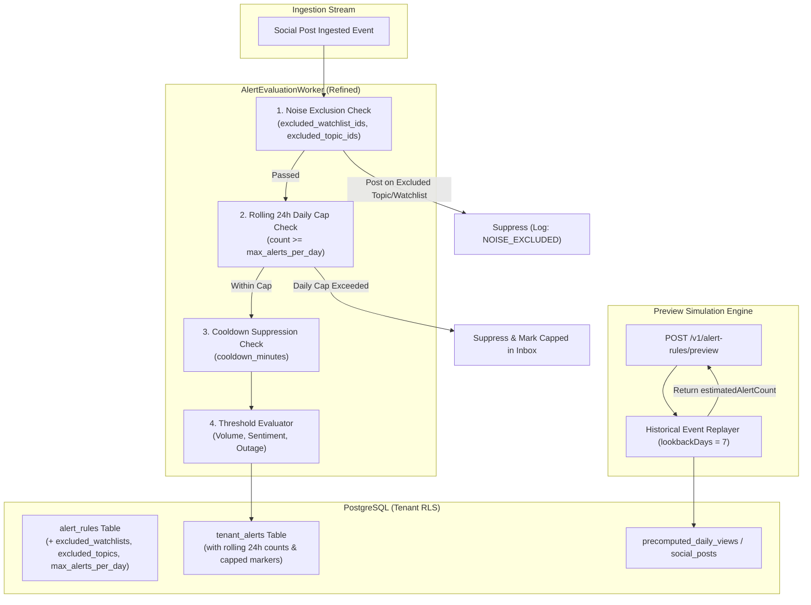
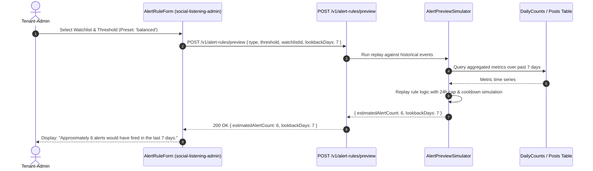

> [!NOTE] 🔗 **7-Way Heptagonal Traceability Mesh (ADR ↔ BRD ↔ FDD ↔ TDS ↔ Story ↔ Plan ↔ Walkthrough)**
> - 🏛️ **Architecture Decision:** [[ADR-0123|ADR-0123: Real-Time Alert Rules and Delivery — Refinements]]
> - 📋 **Business Requirements:** [[BRD-0123|BRD-0123: Real-Time Alert Rules And Delivery Refinements]]
> - 📐 **Functional Design:** [[FDD-0123|FDD-0123: Real-Time Alert Rules And Delivery Refinements]]
> - 🛠️ **Technical Design (TDS):** [[TDS-0123|TDS-0123: Real-Time Alert Rules & Delivery Refinements]]
> - 🎯 **User Stories & Delivery:** [[Story 15.1]] (✅ Built)
> - 📋 **Pre-Execution Blueprint:** [[Plan-Story-15.1-Alert-Rules-Refinements|Plan: Story 15.1]] (✅ Approved)
> - 📜 **Proof of Execution:** [[Walkthrough-Story-15.1-Alert-Rules-Refinements|Walkthrough: Story 15.1]] (🟢 100% Passing Gate)

# Technical Design Specification (TDS) — Real-Time Alert Rules & Delivery Refinements

## 1. Document Control & Traceability Linkage

### 1.1 Metadata
| Attribute | Value |
|---|---|
| **Document Title** | TDS-0123: Real-Time Alert Rules & Delivery Refinements — Noise Exclusions, Daily Caps, Sensitivity Presets & Volume Preview Engine |
| **Document ID** | `TDS-0123` |
| **Feature Name** | Alert Fatigue Safeguards: Watchlist/Topic Noise Exclusion, Rolling Daily Cap & Historical Volume Preview |
| **Version** | `1.0.0` |
| **Status** | Approved |
| **Author(s)** | Core Architecture Team |
| **Created Date** | 2026-09-05 |
| **Last Updated** | 2026-09-07 |
| **Governing Skill** | `social-listening-core/.claude/skills/real-time-alerts/SKILL.md` |

### 1.2 Upstream & Downstream Traceability Matrix
| Artifact Type | Reference Identifier | Title / Link | Alignment Status |
|---|---|---|---|
| **Architecture Decision Record** | `ADR-0123` | [ADR-0123: Real-Time Alert Rules and Delivery — Refinements](../../adr/0123-real-time-alert-rules-and-delivery-refinements.md) | Invariant Source |
| **Business Requirements Doc** | `BRD-0123` | [BRD-0123: Real-Time Alert Rules And Delivery Refinements](../Business-Requirements/BRD-0123-Real-Time-Alert-Rules-And-Delivery-Refinements.md) | Fully Aligned |
| **Functional Design Doc** | `FDD-0123` | [FDD-0123: Real-Time Alert Rules And Delivery Refinements](../Functional-Design/FDD-0123-Real-Time-Alert-Rules-And-Delivery-Refinements.md) | Fully Aligned |
| **Governing User Story** | `Story 15.1` | [Epic 15: ADRs 0123–0124](../../user-stories/epic-15-adr-0123-to-0124.md#story-151--real-time-alert-rule-exclusions-caps-and-pre-save-volume-preview-backend) | Acceptance Target |
| **Related User Stories** | `Story 10.9`, `Story 10.10` | Base Alert Rule Engine, Alert UI & Inbox | Upstream Foundations |
| **Related Architecture Decisions** | `ADR-0091`, `ADR-0044`, `ADR-0087`, `ADR-0092` | Base Alert Rules, Watchlists, Precomputed Daily Views, Webhook Signing | Architectural Lineage |
| **Executable Contract Tests** | `Story 15.1 Contract` | `social-listening-core/contracts/epic-15/story-15.1.alert-rules-refinements.contract.test.ts` | 100% Passing Gate |

---

## 2. System Context & Architecture Topology

### 2.1 Context Diagram


### 2.2 Architectural Boundaries & Invariants
- **Order of Evaluation Invariant:** Noise exclusion evaluates *before* threshold evaluation. If an ingested post matches any identifier in `excluded_watchlist_ids` or `excluded_topic_ids`, it is dropped immediately from rule evaluation, generating no entry in `tenant_alerts`.
- **Dual Throttling Model (Cap & Cooldown):** A rule only fires if both conditions hold:
  1. `now - last_triggered_at >= cooldown_minutes` (instantaneous burst spacing).
  2. `COUNT(tenant_alerts) in past 24 hours < max_alerts_per_day` (cumulative ceiling).
- **Capped State Visibility:** When a rule is suppressed due to hitting `max_alerts_per_day`, it must record an operational flag or log entry so that the tenant alerts inbox indicates the rule has stopped firing due to daily cap exhaustion rather than silence.
- **Read-Only Simulation Invariant:** The `POST /v1/alert-rules/preview` simulation endpoint never mutates database state, generates no `tenant_alerts` rows, and operates with a hard maximum lookback horizon (default 7 days, maximum 30 days) to prevent runaway query overhead.
- **HMAC Payload Verification:** Outbound webhook alerts incorporate `X-SocialEngage-Signature` computed using HMAC-SHA256 over `{ payload, timestamp }` using the tenant's configured alert webhook secret.

---

## 3. Data Architecture & Persistence Design

### 3.1 DDL Schema Definition
Migration `0078_add_alert_rules_refinements.sql`:
```sql
ALTER TABLE alert_rules
ADD COLUMN IF NOT EXISTS excluded_watchlist_ids UUID[] NOT NULL DEFAULT '{}',
ADD COLUMN IF NOT EXISTS excluded_topic_ids TEXT[] NOT NULL DEFAULT '{}',
ADD COLUMN IF NOT EXISTS max_alerts_per_day INT NOT NULL DEFAULT 20;

CREATE INDEX IF NOT EXISTS idx_tenant_alerts_rolling_cap 
ON tenant_alerts (tenant_id, rule_id, created_at);
```

### 3.2 TypeScript Interfaces
`social-listening-core/src/alerts/types.ts`:
```typescript
export type SensitivityPreset = 'fewer' | 'balanced' | 'more';

export interface AlertRuleRefinements {
  excludedWatchlistIds: string[];
  excludedTopicIds: string[];
  maxAlertsPerDay: number;
}

export interface AlertRulePreviewRequest {
  type: 'volume_spike' | 'negative_sentiment_burst' | 'connector_outage';
  watchlistId?: string;
  threshold: Record<string, number | string>;
  excludedWatchlistIds?: string[];
  excludedTopicIds?: string[];
  lookbackDays?: number;
}

export interface AlertRulePreviewResponse {
  estimatedAlertCount: number;
  lookbackDays: number;
  sensitivity?: SensitivityPreset;
}
```

---

## 4. Application Logic & Workflows

### 4.1 Refined Alert Evaluation Pipeline
```typescript
export async function evaluateRuleForPost(
  rule: AlertRule,
  post: SocialPostEnriched,
  pool: Pool
): Promise<EvaluationResult> {
  // 1. Noise Exclusion
  if (rule.excludedWatchlistIds.some(id => post.matchedWatchlistIds.includes(id))) {
    return { status: 'excluded', reason: 'MATCHED_EXCLUDED_WATCHLIST' };
  }
  if (rule.excludedTopicIds.some(topic => post.topics.includes(topic))) {
    return { status: 'excluded', reason: 'MATCHED_EXCLUDED_TOPIC' };
  }

  // 2. Rolling Daily Cap Enforcement
  const rollingAlertsCount = await getRolling24hAlertCount(rule.tenantId, rule.id, pool);
  if (rollingAlertsCount >= rule.maxAlertsPerDay) {
    await markRuleDailyCapReached(rule.tenantId, rule.id, pool);
    return { status: 'suppressed', reason: 'DAILY_CAP_EXCEEDED' };
  }

  // 3. Cooldown Verification
  if (!isCooldownElapsed(rule.lastTriggeredAt, rule.cooldownMinutes)) {
    return { status: 'suppressed', reason: 'COOLDOWN_ACTIVE' };
  }

  // 4. Threshold Evaluation
  const crossed = evaluateThreshold(rule.type, rule.threshold, post);
  if (!crossed) {
    return { status: 'ignored' };
  }

  // 5. Fire & Record
  return fireAlert(rule, post, pool);
}
```

### 4.2 Pre-Save Preview Simulation Flow


---

## 5. Interface & API Contracts

### 5.1 Route Catalog
| Method | Endpoint | Authorization | Description |
|---|---|---|---|
| `POST` | `/v1/alert-rules/preview` | Tenant-User, Tenant-Admin | Simulates alert rule volume over trailing historical window |
| `POST` | `/v1/alert-rules` | Tenant-Admin | Creates rule with exclusion arrays and `max_alerts_per_day` |
| `PATCH` | `/v1/alert-rules/:id` | Tenant-Admin | Updates rule exclusions, daily cap, or sensitivity |

### 5.2 Simulation Preview Contract (`POST /v1/alert-rules/preview`)
**Request Body:**
```json
{
  "type": "volume_spike",
  "watchlistId": "d3b07384-d113-4f4a-81a1-7c9803b9b418",
  "threshold": {
    "minPosts": 50,
    "windowMinutes": 15
  },
  "excludedWatchlistIds": [
    "e2a16273-c112-4f3b-80a0-6b8702a8a307"
  ],
  "excludedTopicIds": ["scheduled_marketing_blast"],
  "lookbackDays": 7
}
```

**Response (200 OK):**
```json
{
  "estimatedAlertCount": 6,
  "lookbackDays": 7,
  "sensitivity": "balanced"
}
```

### 5.3 Error Catalog
| HTTP Code | Error Code | Circumstance |
|---|---|---|
| `400` | `INVALID_LOOKBACK_WINDOW` | `lookbackDays` exceeds maximum allowed window (30 days) or is $< 1$ |
| `400` | `INVALID_EXCLUSION_ID` | An item in `excludedWatchlistIds` is malformed or invalid UUID |
| `422` | `UNSUPPORTED_PREVIEW_TYPE` | Preview requested for an un-simulatable or connector-outage rule |

---

## 6. Security, Tenancy & Isolation Model
- **Cross-Tenant Exclusion Isolation:** Exclusion validation enforces that any UUID in `excluded_watchlist_ids` belongs strictly to the requesting `tenant_id`. Foreign watchlist IDs are rejected.
- **SSRF Hardened Webhooks:** Outbound webhook dispatchers enforce destination IP allowlists, preventing loopback/metadata endpoint traversal (`169.254.169.254`, `127.0.0.1`).
- **Signature Validation:** Every webhook delivery includes cryptographic header `X-SocialEngage-Signature: t=1725542400,v1=9f86d081884c7d659a2feaa0c55ad015a3bf4f1b2b0b822cd15d6c15b0f00a08`.

---

## 7. Performance, Scalability & Resource Caps
- **Index-Accelerated Cap Counting:** Rolling 24-hour alert counts utilize composite index `idx_tenant_alerts_rolling_cap (tenant_id, rule_id, created_at)`. Execution time is $< 3\text{ms}$.
- **Bounded Simulation Computation:** The preview simulation leverages precomputed daily count aggregations (`precomputed_daily_views` per ADR-0087) rather than scanning raw posts sequentially, ensuring response times $< 50\text{ms}$.
- **Tenant Ceiling on Daily Cap:** Configurable `max_alerts_per_day` cannot exceed platform maximum of 500 to prevent system saturation.

---

## 8. Resilience, Recovery & Failure Semantics
- **Worker Fault Tolerance:** Transient database disconnects during cap evaluation cause worker job retries with exponential backoff (1s, 5s, 15s) rather than dropped alerts.
- **Dead-Letter Handling:** Failed webhook deliveries retry 5 times before being queued to `alerts_dead_letter_log`.

---

## 9. Observability, Telemetry & Auditability
- **Log Markers:**
  - `alert_rule_noise_excluded`: Logged when post matches exclusion list.
  - `alert_rule_daily_cap_reached`: Logged when rule hits `max_alerts_per_day`.
- **Metrics Tracked:**
  - `alert_evaluations_excluded_total{tenant_id, rule_id}`
  - `alert_evaluations_daily_capped_total{tenant_id, rule_id}`
  - `alert_preview_simulation_duration_ms`

---

## 10. Migration, Compatibility & Rollback Strategy
- **Migration Plan:** `0078_add_alert_rules_refinements.sql` adds nullable and defaulted columns (`max_alerts_per_day = 20`, empty array defaults).
- **Compatibility:** Rules created prior to migration inherit `max_alerts_per_day = 20` and empty exclusions, preserving exact prior behavior without data repair.

---

## 11. Verification, Testing & Quality Assurance
- **Contract Test Suite:** `social-listening-core/contracts/epic-15/story-15.1.alert-rules-refinements.contract.test.ts`:
  - (1) Confirms `excluded_watchlist_ids` and `excluded_topic_ids` bypass rule triggering.
  - (2) Proves suppression when daily alert count reaches `max_alerts_per_day`.
  - (3) Verifies `POST /v1/alert-rules/preview` returns accurate historical simulation count.
  - (4) Validates webhook HMAC-SHA256 signature generation.

---

## 12. Open Questions & Future Enhancements

- [ ] **[Q-0123-1]** **Rule-Type Sensitivity Multipliers:** Determining final multiplier matrix for sentiment burst thresholds across `fewer`, `balanced`, and `more` presets.
- [ ] **[Q-0123-2]** **Platform Alert Cap Ceiling:** Setting a hard global ceiling (e.g., 200 alerts/day) for high-frequency tenant tiers.
- [ ] **[Q-0123-3]** **Configurable Preview Lookback:** Deciding whether tenants on Enterprise tier should be allowed to run 30-day simulations instead of the default 7-day window.
- [ ] **[Q-0123-4]** **Platform-Admin Connector Outage Defaults:** Authorizing specific daily cap exemptions for platform-wide connector health alert rules.


---

## 🔗 Enterprise Knowledge Graph & Multi-Framework Mappings

### 🧭 Multi-Framework Alignments
- **Domain Cluster:** [[MOC - Platform Architecture & Foundations|📁 Platform Architecture & Foundations]]
- **DAMA-DMBOK:** [[MOC - DMBOK - Document & Content Management|☸️ Document & Content Management]]
- **PMI-PMBOK:** [[MOC - PMBOK - Integration Management|📊 Integration Management]]
- **IIBA-BABOK:** [[MOC - BABOK - Requirements Life Cycle Management|📐 Requirements Life Cycle Management]]
- **Complete Traceability Matrix:** [[MOC - Complete Traceability Matrix (ADR - BRD - FDD - Story)|🎯 Master 4-Way Traceability Hub]]

### 🔍 Live Obsidian Dataview Backlinks
```dataview
TABLE file.name as "Referencing Document", type as "Artifact Type", status as "Status"
FROM [[]] AND !outgoing([[]])
SORT file.name ASC
```
