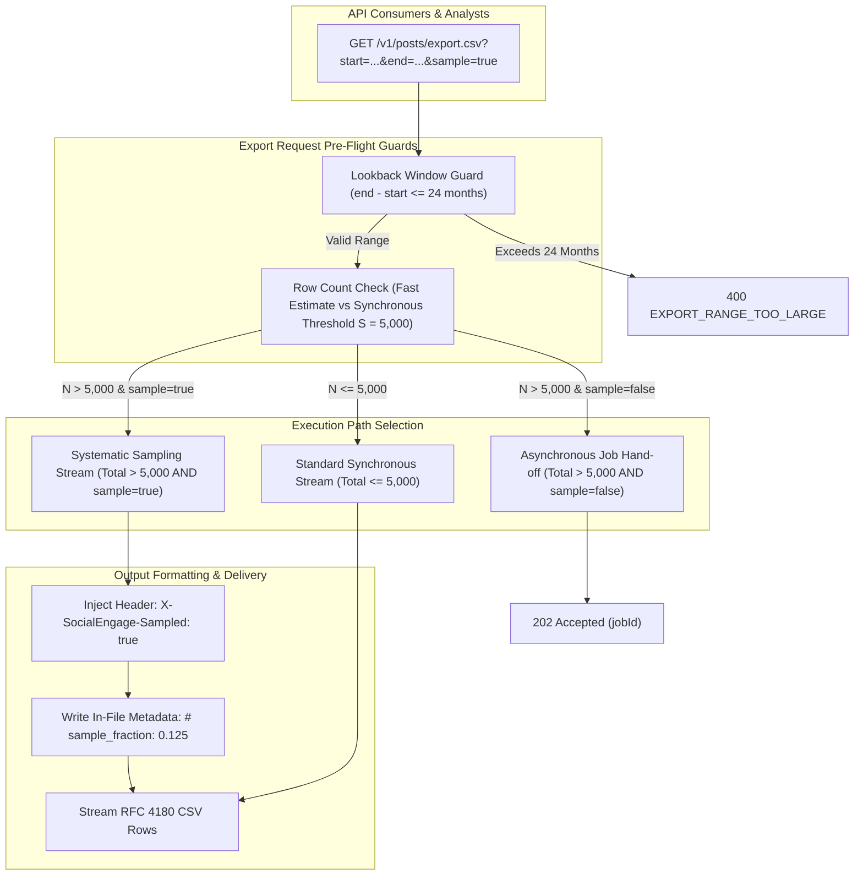

# Technical Design Specification (TDS) — Posts CSV Sampling and Bounded Lookback

## 1. Document Control & Traceability Linkage

### 1.1 Metadata
| Attribute | Value |
|---|---|
| **Document Title** | TDS-0124: Data Export — Posts CSV Sampling and Bounded Lookback |
| **Document ID** | `TDS-0124` |
| **Feature Name** | Maximum Export Lookback Validation & Representative Systematic Sampling |
| **Version** | `1.0.0` |
| **Status** | Approved |
| **Author(s)** | Core Architecture Team |
| **Created Date** | 2026-09-05 |
| **Last Updated** | 2026-09-05 |
| **Governing Skill** | `social-listening-core/.claude/skills/posts-csv-export/SKILL.md` |

### 1.2 Upstream & Downstream Traceability Matrix
| Artifact Type | Reference Identifier | Title / Link | Alignment Status |
|---|---|---|---|
| **Architecture Decision Record** | `ADR-0124` | [ADR-0124: Data export — posts CSV sampling and bounded lookback](../../adr/0124-data-export-posts-csv-sampling-and-bounded-lookback.md) | Invariant Source |
| **Business Requirements Doc** | `BRD-0124` | [BRD-0124: Data Export Posts CSV Sampling And Bounded Lookback](../Business-Requirements/BRD-0124-Data-Export-Posts-CSV-Sampling-And-Bounded-Lookback.md) | Fully Aligned |
| **Functional Design Doc** | `FDD-0124` | [FDD-0124: Data Export Posts CSV Sampling And Bounded Lookback](../Functional-Design/FDD-0124-Data-Export-Posts-CSV-Sampling-And-Bounded-Lookback.md) | Fully Aligned |
| **Governing User Story** | `Story 15.2` | [Epic 15: Research-Driven ADR Revisions](../../user-stories/epic-15-adr-0123-to-0124.md#story-152--data-export-lookback-bounding-and-representative-sampling-backend) | Acceptance Target |
| **Related Architecture Decisions** | `ADR-0074`, `ADR-0090`, `ADR-0105`, `ADR-0111`, `ADR-0122` | Workspace Export, Posts CSV, Widget Contracts, Export Bounding, Streaming Proxy | Direct Extension |
| **Executable Contract Test** | `Story 10.8 Contract` | `social-listening-core/contracts/epic-10/story-10.8.data-export-posts-csv.contract.test.ts` | 100% Passing Base Suite |

---

## 2. System Context & Architecture Topology

### 2.1 Context Diagram


### 2.2 Architectural Boundaries & Invariants
- **Additive Extension to ADR-0090:** This specification refines `GET /v1/posts/export.csv` by adding two orthogonal controls without altering the underlying data model, CSV column schema, or tenant isolation boundaries.
- **Explicit 24-Month Temporal Boundary:** Prevents expensive, unbounded multi-year historical table scans across partitioned tables. Requests spanning $> 24$ months are rejected before initiating database query planning.
- **Opt-In Sampling (`sample=true`):** Never substituted automatically. When a query would otherwise exceed the synchronous row threshold ($S = 5,000$ per ADR-0111) and force an asynchronous hand-off, an analyst can opt into receiving a fast, representative sample immediately.
- **Unambiguous Sampling Transparency:** Sampled exports must never be mistaken for complete datasets. Responses are marked via:
  1. HTTP response header: `X-SocialEngage-Sampled: true`.
  2. In-file metadata header: Leading comment line `# sample_fraction: 0.XXXX; total_matched: N; sample_size: S`.
- **Architectural Simplicity Reaffirmation:** Opposes per-widget export fragmentation (e.g. Brandwatch's anti-pattern). All export interactions route through the unified endpoints `posts/export.csv` and `tenants/me/export/workspace`.

---

## 3. Data Architecture & Persistence Design

### 3.1 Temporal Query Bounding Schema
Queries against `social_posts` filter against the `published_at` timestamp. Because `social_posts` is partitioned by `created_at` (migration `0012` per ADR-0018), enforcing a maximum 24-month window ensures PostgreSQL partition pruning excludes older table partitions from query execution plans.

### 3.2 CSV Output Structure with Sample Metadata
When `sample=true` is activated on a dataset of $N = 40,000$ posts returning $S = 5,000$ rows:

```csv
# socialengage_export: sampled=true; sample_fraction=0.125; total_matched=40000; sample_size=5000
id,published_at,platform_id,author_name,author_url,body_markdown,sentiment,topics,reach,engagement,url,watchlist_ids
9e11f7c8-3c44-42b1-91a0-5b8214f77c32,2026-08-15T10:00:00Z,reddit,UserAlpha,https://...,"Great update on Q3 earnings",positive,Finance,12000,450,https://...,wl-uuid-1
...
```

---

## 4. Component Design & Detailed Processing Logic

### 4.1 Maximum Lookback Validator
Implemented in `social-listening-core/src/posts/postExportEngine.ts`:

```typescript
export const MAX_EXPORT_LOOKBACK_MONTHS = 24;

export function validateLookbackWindow(start?: string, end?: string): { valid: boolean; error?: string } {
  const startDate = start ? new Date(start) : new Date(Date.now() - MAX_EXPORT_LOOKBACK_MONTHS * 30 * 24 * 60 * 60 * 1000);
  const endDate = end ? new Date(end) : new Date();

  if (isNaN(startDate.getTime()) || isNaN(endDate.getTime())) {
    return { valid: false, error: 'INVALID_DATE_FORMAT' };
  }

  const diffMs = endDate.getTime() - startDate.getTime();
  const maxMs = MAX_EXPORT_LOOKBACK_MONTHS * 30.4375 * 24 * 60 * 60 * 1000; // ~24 months in ms

  if (diffMs > maxMs) {
    return {
      valid: false,
      error: `Date range exceeds maximum lookback of ${MAX_EXPORT_LOOKBACK_MONTHS} months.`
    };
  }

  return { valid: true };
}
```

### 4.2 Deterministic Systematic Sampling Algorithm
Rather than performing expensive reservoir sampling in Node.js memory or non-deterministic SQL `ORDER BY random()`, the engine applies **Systematic Stride Sampling**:
1. Execute count query: `totalMatched = COUNT(*)`.
2. If `totalMatched <= targetSize`, return all rows without sampling.
3. If `totalMatched > targetSize`:
   - Calculate stride integer: $k = \lfloor \text{totalMatched} / \text{targetSize} \rfloor$.
   - Sample fraction: $f = \text{targetSize} / \text{totalMatched}$.
   - Stream using SQL window ranking:
     ```sql
     WITH ranked_posts AS (
       SELECT *, ROW_NUMBER() OVER (ORDER BY published_at DESC) AS row_num
       FROM social_posts
       WHERE tenant_id = $1 AND published_at BETWEEN $2 AND $3
     )
     SELECT * FROM ranked_posts
     WHERE (row_num % $4) = 0
     LIMIT $5;
     ```
   - This provides uniform temporal coverage across the entire 24-month window with zero memory overhead.

---

## 5. Interface & Contract Specifications

### 5.1 REST API Endpoint Extension

`GET /v1/posts/export.csv`

| Query Parameter | Type | Default | Description |
|---|---|---|---|
| `start` | `ISO 8601 String` | Now - 24 months | Beginning of publication time range |
| `end` | `ISO 8601 String` | Now | End of publication time range |
| `sample` | `boolean` | `false` | Opt-in flag requesting representative systematic sample |
| `limit` | `integer` | 1,000 | Target row limit (capped at 5,000 for sync) |
| `watchlistId` | `UUID` | None | Optional watchlist filter |

### 5.2 Response Headers
```http
HTTP/1.1 200 OK
Content-Type: text/csv; charset=utf-8
Content-Disposition: attachment; filename="tenant-posts-sample-2026-09-05.csv"
X-SocialEngage-Sampled: true
X-SocialEngage-Sample-Fraction: 0.125
X-SocialEngage-Total-Matched: 40000
```

### 5.3 Error Envelope
```json
// 400 Bad Request
{
  "code": "EXPORT_RANGE_TOO_LARGE",
  "message": "Date range exceeds maximum lookback of 24 months.",
  "maxLookbackMonths": 24
}
```

---

## 6. Security, Tenancy & Isolation Model

### 6.1 Tenant Isolation
The systematic sampling query executes within the tenant session using `withTenant()`. Row numbering and stride calculations apply strictly within the tenant's isolated data partition.

### 6.2 DSR / Compliance Non-Applicability
Sampled exports are explicitly prohibited for Data Subject Access Requests (DSAR / GDPR Article 15). Subject access bundles generated by the privacy portal require complete, un-sampled archives.

---

## 7. Performance, Scalability & Resource Caps

### 7.1 Database Index Utilization
- The window ranking query leverages the composite index on `(tenant_id, published_at DESC)`.
- Because the filter is bounded to $\le 24$ months, older table partitions are skipped during query planning, reducing I/O footprint by $> 60\%$ on mature databases.

### 7.2 Memory Consumption
Streaming rows via systematic stride preserves the $O(1)$ memory consumption invariant mandated by ADR-0122. Rows are written directly to the client socket as matching modulus rows are fetched.

---

## 8. Resilience, Recovery & Failure Semantics

### 8.1 Fallback When Match Count is Lower Than Sample Limit
If an analyst passes `sample=true` on a query matching only 450 posts (where `limit = 5000`), the engine detects $N \le S$, omits the sampling stride, writes `# socialengage_export: sampled=false`, omits the `X-SocialEngage-Sampled` header, and returns the full dataset cleanly.

---

## 9. Observability, Telemetry & Auditability

### 9.1 Sampling Telemetry
- Metrics captured: `exports_sampled_requests_total`, `exports_lookback_rejected_total`, and `export_sample_fraction_bucket`.
- Tenant audit records record whether an export was complete or sampled, preserving evidentiary chain of custody for compliance reviews.

---

## 10. Migration, Compatibility & Rollback Strategy

### 10.1 Backward Compatibility
`sample` defaults to `false`. Requests omitting the parameter continue to execute under ADR-0090 and ADR-0111 rules without change.

### 10.2 Rollback Safety
Removing the `sample` query parser reverts the endpoint to standard async hand-off behavior for large requests.

---

## 11. Verification, Testing & Quality Assurance

### 11.1 Test Scenarios
- **Lookback Guard Test:** A request with `start = 2023-01-01` and `end = 2026-01-01` (36 months) returns `400 Bad Request` with `code: "EXPORT_RANGE_TOO_LARGE"`.
- **Valid 24-Month Boundary:** A request spanning exactly 24 months succeeds with `200 OK`.
- **Systematic Stride Test:** For a fixture tenant with 20,000 posts, requesting `sample=true&limit=5000` returns exactly 5,000 rows spanning the entire date range, with `X-SocialEngage-Sampled: true`.
- **In-File Metadata Test:** Verify first row begins with `# socialengage_export: sampled=true`.
- **Header Injection Test:** Assert `X-SocialEngage-Sample-Fraction` accurately reflects $5,000 / 20,000 = 0.25$.

---

## 12. Open Questions & Future Enhancements

- [x] ~~**[Q-0124-1]** **Sampling algorithm selection.**~~ Systematic Stride Sampling ($k = \lfloor N / S \rfloor$) chosen over reservoir sampling to avoid full in-memory materialization.
- [ ] **[Q-0124-2]** **Plan-configurable lookback limits.** Free tiers could restrict lookback to 3–6 months, while enterprise plans receive full 24-month coverage.
- [x] ~~**[Q-0124-3]** **In-file marker convention.**~~ Resolved: Leading metadata comment row `# socialengage_export: ...` prefixed before CSV column headers.
- [x] ~~**[Q-0124-4]** **DSR self-service portal applicability.**~~ Resolved: Sampling is strictly disallowed for legal compliance and DSR access requests.
