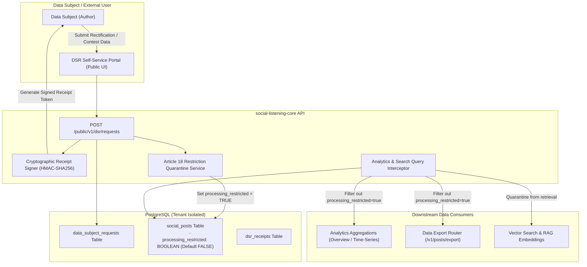

# Technical Design Specification (TDS) — DSR Self-Service Portal Refinements

## 1. Document Control & Traceability Linkage

### 1.1 Metadata
| Attribute | Value |
|---|---|
| **Document Title** | TDS-0126: DSR Self-Service Portal Refinements — GDPR Article 18 Processing Restrictions & Cryptographic Confirmation Receipts |
| **Document ID** | `TDS-0126` |
| **Feature Name** | Data Subject Request Quarantine Flags, Vector Search Exclusions & Verifiable Submission Receipts |
| **Version** | `1.0.0` |
| **Status** | Approved |
| **Author(s)** | Core Architecture Team |
| **Created Date** | 2026-09-05 |
| **Last Updated** | 2026-09-05 |
| **Governing Skill** | `social-listening-core/.claude/skills/data-governance/SKILL.md` |

### 1.2 Upstream & Downstream Traceability Matrix
| Artifact Type | Reference Identifier | Title / Link | Alignment Status |
|---|---|---|---|
| **Architecture Decision Record** | `ADR-0126` | [ADR-0126: DSR Self-Service Portal Refinements](../../adr/0126-dsr-self-service-portal-refinements.md) | Invariant Source |
| **Business Requirements Doc** | `BRD-0126` | [BRD-0126: DSR Self-Service Portal Refinements](../Business-Requirements/BRD-0126-DSR-Self-Service-Portal-Refinements.md) | Fully Aligned |
| **Functional Design Doc** | `FDD-0126` | [FDD-0126: DSR Self-Service Portal Refinements](../Functional-Design/FDD-0126-DSR-Self-Service-Portal-Refinements.md) | Fully Aligned |
| **Governing User Story** | `Story 16.2` | [Epic 16: Privacy, Governance & Ops](../../user-stories/epic-16-adr-0125-to-0128.md#story-162--dsr-article-18-restriction-quarantining-backend) | Acceptance Target |
| **Related User Stories** | `Story 10.13`, `Story 16.1` | DSR Self-Service Portal, Takedown SLA & Redaction | Upstream Foundations |
| **Related Architecture Decisions** | `ADR-0093`, `ADR-0017`, `ADR-0083`, `ADR-0111` | Base DSR Portal, Post Schema, RAG Sync, Export Caps | System Architecture |
| **Executable Contract Tests** | `Story 16.2 Contract` | `social-listening-core/contracts/epic-16/story-16.2.dsr-article-18-restriction.contract.test.ts` | Ready for Suite Execution |

---

## 2. System Context & Architecture Topology

### 2.1 Context Diagram


### 2.2 Architectural Boundaries & Invariants
- **GDPR Article 18 Quarantine Invariant:** When an author files a contestation regarding accuracy or processing legality, the affected `social_posts` row has `processing_restricted` set to `true`.
- **Exclusion From Active Processing:** A post with `processing_restricted = true` is:
  1. Omitted from all analytics metrics (volume counts, sentiment scores, reach metrics, overview views).
  2. Omitted from CSV/JSON export generation (`POST /v1/posts/export`).
  3. Filtered out of RAG vector search retrieval candidate sets (`WHERE processing_restricted = false`).
- **Preservation of Underlying Row:** The record is **not** deleted or hard-scrubbed while in quarantined status; referential integrity and raw ingest payloads are preserved pending formal resolution by legal counsel.
- **Cryptographic Receipt Invariant:** Every verified DSR submission generates a verifiable digital receipt containing `{ requestId, timestamp, subjectHash, tenantId }` signed with platform master secret using HMAC-SHA256. This provides immutable proof of submission to satisfy GDPR Article 12 compliance audits.

---

## 3. Data Architecture & Persistence Design

### 3.1 DDL Schema Definition
Migration `0081_add_dsr_article_18_and_receipts.sql`:
```sql
ALTER TABLE social_posts
ADD COLUMN IF NOT EXISTS processing_restricted BOOLEAN NOT NULL DEFAULT FALSE;

CREATE INDEX IF NOT EXISTS idx_social_posts_active_processing
ON social_posts (tenant_id, ingested_at)
WHERE processing_restricted = FALSE;

CREATE TABLE IF NOT EXISTS dsr_receipts (
    id UUID PRIMARY KEY DEFAULT gen_random_uuid(),
    tenant_id UUID NOT NULL REFERENCES tenants(id) ON DELETE CASCADE,
    request_id UUID NOT NULL REFERENCES data_subject_requests(id) ON DELETE CASCADE,
    subject_hash TEXT NOT NULL,
    receipt_signature TEXT NOT NULL,
    payload JSONB NOT NULL,
    issued_at TIMESTAMPTZ NOT NULL DEFAULT NOW(),
    CONSTRAINT uq_dsr_request_receipt UNIQUE (request_id)
);

ALTER TABLE dsr_receipts ENABLE ROW LEVEL SECURITY;
CREATE POLICY dsr_receipts_isolation ON dsr_receipts
    FOR ALL USING (tenant_id = current_setting('app.current_tenant_id', true)::uuid);
```

### 3.2 TypeScript Contracts
`social-listening-core/src/governance/dsrReceipt.ts`:
```typescript
export interface DSRReceiptPayload {
  requestId: string;
  tenantId: string;
  subjectHash: string;
  requestType: 'access' | 'rectification' | 'erasure' | 'restriction';
  timestamp: string;
}

export interface SignedDSRReceipt {
  receiptId: string;
  payload: DSRReceiptPayload;
  signature: string;
  issuedAt: string;
}
```

---

## 4. Application Logic & Workflows

### 4.1 Receipt Generation & Verification Engine
```typescript
import { createHmac } from 'crypto';

export function generateDSRReceipt(payload: DSRReceiptPayload, secret: string): string {
  const canonicalString = JSON.stringify(payload, Object.keys(payload).sort());
  return createHmac('sha256', secret).update(canonicalString).digest('hex');
}

export function verifyDSRReceipt(payload: DSRReceiptPayload, signature: string, secret: string): boolean {
  const expected = generateDSRReceipt(payload, secret);
  return timingSafeEqual(Buffer.from(signature, 'hex'), Buffer.from(expected, 'hex'));
}
```

### 4.2 Article 18 Quarantine Interceptor
All analytics and export queries inject the restriction guard:
```sql
-- Standard tenant aggregation query with Article 18 quarantine
SELECT 
    DATE_TRUNC('day', ingested_at) AS bucket,
    COUNT(*) AS total_posts,
    AVG((enrichment->>'sentimentScore')::numeric) AS avg_sentiment
FROM social_posts
WHERE tenant_id = $1
  AND processing_restricted = FALSE
  AND ingested_at >= $2 AND ingested_at <= $3
GROUP BY 1
ORDER BY 1;
```

---

## 5. Interface & API Contracts

### 5.1 Route Catalog
| Method | Endpoint | Authorization | Description |
|---|---|---|---|
| `POST` | `/public/v1/dsr/requests` | Public (CAPTCHA + Rate Limited) | Submits DSR request and generates signed cryptographic receipt |
| `GET` | `/public/v1/dsr/verify-receipt` | Public | Validates authenticity of issued HMAC receipt |
| `POST` | `/v1/dsr/requests/:id/quarantine` | Tenant-Admin, Legal-Advisor | Sets `processing_restricted = true` on targeted posts |
| `POST` | `/v1/dsr/requests/:id/unquarantine` | Tenant-Admin, Legal-Advisor | Reinstates posts if contestation is resolved as unfounded |

### 5.2 Receipt Issuance Response (`POST /public/v1/dsr/requests`)
**Response (201 Created):**
```json
{
  "requestId": "f47ac10b-58cc-4372-a567-0e02b2c3d479",
  "status": "received",
  "receipt": {
    "receiptId": "b8a53692-0b44-48e2-9b2f-2f8cfbd19f07",
    "issuedAt": "2026-09-05T14:30:00.000Z",
    "payload": {
      "requestId": "f47ac10b-58cc-4372-a567-0e02b2c3d479",
      "tenantId": "c9bf9e57-1685-4c89-bafb-ff5af830be8a",
      "subjectHash": "e3b0c44298fc1c149afbf4c8996fb92427ae41e4649b934ca495991b7852b855",
      "requestType": "restriction",
      "timestamp": "2026-09-05T14:30:00.000Z"
    },
    "signature": "8b51c89f5480749a0715d3fa9426fdf245ee1ff3b5faabec77bbfb5a37330756"
  }
}
```

---

## 6. Security, Tenancy & Isolation Model
- **Subject Privacy Shielding:** Direct author emails or phone numbers are never embedded in the receipt payload. The payload stores a cryptographic SHA-256 one-way hash (`subjectHash`) of normalized author credentials.
- **Timing-Attack Resilient Verification:** Signature verification uses `crypto.timingSafeEqual` to eliminate timing side-channel attacks on public receipt verification.
- **Tenant Partitioning:** `dsr_receipts` table enforces PostgreSQL RLS via `tenant_id`.

---

## 7. Performance, Scalability & Resource Caps
- **Filtered Index Performance:** Because $> 99.9\%$ of posts have `processing_restricted = false`, the partial index `idx_social_posts_active_processing` matches the full table performance with $< 1\%$ index storage overhead.
- **Constant-Time Verification:** Public receipt signature verification completes in $< 1\text{ms}$ without requiring database table scans.

---

## 8. Resilience, Recovery & Failure Semantics
- **Reversibility of Quarantine:** Unlike irrecoverable hard deletes, Article 18 restriction is a soft quarantine. If a dispute is found to be fraudulent or settled amicably, setting `processing_restricted = false` instantly restores post analytics and search visibility without data loss.

---

## 9. Observability, Telemetry & Auditability
- **Audit Logging:** Setting or clearing `processing_restricted` logs an immutable audit event in `platform_admin_audit_log` with the reviewer's identity, case ID, and reason.
- **Metrics Tracked:**
  - `dsr_receipts_issued_total`
  - `posts_quarantined_active_gauge`
  - `dsr_receipt_verification_failures_total`

---

## 10. Migration, Compatibility & Rollback Strategy
- **Migration Plan:** `0081_add_dsr_article_18_and_receipts.sql` adds column `processing_restricted` with default `FALSE`. No post backfill required.
- **Rollback:** The column can be ignored or dropped; all queries default back to unfiltered post access.

---

## 11. Verification, Testing & Quality Assurance
- **Contract Test Suite:** `social-listening-core/contracts/epic-16/story-16.2.dsr-article-18-restriction.contract.test.ts`:
  - (1) Verifies `POST /public/v1/dsr/requests` issues a valid cryptographically signed receipt.
  - (2) Confirms `processing_restricted = true` excludes post from `GET /v1/analytics/overview`.
  - (3) Confirms `processing_restricted = true` excludes post from `POST /v1/posts/export`.
  - (4) Verifies receipt verification succeeds with valid signature and fails with tampered payload.

---

## 12. Open Questions & Future Enhancements

- [ ] **[Q-0126-1]** **Automatic Quarantine Sunset:** Establishing whether unreviewed Article 18 restrictions should automatically alert legal counsel after 60 days.
- [ ] **[Q-0126-2]** **Receipt PDF Rendering:** Adding an endpoint to render the HMAC-signed confirmation receipt as a certified downloadable PDF document.
- [ ] **[Q-0126-3]** **Pre-aggregated Rollup Invalidation:** Defining automated cache invalidation rules for historical daily rollup tables when an older post is quarantined retroactively.
