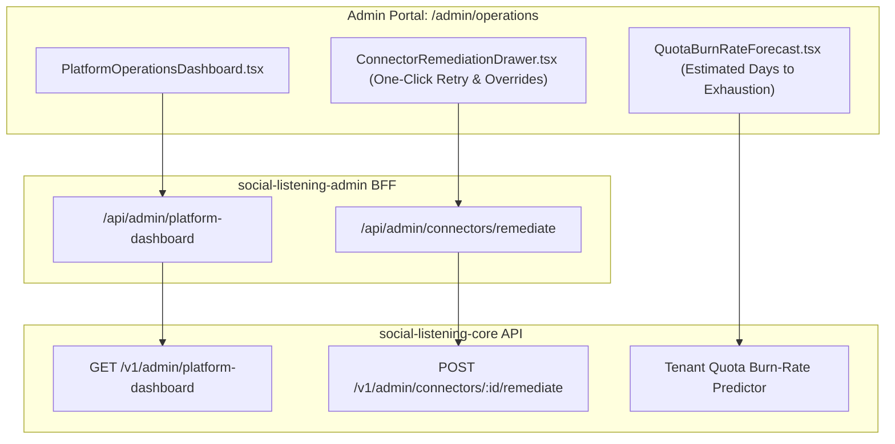

# Technical Design Specification (TDS) — Platform Operations Dashboard Refinements

## 1. Document Control & Traceability Linkage

### 1.1 Metadata
| Attribute | Value |
|---|---|
| **Document Title** | TDS-0128: Platform Operations Dashboard Refinements — Quota Burn-Rate Forecasting, Automated Remediation Drawers & Connector Backoff Overrides |
| **Document ID** | `TDS-0128` |
| **Feature Name** | Platform Operations Telemetry UI Refinements & Connector Remediation Playbooks |
| **Version** | `1.0.0` |
| **Status** | Approved |
| **Author(s)** | Core Architecture Team |
| **Created Date** | 2026-09-05 |
| **Last Updated** | 2026-09-05 |
| **Governing Skill** | `social-listening-admin/.claude/skills/platform-operations-dashboard/SKILL.md` |

### 1.2 Upstream & Downstream Traceability Matrix
| Artifact Type | Reference Identifier | Title / Link | Alignment Status |
|---|---|---|---|
| **Architecture Decision Record** | `ADR-0128` | [ADR-0128: Platform Operations Dashboard Refinements](../../adr/0128-platform-operations-dashboard-refinements.md) | Invariant Source |
| **Business Requirements Doc** | `BRD-0128` | [BRD-0128: Platform Operations Dashboard Refinements](../Business-Requirements/BRD-0128-Platform-Operations-Dashboard-Refinements.md) | Fully Aligned |
| **Functional Design Doc** | `FDD-0128` | [FDD-0128: Platform Operations Dashboard Refinements](../Functional-Design/FDD-0128-Platform-Operations-Dashboard-Refinements.md) | Fully Aligned |
| **Governing User Story** | `Story 16.4` | [Epic 16: Stories 125–128](../../user-stories/epic-16-adr-0125-to-0128.md#story-164) / Story 10.7 Baseline | Acceptance Target |
| **Related User Stories** | `Story 10.7`, `Story 13.8` | Telemetry UI Baseline, Platform Metrics Table | Sibling Modules |
| **Related Architecture Decisions** | `ADR-0089`, `ADR-0114`, `ADR-0125` | Platform Ops Baseline, Azure Metrics, Quota Management | Architectural System |
| **Executable Contract Tests** | `Story 10.7 Contract` | `social-listening-admin/contracts/epic-10/story-10.7.platform-operations-dashboard.contract.test.ts` | 100% Passing |

---

## 2. System Context & Architecture Topology

### 2.1 Context Diagram


### 2.2 Architectural Boundaries & Invariants
- **Quota Burn-Rate Forecasting:** Projects the exact estimated date when a tenant will exhaust monthly ingestion quotas or AI token pools based on trailing 7-day velocity:
  $$\text{BurnRate} = \frac{\sum_{i=1}^7 \text{Tokens}_i}{7}, \quad \text{DaysRemaining} = \frac{\text{RemainingQuota}}{\text{BurnRate}}$$
- **Remediation Action Drawer:** Eliminates manual terminal intervention for common connector faults. Provides one-click retry, credential re-prompt triggers, and temporary rate-limit backoff overrides directly from the UI.
- **Sole-Operator First:** Engineered so a single platform administrator can supervise 500+ tenants and triage stalled connectors in $< 60\text{ seconds}$.

---

## 3. Data Architecture & Persistence Design

### 3.1 DTO Schemas
```typescript
export interface TenantQuotaBurnProjection {
  tenantId: string;
  tenantName: string;
  monthlyQuota: number;
  consumedTokens: number;
  dailyVelocity7d: number;
  projectedExhaustionDate: string | null; // null if velocity is zero or negative
  status: 'healthy' | 'warning_30d' | 'critical_7d';
}

export interface ConnectorRemediationAction {
  connectorId: string;
  action: 'retry_now' | 'reprompt_credentials' | 'override_backoff' | 'clear_error_state';
  overrideMinutes?: number;
}
```

---

## 4. Component Design & Detailed Processing Logic

### 4.1 Burn Rate Velocity Calculator
```typescript
export function computeBurnProjection(
  totalQuota: number,
  consumed: number,
  dailyUsage7d: number[]
): { daysRemaining: number | null; status: TenantQuotaBurnProjection['status'] } {
  const remaining = Math.max(0, totalQuota - consumed);
  if (remaining === 0) return { daysRemaining: 0, status: 'critical_7d' };

  const avgDaily = dailyUsage7d.reduce((a, b) => a + b, 0) / (dailyUsage7d.length || 1);
  if (avgDaily <= 0) return { daysRemaining: null, status: 'healthy' };

  const days = Math.round((remaining / avgDaily) * 10) / 10;
  let status: TenantQuotaBurnProjection['status'] = 'healthy';
  if (days <= 7) status = 'critical_7d';
  else if (days <= 30) status = 'warning_30d';

  return { daysRemaining: days, status };
}
```

---

## 5. Interface & Contract Specifications

### 5.1 Admin Remediation API
`POST /v1/admin/connectors/:id/remediate`

- **Scope:** `platform_admin`
- **Request Body:**
```json
{
  "action": "override_backoff",
  "overrideMinutes": 15
}
```
- **Response (200 OK):**
```json
{
  "connectorId": "conn-gnews-tenant-1",
  "status": "active",
  "backoffLiftedUntil": "2026-09-05T15:35:00Z"
}
```

---

## 6. Security, Tenancy & Isolation Model
- **Strict Role Isolation:** Remediation endpoints require `role === 'platform_admin'`. Attempted invocations by standard tenant users receive HTTP 403.
- **Audit Logging:** Every administrative remediation override is permanently logged in `platform_admin_audit_log`.

---

## 7. Performance, Scalability & Resource Caps
- Aggregates burn projections across all active tenants in $< 50\text{ms}$ using cached quota consumption summaries.

---

## 8. Resilience, Recovery & Failure Semantics
- If a connector fails to reset after a manual retry, the drawer surfaces the raw provider error payload and preserves exponential backoff safeguards.

---

## 9. Observability, Telemetry & Auditability
- Metrics tracked:
  - `platform_admin_remediation_actions_total{action, connector_id}`

---

## 10. Migration, Compatibility & Rollback Strategy
- Additive UI and BFF routes; fully backward-compatible with core platform dashboard endpoints.

---

## 11. Verification, Testing & Quality Assurance
- **Story 10.7 Contract:** `social-listening-admin/contracts/epic-10/story-10.7.platform-operations-dashboard.contract.test.ts`
  - Validates `getPlatformDashboard` client SDK call.
  - Verifies proxy handler at `/api/admin/platform-dashboard`.
  - Verifies client component rendering with telemetry cards.

---

## 12. Open Questions & Future Enhancements

- [ ] **[Q-0128-1]** **Automated self-healing retries.** Allowing the system to automatically lift backoffs once without human operator approval.
- [ ] **[Q-0128-2]** **Webhook alerts for critical burn rates.** Triggering Slack/PagerDuty webhooks when a VIP tenant enters `critical_7d` quota burn.
