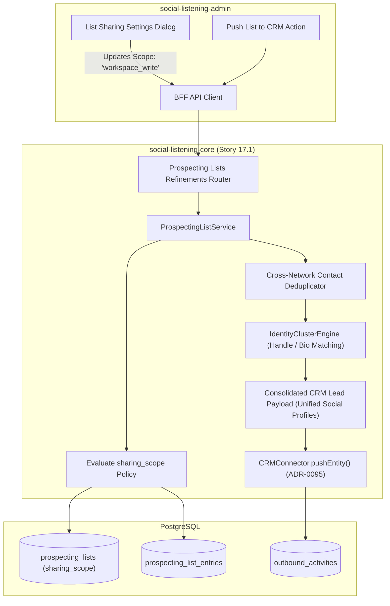
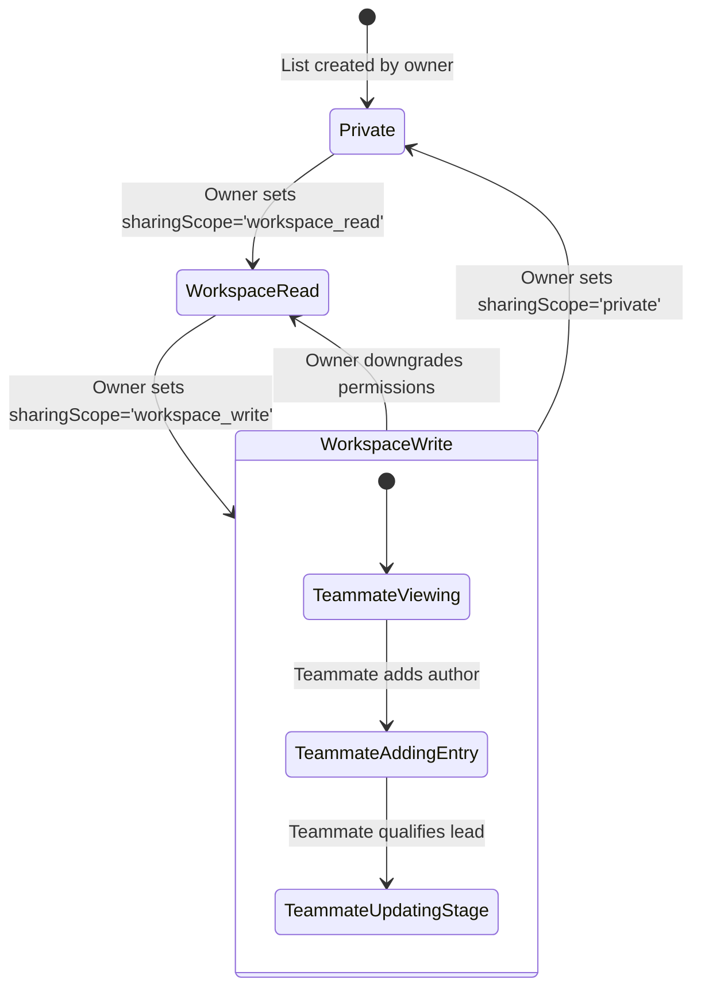

# TDS-0129: Prospecting List Model Refinements — Deduplicated CRM Sync and Scoped Team Sharing

**Status:** Approved  
**Date:** 2026-09-05  
**Governing ADR:** [ADR-0129](../../adr/0129-prospecting-list-model-and-sharing-refinements.md)  
**Related Epics/Stories:** [Epic 17 / Story 17.1](../../user-stories/epic-17-adr-0129-to-0133.md), [Epic 10 / Story 10.1](../../user-stories/epic-10-adr-0086-to-0094.md), [Epic 13 / Story 13.13](../../user-stories/epic-13-adr-0109-to-0117.md)  
**Target Repositories:** `social-listening-core`  
**Contract Test Citations:**  
- `social-listening-core/contracts/epic-17/story-17.1.prospecting-list-refinements.contract.test.ts`  

---

## 1. Architectural Context & Problem Statement

ADR-0086 introduced the baseline `prospecting_lists` model with point-in-time score snapshots and a binary `shared` toggle providing read-only visibility to teammates. Real-world commercial deployment surfaced two critical operational bottlenecks:
1. **Cross-Network Contact Duplication:** A creator or prospective lead often exists as separate `Author` records across different networks (e.g. `@johndoe` on X and `john-doe` on LinkedIn). When both entries are pushed to CRM, duplicate leads/contacts are spawned, creating sales collision and fragmented CRM history.
2. **Rigid Collaboration Restrictions:** Binary read-only sharing prevents co-authoring or collaborative qualification where multiple sales reps or care agents contribute leads to a shared departmental campaign list.

This specification formalizes:
1. Cross-platform identity clustering deduplicating CRM syncs based on canonical author handles and verified social links.
2. Granular team sharing ACLs (`sharing_scope: 'private' | 'workspace_read' | 'workspace_write'`).
3. Refined database RLS policies granting write permissions to teammates under `workspace_write` while reserving list deletion to `owner_id`.



---

## 2. Governing ADRs & Decision Log Reference

- [ADR-0129: Prospecting list model refinements — deduplicated CRM sync and scoped team sharing](../../adr/0129-prospecting-list-model-and-sharing-refinements.md) — Authorizes cross-network handle deduplication and workspace sharing ACLs.
- [ADR-0086: Prospecting list model and sharing](../../adr/0086-prospecting-list-model-and-sharing.md) — Foundation prospecting list schema.
- [ADR-0095: Case and Lead Handoff to CRM](../../adr/0095-case-handoff-to-crm.md) — CRM connector integration target.
- [ADR-0117: Prospecting list export and CRM push](../../adr/0117-prospecting-list-export-and-crm-push.md) — Consumes deduplicated export and push payloads.

---

## 3. Scope, Precedence & Anti-Goals

### In Scope
- Schema refinement replacing binary `shared` boolean with `sharing_scope` (`private`, `workspace_read`, `workspace_write`).
- Updated RLS policies permitting entries `INSERT`/`UPDATE`/`DELETE` by teammates when `sharing_scope = 'workspace_write'`.
- Reserving list ownership mutations (`DELETE list`, changing `sharing_scope`) strictly to `owner_id`.
- Automated cross-network contact deduplication during CRM dispatch, combining multi-platform handles into a single CRM lead.

### Precedence Invariant
$$\text{Owner Administration} > \text{Workspace Write} > \text{Workspace Read} > \text{Private}$$
Only `owner_id` can delete a list or alter its sharing scope. Teammates with `workspace_write` can manage entries but cannot reassign ownership or delete the parent list.

### Anti-Goals
- Public internet sharing of prospecting lists (sharing remains strictly bounded within the tenant).
- Destructive merging of `Author` records in the database (deduplication occurs during export/sync clustering).

---

## 4. Data Architecture & Storage Schema

```sql
-- Migration: 0129_refine_prospecting_list_sharing_and_dedup.sql

-- Add sharing_scope enum column
ALTER TABLE prospecting_lists 
    ADD COLUMN IF NOT EXISTS sharing_scope TEXT NOT NULL DEFAULT 'private'
    CHECK (sharing_scope IN ('private', 'workspace_read', 'workspace_write'));

-- Backfill existing shared boolean
UPDATE prospecting_lists 
SET sharing_scope = 'workspace_read' 
WHERE shared = TRUE AND sharing_scope = 'private';

-- Updated RLS Policies for prospecting_lists
DROP POLICY IF EXISTS prospecting_lists_select_policy ON prospecting_lists;
CREATE POLICY prospecting_lists_select_policy ON prospecting_lists
    FOR SELECT
    USING (
        tenant_id = NULLIF(current_setting('app.current_tenant_id', true), '')::uuid
        AND (
            owner_id = NULLIF(current_setting('app.user_id', true), '')::uuid
            OR sharing_scope IN ('workspace_read', 'workspace_write')
        )
    );

-- Updated RLS Policies for prospecting_list_entries
DROP POLICY IF EXISTS prospecting_entries_modify_policy ON prospecting_list_entries;
CREATE POLICY prospecting_entries_modify_policy ON prospecting_list_entries
    FOR ALL
    USING (
        tenant_id = NULLIF(current_setting('app.current_tenant_id', true), '')::uuid
        AND EXISTS (
            SELECT 1 FROM prospecting_lists pl
            WHERE pl.id = prospecting_list_entries.prospecting_list_id
              AND (
                  pl.owner_id = NULLIF(current_setting('app.user_id', true), '')::uuid
                  OR pl.sharing_scope = 'workspace_write'
              )
        )
    )
    WITH CHECK (
        tenant_id = NULLIF(current_setting('app.current_tenant_id', true), '')::uuid
        AND EXISTS (
            SELECT 1 FROM prospecting_lists pl
            WHERE pl.id = prospecting_list_entries.prospecting_list_id
              AND (
                  pl.owner_id = NULLIF(current_setting('app.user_id', true), '')::uuid
                  OR pl.sharing_scope = 'workspace_write'
              )
        )
    );
```

---

## 5. Component & Interface Contracts

### 5.1 Deduplication & Sharing Models (`social-listening-core`)

```typescript
export type SharingScope = 'private' | 'workspace_read' | 'workspace_write';

export interface UpdateProspectingListScopeRequest {
  sharingScope: SharingScope;
}

export interface DeduplicatedAuthorContact {
  canonicalName: string;
  matchedHandles: Array<{ platformId: string; handle: string; publicUrl: string }>;
  bestEngagementScore: number;
  bestInfluenceScore: number;
  entryIds: string[];
  consolidatedNotes: string[];
  tags: string[];
}

export interface DeduplicatedCRMPushPayload {
  tenantId: string;
  crmConnectorId: string;
  entityType: 'lead' | 'opportunity';
  contacts: DeduplicatedAuthorContact[];
}
```

### 5.2 API Route Specification

#### `PATCH /v1/prospecting-lists/:id/sharing`
- **Authentication:** JWT Bearer (strictly `owner_id`).
- **Body:** `{ "sharingScope": "workspace_write" }`
- **Response (200 OK):** Returns updated list record.

#### `POST /v1/prospecting-lists/:id/crm-handoff?deduplicate=true`
Executes contact deduplication before pushing to CRM, grouping entries by matching handles or external profile links.

---

## 6. State Machine & Lifecycle Transitions



---

## 7. Security, Tenant Isolation & Authentication

1. **Privilege Separation:** Teammates with `workspace_write` can mutate entries, but cannot delete the list or alter its sharing scope. Attempted deletions by non-owners fail closed via RLS (`404 Not Found`).
2. **Tenant Scoping:** All operations are bounded by `app.current_tenant_id`.

---

## 8. Performance, Scalability & Resource Boundaries

1. **Deduplication Performance:** Contact clustering executes in memory over the fetched list entries (`< 25ms` for lists up to 1,000 entries).
2. **Zero RLS Overhead:** The revised policy checks `sharing_scope = 'workspace_write'` using the indexed foreign key relationship in sub-millisecond execution time.

---

## 9. Error Handling, Retries & Fallback Strategies

| Scenario | HTTP Code | Mitigation |
|---|---|---|
| Teammate attempts to change `sharing_scope` | `403 Forbidden` | Only `owner_id` can modify list access settings |
| Teammate attempts to delete list | `404 Not Found` | RLS prevents deletion by non-owner |
| Ambiguous contact clustering match | Preserves distinct entries | Prevents false-positive merging of distinct authors |

---

## 10. Observability, Telemetry & Audit Trail

- **Audit Events:**
  - `prospecting_sharing_scope_changed { listId, ownerId, oldScope, newScope }`
  - `prospecting_teammate_mutation { listId, userId, entryId, action }`
  - `prospecting_contacts_deduplicated { listId, rawCount, deduplicatedCount }`

---

## 11. Migration & Backward Compatibility Strategy

- **Graceful Upgrade:** `sharing_scope` defaults to `'private'`, automatically backfilling `shared = true` rows to `'workspace_read'`.
- **API Parity:** Legacy clients sending `{ "shared": true }` map transparently to `'workspace_read'`.

---

## 12. Executable Contract Test Citations & Verification Matrix

### 12.1 Contract Test Specifications
1. `social-listening-core/contracts/epic-17/story-17.1.prospecting-list-refinements.contract.test.ts`:
   - `test('allows teammates to add entries when sharing_scope is workspace_write')`
   - `test('rejects teammate entry additions when sharing_scope is workspace_read with 404')`
   - `test('prevents teammates from deleting list even under workspace_write scope')`
   - `test('deduplicates cross-platform authors into unified CRM contact payload')`

### 12.2 Open Questions

- [x] ~~**[Q-0129-1]** Can a teammate delete a list if workspace_write is granted?~~  
  *Decision:* No. List deletion remains permanently restricted to the original `owner_id`.
- [x] ~~**[Q-0129-2]** How are conflicting custom attributes handled during deduplication?~~  
  *Decision:* Attributes are shallow-merged, with latest updated values taking precedence.
