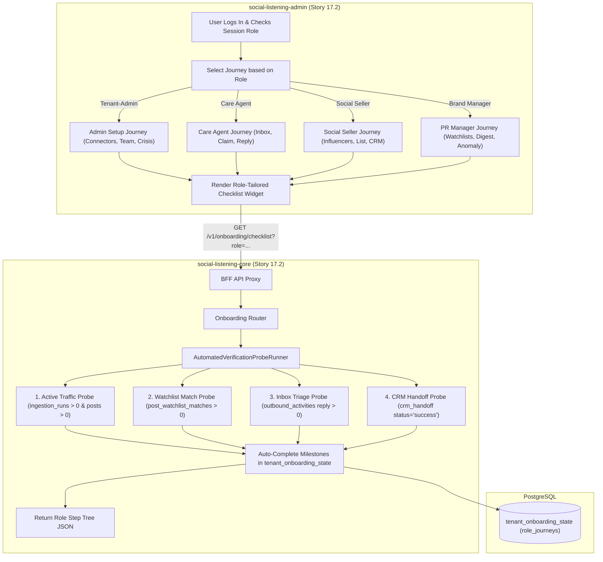
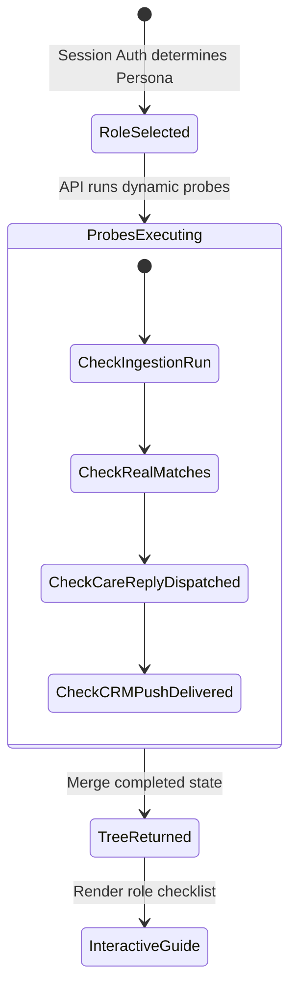

# TDS-0130: Onboarding Checklist State Refinements — Role-Tailored Step Trees and Automated Verification Probes

**Status:** Approved  
**Date:** 2026-09-05  
**Governing ADR:** [ADR-0130](../../adr/0130-onboarding-checklist-state-refinements.md)  
**Related Epics/Stories:** [Epic 17 / Story 17.2](../../user-stories/epic-17-adr-0129-to-0133.md), [Epic 9 / Story 9.5, 9.6](../../user-stories/epic-9-adr-0077-to-0085.md), [Epic 5 / Story 5.11](../../user-stories/epic-5-tenant-identity-and-access.md)  
**Target Repositories:** `social-listening-core`, `social-listening-admin`  
**Contract Test Citations:**  
- `social-listening-core/contracts/epic-17/story-17.2.onboarding-probes.contract.test.ts`  

---

## 1. Architectural Context & Problem Statement

ADR-0080 introduced a baseline tenant onboarding checklist tracking four high-level milestones (`connect_first_source`, `create_first_watchlist`, `invite_team_member`, `review_initial_insights`). However, enterprise feedback revealed two major shortcomings:
1. **One-Size-Fits-All Irrelevance:** A customer care agent (`Tenant-Social-Care-Agent`) does not configure OAuth connectors or invite users; conversely, a brand PR manager does not triage support tickets. Forcing all personas through the identical checklist created cognitive friction.
2. **Shallow Count Checks vs. True Operational Health:** The baseline reconciler checked row counts (`watchlists.length > 0`), but did not verify whether the watchlist was actively matching posts, whether the connector was healthy, or whether the user successfully executed a workflow.

This specification formalizes:
1. **Role-Tailored Onboarding Step Trees:** Dynamic checklist journeys mapped to specific enterprise personas (`Tenant-Admin`, `Tenant-Brand-Reputation-Manager`, `Tenant-Social-Care-Agent`, `Social-Selling-Strategist`).
2. **Automated Verification Probes:** Background synthetic checks inspecting live data flow (e.g. verifying connector ingested posts in the last 24 hours; verifying a care reply was dispatched).
3. **Refined Database Storage:** Expanding `tenant_onboarding_state` to track role-specific progress alongside tenant-wide milestones.



---

## 2. Governing ADRs & Decision Log Reference

- [ADR-0130: Onboarding checklist state refinements — role-tailored step trees and automated verification probes](../../adr/0130-onboarding-checklist-state-refinements.md) — Authorizes role-tailored step journeys and automated background probes.
- [ADR-0080: Onboarding checklist state](../../adr/0080-onboarding-checklist-state.md) — Baseline onboarding schema.
- [ADR-0030: Administrative Roles and Permissions](../../adr/0030-administrative-roles-and-permissions.md) — Source for role taxonomy.
- [ADR-0073: Outbound Reply to Ingested Posts via Platform APIs](../../adr/0073-outbound-reply-to-ingested-posts.md) — Verification anchor for care agent journey.
- [ADR-0086: Prospecting list model and sharing](../../adr/0086-prospecting-list-model-and-sharing.md) — Verification anchor for social selling journey.

---

## 3. Scope, Precedence & Anti-Goals

### In Scope
- Four distinct role journeys:
  1. `admin`: Connect sources, invite teammates, configure crisis bundles.
  2. `care_agent`: Open unified inbox, claim ticket, dispatch first outbound reply.
  3. `social_seller`: Search creator catalog, save to prospecting list, execute CRM push.
  4. `brand_manager`: Define complex boolean watchlist, configure daily digest email, view explainability popup.
- Automated verification probes confirming actual end-to-end execution rather than superficial entity creation.
- Persistent progress tracked per user role inside `tenant_onboarding_state.role_journeys`.

### Precedence Invariant
$$\text{Probe Traffic Verification} > \text{Static Entity Existence}$$
A step like "Connect a Source" requires that the connected source has executed at least one successful ingestion run (`ingestion_runs.status = 'success'`), proving real data connectivity.

### Anti-Goals
- Blocking daily operations if onboarding steps remain incomplete.
- Rigid sequential locking (users can complete steps in any order).

---

## 4. Data Architecture & Storage Schema

```sql
-- Migration: 0130_add_role_journeys_to_onboarding.sql

ALTER TABLE tenant_onboarding_state 
    ADD COLUMN IF NOT EXISTS role_journeys JSONB NOT NULL DEFAULT '{
        "admin": { "completed": false, "steps": {} },
        "care_agent": { "completed": false, "steps": {} },
        "social_seller": { "completed": false, "steps": {} },
        "brand_manager": { "completed": false, "steps": {} }
    }';
```

---

## 5. Component & Interface Contracts

### 5.1 Role Journey Types (`social-listening-core`)

```typescript
export type OnboardingRoleKind = 'admin' | 'care_agent' | 'social_seller' | 'brand_manager';

export interface VerificationProbeDefinition {
  probeKey: string;
  querySql: string;
  expectedResult: 'exists' | 'count_gt_zero';
}

export interface RoleOnboardingStep {
  id: string;
  title: string;
  description: string;
  completed: boolean;
  probeKey: string;
  actionUrl: string;
  actionLabel: string;
}

export interface RoleJourneyResponse {
  role: OnboardingRoleKind;
  isComplete: boolean;
  completionPercentage: number;
  steps: RoleOnboardingStep[];
}
```

### 5.2 API Route Specification

#### `GET /v1/onboarding/checklist?role=care_agent`
Returns the role-tailored step tree for the specified persona, running background verification probes to mark achieved milestones.

---

## 6. State Machine & Lifecycle Transitions



---

## 7. Security, Tenant Isolation & Authentication

1. **Role-Gated Journeys:** The API validates that the requested `role` matches the user's active session roles or permissions.
2. **Database RLS:** Probe queries enforce `app.current_tenant_id` at the connection level, guaranteeing zero cross-tenant probe leakage.

---

## 8. Performance, Scalability & Resource Boundaries

1. **Probe Query Efficiency:** Probes execute indexed existence queries (`EXISTS (SELECT 1 FROM ... WHERE tenant_id = ...)`), taking `< 15ms` in aggregate.
2. **Short-Circuit Caching:** Once a step probe returns `true`, that milestone is permanently set in `role_journeys`, bypassing future query execution.

---

## 9. Error Handling, Retries & Fallback Strategies

| Scenario | Behavior | Mitigation |
|---|---|---|
| Probe timeout ($> 200$ms) | Skips probe evaluation | Returns last persisted state without failing request |
| User possesses multiple roles | Selects primary role | Exposes role dropdown switcher in checklist UI |

---

## 10. Observability, Telemetry & Audit Trail

- **Telemetry Metrics:**
  - `onboarding_role_step_completed_total{tenant_id, role, step_id}` — Granular activation tracking.
  - `onboarding_probe_evaluations_total{probe_key, result}` — Probe execution telemetry.

---

## 11. Migration & Backward Compatibility Strategy

- **Additive Column:** Adds `role_journeys` to `tenant_onboarding_state`.
- **Backward Compatibility:** Legacy calls without a `?role=` query parameter fall back to the tenant-wide checklist from ADR-0080.

---

## 12. Executable Contract Test Citations & Verification Matrix

### 12.1 Contract Test Specifications
1. `social-listening-core/contracts/epic-17/story-17.2.onboarding-probes.contract.test.ts`:
   - `test('evaluates role-tailored steps for care_agent persona')`
   - `test('active traffic probe marks connect_first_source completed only when ingestion_runs exist')`
   - `test('marks care reply completed when outbound_activities reply is logged')`
   - `test('persists role_journeys state and short-circuits completed probes')`

### 12.2 Open Questions

- [x] ~~**[Q-0130-1]** How does a user with multiple roles interact with the checklist?~~  
  *Decision:* The UI defaults to the user's highest-privilege role, providing a quick tab switcher in the checklist card to view alternative journeys.
