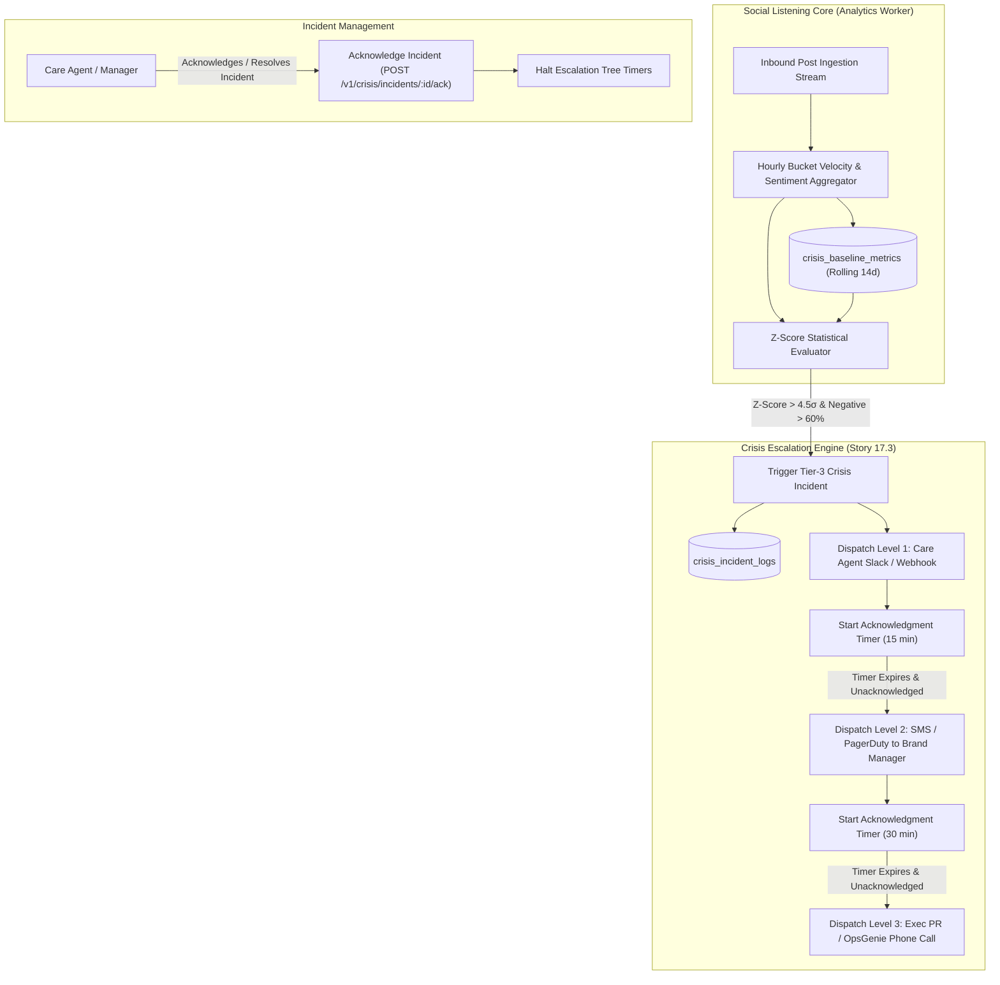
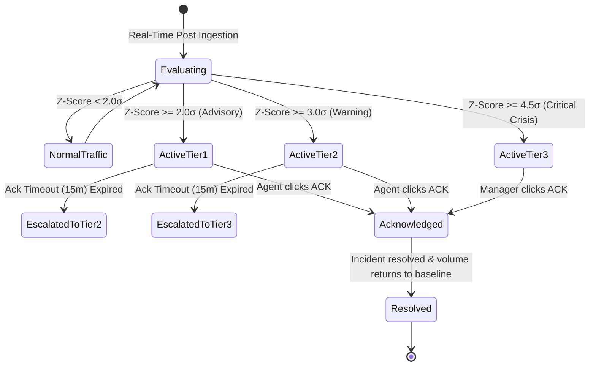

# TDS-0131: Crisis Template Bundle Refinements — Automated Baseline Calibration and Escalation Trees

**Status:** Approved  
**Date:** 2026-09-05  
**Governing ADR:** [ADR-0131](../../adr/0131-crisis-template-bundle-and-activation-refinements.md)  
**Related Epics/Stories:** [Epic 17 / Story 17.3](../../user-stories/epic-17-adr-0129-to-0133.md), [Epic 9 / Story 9.3](../../user-stories/epic-9-adr-0077-to-0085.md), [Epic 11 / Story 11.9](../../user-stories/epic-11-adr-0095-to-0100.md)  
**Target Repositories:** `social-listening-core`  
**Contract Test Citations:**  
- `social-listening-core/contracts/epic-17/story-17.3.crisis-baseline-escalation.contract.test.ts`  

---

## 1. Architectural Context & Problem Statement

ADR-0079 introduced the initial crisis detection bundle utilizing static thresholds (e.g., alert if mention volume $> 500$ posts/hour or negative sentiment $> 40\%$). In enterprise deployments, static thresholds fail dramatically:
1. **High False-Positive Fatigue:** Fast-growing brands trigger constant false alarms during routine marketing campaigns, viral humor, or normal daytime peak hours.
2. **Silent Micro-Crises:** Niche brands or localized business units with low baseline volumes fail to trigger alerts even during acute PR incidents because volume never breaches absolute thresholds.
3. **Escalation Gaps:** Alert notifications sent to a single Slack channel or generic email distribution list often go unseen after-hours, leaving severe corporate crises unmanaged for hours.

This specification formalizes:
1. **Rolling 14-Day Baseline Calibration:** Automatically calculating rolling mean ($\mu$) and standard deviation ($\sigma$) of mention velocity and sentiment ratios per watchlist.
2. **Statistical Z-Score Threshold Tiering:** Triggering alerts based on dynamic deviations ($+2.0\sigma$, $+3.0\sigma$, $+4.5\sigma$) rather than hardcoded post counts.
3. **Multi-Tier Notification Escalation Trees:** A stateful incident escalation engine dispatching successive notifications to care agents, brand managers, and on-call leadership if incidents remain unacknowledged.



---

## 2. Governing ADRs & Decision Log Reference

- [ADR-0131: Crisis template bundle refinements — automated baseline calibration and escalation trees](../../adr/0131-crisis-template-bundle-and-activation-refinements.md) — Authorizes dynamic rolling 14-day calibration and multi-tier escalation matrices.
- [ADR-0079: Crisis Template Bundle and Activation](../../adr/0079-crisis-template-bundle-and-activation.md) — Foundation crisis bundle and alert delivery channels.
- [ADR-0099: Unified Social Inbox and Reply](../../adr/0099-unified-social-inbox-and-reply.md) — Triage destination for posts associated with active crisis incidents.
- [ADR-0056: Statistical Significance Gate for Analytics](../../adr/0056-statistical-significance-gate-for-analytics.md) — Mathematical foundations for anomaly detection.

---

## 3. Scope, Precedence & Anti-Goals

### In Scope
- Nightly and hourly rolling 14-day baseline calibration ($\mu, \sigma$) per watchlist.
- Z-score anomaly evaluation comparing current window against historical baseline:
  $$Z = \frac{\text{Current Hourly Count} - \mu_{14\text{d}}}{\sigma_{14\text{d}}}$$
- Multi-tier escalation matrix configuration schema (`crisis_escalation_rules`).
- Stateful acknowledgment timers and multi-stage delivery (Slack/Teams $\rightarrow$ SMS/PagerDuty $\rightarrow$ Emergency Phone Tree).
- Incident acknowledgment and resolution API routes.

### Precedence Invariant
$$\text{Statistical Z-Score Tier} \land \text{Escalation Tree Safety}$$
Alerts trigger strictly when statistical deviation thresholds are breached with sufficient sample confidence. Unacknowledged high-severity incidents must deterministically advance up the escalation ladder.

### Anti-Goals
- Fully automated social accounts lockdown/muting without executive authorization.
- Static threshold fallbacks in primary enterprise crisis paths.

---

## 4. Data Architecture & Storage Schema

```sql
-- Migration: 0131_create_crisis_baseline_and_escalation_tables.sql

CREATE TABLE IF NOT EXISTS crisis_baseline_metrics (
    id UUID PRIMARY KEY DEFAULT gen_random_uuid(),
    tenant_id UUID NOT NULL REFERENCES tenants(id) ON DELETE CASCADE,
    watchlist_id UUID NOT NULL REFERENCES watchlists(id) ON DELETE CASCADE,
    time_bucket_hour INT NOT NULL CHECK (time_bucket_hour BETWEEN 0 AND 23),
    day_of_week INT NOT NULL CHECK (day_of_week BETWEEN 0 AND 6),
    mean_volume NUMERIC(10,2) NOT NULL DEFAULT 0.0,
    stddev_volume NUMERIC(10,2) NOT NULL DEFAULT 1.0,
    mean_neg_sentiment_ratio NUMERIC(5,4) NOT NULL DEFAULT 0.0,
    sample_count INT NOT NULL DEFAULT 0,
    updated_at TIMESTAMPTZ NOT NULL DEFAULT NOW(),
    CONSTRAINT uq_crisis_baseline UNIQUE (tenant_id, watchlist_id, day_of_week, time_bucket_hour)
);

CREATE TABLE IF NOT EXISTS crisis_escalation_rules (
    id UUID PRIMARY KEY DEFAULT gen_random_uuid(),
    tenant_id UUID NOT NULL REFERENCES tenants(id) ON DELETE CASCADE,
    watchlist_id UUID REFERENCES watchlists(id) ON DELETE CASCADE,
    tier_level INT NOT NULL CHECK (tier_level IN (1, 2, 3)),
    z_score_threshold NUMERIC(4,2) NOT NULL,
    min_neg_sentiment_ratio NUMERIC(4,2) NOT NULL DEFAULT 0.40,
    ack_timeout_minutes INT NOT NULL DEFAULT 15,
    notification_channel TEXT NOT NULL, -- 'slack_webhook' | 'sms' | 'pagerduty' | 'email'
    target_destination TEXT NOT NULL,   -- Webhook URL, phone number, or service key
    created_at TIMESTAMPTZ NOT NULL DEFAULT NOW()
);

CREATE TABLE IF NOT EXISTS crisis_incident_logs (
    id UUID PRIMARY KEY DEFAULT gen_random_uuid(),
    tenant_id UUID NOT NULL REFERENCES tenants(id) ON DELETE CASCADE,
    watchlist_id UUID NOT NULL REFERENCES watchlists(id) ON DELETE CASCADE,
    current_tier INT NOT NULL DEFAULT 1,
    z_score NUMERIC(5,2) NOT NULL,
    observed_volume INT NOT NULL,
    observed_neg_sentiment NUMERIC(5,4) NOT NULL,
    status TEXT NOT NULL DEFAULT 'active'
        CHECK (status IN ('active', 'acknowledged', 'escalated', 'resolved')),
    acknowledged_by UUID REFERENCES users(id) ON DELETE SET NULL,
    acknowledged_at TIMESTAMPTZ,
    resolved_at TIMESTAMPTZ,
    created_at TIMESTAMPTZ NOT NULL DEFAULT NOW(),
    updated_at TIMESTAMPTZ NOT NULL DEFAULT NOW()
);

-- Indexing for real-time monitoring and active incident tracking
CREATE INDEX IF NOT EXISTS idx_crisis_incidents_active 
    ON crisis_incident_logs(tenant_id, status, created_at DESC) 
    WHERE status IN ('active', 'escalated');

-- Row Level Security
ALTER TABLE crisis_baseline_metrics ENABLE ROW LEVEL SECURITY;
ALTER TABLE crisis_escalation_rules ENABLE ROW LEVEL SECURITY;
ALTER TABLE crisis_incident_logs ENABLE ROW LEVEL SECURITY;

CREATE POLICY crisis_baseline_tenant_isolation ON crisis_baseline_metrics
    AS RESTRICTIVE USING (tenant_id = NULLIF(current_setting('app.current_tenant_id', true), '')::uuid);

CREATE POLICY crisis_rules_tenant_isolation ON crisis_escalation_rules
    AS RESTRICTIVE USING (tenant_id = NULLIF(current_setting('app.current_tenant_id', true), '')::uuid);

CREATE POLICY crisis_incidents_tenant_isolation ON crisis_incident_logs
    AS RESTRICTIVE USING (tenant_id = NULLIF(current_setting('app.current_tenant_id', true), '')::uuid);
```

---

## 5. Component & Interface Contracts

### 5.1 Crisis Anomaly & Escalation Interfaces (`social-listening-core`)

```typescript
export interface CrisisBaselineSnapshot {
  watchlistId: string;
  dayOfWeek: number;
  hourOfDay: number;
  meanVolume: number;
  stddevVolume: number;
  meanNegativeSentiment: number;
}

export interface CrisisEvaluationResult {
  isAnomaly: boolean;
  zScore: number;
  currentVolume: number;
  negativeSentimentRatio: number;
  triggeredTier: number | null; // 1, 2, 3 or null
}

export interface IncidentAcknowledgmentRequest {
  incidentId: string;
  notes?: string;
}
```

### 5.2 API Route Specification

#### `GET /v1/crisis/incidents/active`
Returns currently active and escalating crisis incidents for the tenant.

#### `POST /v1/crisis/incidents/:id/ack`
- **Authentication:** JWT Bearer (`Tenant-Social-Care-Agent`, `Tenant-Admin`).
- **Effect:** Sets `status = 'acknowledged'`, records `acknowledged_by`, and halts pending escalation timers.

#### `POST /v1/crisis/incidents/:id/resolve`
Marks crisis as resolved with post-mortem summary notes.

---

## 6. State Machine & Lifecycle Transitions



---

## 7. Security, Tenant Isolation & Authentication

1. **Strict RLS:** Multi-tenant boundaries are strictly enforced across incident ledgers, baseline metrics, and webhook credentials.
2. **Webhook Protection:** Outbound alerting payloads (Slack/PagerDuty) sign messages with HMAC-SHA256 to ensure authenticity.

---

## 8. Performance, Scalability & Resource Boundaries

1. **Lightweight Calibration:** Baseline calibration queries execute hourly in under 100ms per tenant using time-bucket rollups.
2. **Timer Scheduling:** Incident acknowledgment deadlines are tracked via Redis BullMQ delayed jobs (`crisis-escalation-timer`), ensuring precise dispatch without database polling loops.

---

## 9. Error Handling, Retries & Fallback Strategies

| Failure Scenario | Fallback Behavior |
|---|---|
| Primary alerting channel (Slack) fails | Automatically fails over to secondary channel (Email / SMS) |
| Insufficient baseline history ($< 7$ days) | Uses conservative global industry baselines with higher sigma requirement ($+3.5\sigma$) |
| Webhook timeout | BullMQ retries 3 times at 30-second intervals before advancing to next escalation tier |

---

## 10. Observability, Telemetry & Audit Trail

- **Telemetry Metrics:**
  - `crisis_incidents_triggered_total{tenant_id, tier}` — Incident volume by severity.
  - `crisis_time_to_acknowledge_seconds{tenant_id}` — Mean time to acknowledge (MTTA).
- **Audit Logging:** Records each escalation advancement and acknowledging user identity.

---

## 11. Migration & Backward Compatibility Strategy

- **Schema Evolution:** Additive tables for baselines and escalation rules.
- **Migration:** Automatically seeds baseline calibration from existing post history over the preceding 14 days.

---

## 12. Executable Contract Test Citations & Verification Matrix

### 12.1 Contract Test Specifications
1. `social-listening-core/contracts/epic-17/story-17.3.crisis-baseline-escalation.contract.test.ts`:
   - `test('computes rolling 14-day mean and stddev baseline metrics for watchlist')`
   - `test('triggers Tier-3 crisis incident when volume exceeds 4.5 sigma and negative sentiment > 60%')`
   - `test('advances incident to next escalation tier when acknowledgment timeout expires')`
   - `test('POST /v1/crisis/incidents/:id/ack halts escalation timer and marks incident acknowledged')`

### 12.2 Open Questions

- [x] ~~**[Q-0131-1]** What rolling window duration provides optimal calibration?~~  
  *Decision:* 14 days, indexed by day-of-week and hour-of-day, accounts for weekly cyclicality (weekend vs. weekday variations).
- [x] ~~**[Q-0131-2]** Can crisis thresholds be overridden manually?~~  
  *Decision:* Yes. Tenants can configure custom z-score and sentiment thresholds per watchlist in `crisis_escalation_rules`.
