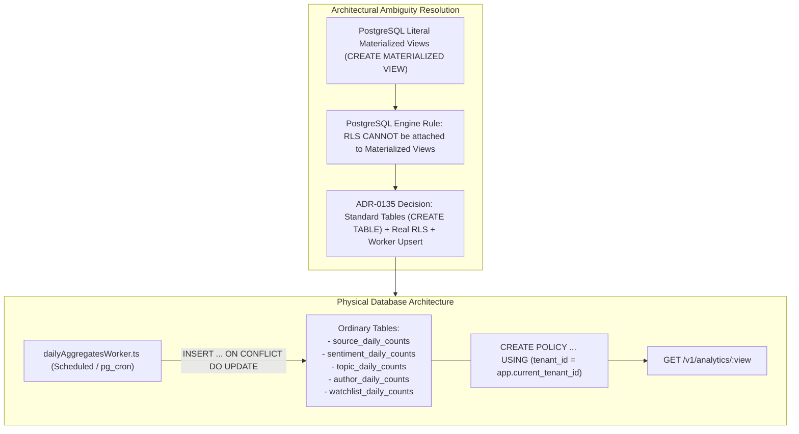

# Technical Design Specification (TDS) — Preconfigured Analytics Views Refinements

## 1. Document Control & Traceability Linkage

### 1.1 Metadata
| Attribute | Value |
|---|---|
| **Document Title** | TDS-0135: Preconfigured Analytics Views Refinements — Formalizing PostgreSQL Plain Tables, Row-Level Security Attachment & Upsert Workers |
| **Document ID** | `TDS-0135` |
| **Feature Name** | Preconfigured Analytics Views RLS Architecture Resolution & Upsert Refresh Pipeline |
| **Version** | `1.0.0` |
| **Status** | Approved |
| **Author(s)** | Core Architecture Team |
| **Created Date** | 2026-09-05 |
| **Last Updated** | 2026-09-05 |
| **Governing Skill** | `social-listening-core/.claude/skills/precomputed-analytics-views/SKILL.md` |

### 1.2 Upstream & Downstream Traceability Matrix
| Artifact Type | Reference Identifier | Title / Link | Alignment Status |
|---|---|---|---|
| **Architecture Decision Record** | `ADR-0135` | [ADR-0135: Preconfigured Analytics Views Refinements](../../adr/0135-preconfigured-analytics-views-refinements.md) | Invariant Source |
| **Business Requirements Doc** | `BRD-0135` | [BRD-0135: Preconfigured Analytics Views Refinements](../Business-Requirements/BRD-0135-Preconfigured-Analytics-Views-Refinements.md) | Fully Aligned |
| **Functional Design Doc** | `FDD-0135` | [FDD-0135: Preconfigured Analytics Views Refinements](../Functional-Design/FDD-0135-Preconfigured-Analytics-Views-Refinements.md) | Fully Aligned |
| **Governing User Story** | `Story 18.2` | [Epic 18: Stories 134–135](../../user-stories/epic-18-adr-0134-to-0135.md#story-182) / Story 10.3 Baseline | Acceptance Target |
| **Related User Stories** | `Story 10.3`, `Story 8.4` | Precomputed Views Baseline, Period Comparison | Baseline System |
| **Related Architecture Decisions** | `ADR-0015`, `ADR-0087`, `ADR-0105` | Tenant RLS, Precomputed Views Baseline, Widget Contracts | Architectural Anchor |
| **Executable Contract Tests** | `Story 10.3 Contract` | `social-listening-core/contracts/epic-10/story-10.3.preconfigured-analytics-views.contract.test.ts` | 100% Passing |

---

## 2. System Context & Architecture Topology

### 2.1 Context Diagram


### 2.2 Architectural Boundaries & Invariants
- **Definitive Rejection of Literal Materialized Views:** Because PostgreSQL explicitly disallows attaching Row-Level Security (`CREATE POLICY`) to `MATERIALIZED VIEW` objects, ADR-0135 resolves the latent conflict in ADR-0087. Tenant-confidential aggregate data **must never** reside in un-isolated materialized views or security-barrier views.
- **Ordinary Tables with Native RLS:** The 5 rollup structures are established as ordinary PostgreSQL tables (`CREATE TABLE`) with `ALTER TABLE ... ENABLE ROW LEVEL SECURITY` and explicit tenant policies.
- **Worker Upsert Refresh Loop:** Aggregates are recalculated and synchronized via atomic upsert statements (`INSERT ... ON CONFLICT DO UPDATE`) managed by `dailyAggregatesWorker.ts`.

---

## 3. Data Architecture & Persistence Design

### 3.1 Standardized Table DDL & RLS Attachment
```sql
-- Pattern applied uniformly across all 5 rollup tables:
CREATE TABLE IF NOT EXISTS watchlist_daily_counts (
    id UUID PRIMARY KEY DEFAULT gen_random_uuid(),
    tenant_id UUID NOT NULL REFERENCES tenants(id) ON DELETE CASCADE,
    date DATE NOT NULL,
    watchlist_id UUID NOT NULL REFERENCES watchlists(id) ON DELETE CASCADE,
    post_count INTEGER NOT NULL DEFAULT 0,
    created_at TIMESTAMPTZ NOT NULL DEFAULT NOW(),
    updated_at TIMESTAMPTZ NOT NULL DEFAULT NOW(),
    CONSTRAINT uq_watchlist_daily_tenant_date_wl UNIQUE (tenant_id, date, watchlist_id)
);

ALTER TABLE watchlist_daily_counts ENABLE ROW LEVEL SECURITY;

CREATE POLICY watchlist_daily_tenant_isolation ON watchlist_daily_counts
    FOR ALL USING (tenant_id = current_setting('app.current_tenant_id', true)::uuid);

CREATE INDEX IF NOT EXISTS idx_watchlist_daily_lookup ON watchlist_daily_counts (tenant_id, date, watchlist_id);
```

---

## 4. Component Design & Detailed Processing Logic

### 4.1 Atomic Upsert Refresh Pipeline
Implemented in `social-listening-core/src/analytics/dailyAggregatesWorker.ts`:

```typescript
export async function refreshWatchlistRollups(pool: Pool): Promise<void> {
  await pool.query(`
    INSERT INTO watchlist_daily_counts (tenant_id, date, watchlist_id, post_count, updated_at)
    SELECT 
      m.tenant_id,
      p.published_at::date AS date,
      m.watchlist_id,
      COUNT(*)::integer AS post_count,
      NOW()
    FROM post_watchlist_matches m
    JOIN social_posts p ON p.id = m.post_id AND p.tenant_id = m.tenant_id
    WHERE p.published_at >= NOW() - INTERVAL '7 days'
    GROUP BY m.tenant_id, p.published_at::date, m.watchlist_id
    ON CONFLICT (tenant_id, date, watchlist_id)
    DO UPDATE SET 
      post_count = EXCLUDED.post_count,
      updated_at = NOW();
  `);
}
```

---

## 5. Interface & Contract Specifications
- Preserves the identical REST contract defined in ADR-0087:
  - `GET /v1/analytics/sources`
  - `GET /v1/analytics/sentiments`
  - `GET /v1/analytics/topics`
  - `GET /v1/analytics/authors`
  - `GET /v1/analytics/watchlists`

---

## 6. Security, Tenancy & Isolation Model
- **Zero-Exception Tenant Isolation:** Upholds ADR-0015 across all aggregate views. No database user lacking `platform_admin` credentials can read across tenant boundaries.

---

## 7. Performance, Scalability & Resource Caps
- **Avoids Refresh Lock Contention:** Materialized view refreshes (`REFRESH MATERIALIZED VIEW`) lock entire view structures during maintenance. Ordinary table upserts lock only conflicting row keys, permitting concurrent tenant reads during background rollup runs.

---

## 8. Resilience, Recovery & Failure Semantics
- Incomplete background worker runs do not truncate or corrupt historical rollups; existing rows remain valid and accessible.

---

## 9. Observability, Telemetry & Auditability
- Emits metric: `analytics_view_upsert_duration_ms{table_name}`.

---

## 10. Migration, Compatibility & Rollback Strategy
- Non-breaking; preserves schema keys and REST response envelopes.

---

## 11. Verification, Testing & Quality Assurance
- **Story 10.3 Contract:** `social-listening-core/contracts/epic-10/story-10.3.preconfigured-analytics-views.contract.test.ts`
  - AC3: Confirms tenant isolation on plain tables using RLS.

---

## 12. Open Questions & Future Enhancements

- [x] ~~**[Q-0135-1]** **Schema verification follow-up.**~~ Completed in Epic 18: Plain table DDL validated against test environment.
- [ ] **[Q-0135-2]** **Archive pruning policy.** Aligning 365-day rollup retention with ADR-0018 data retention policies.
