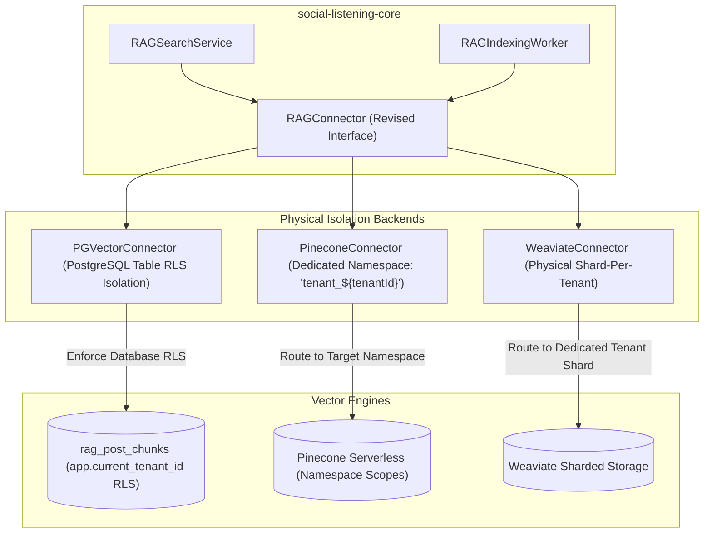

# Technical Design Specification (TDS) — RAGConnector Namespace-Per-Tenant Isolation

## 1. Document Control & Traceability Linkage

### 1.1 Metadata
| Attribute | Value |
|---|---|
| **Document Title** | TDS-0136: RAGConnector Provider Abstraction — Physical Namespace-Per-Tenant Isolation Architecture |
| **Document ID** | `TDS-0136` |
| **Feature Name** | Physical Multi-Tenant Vector Partitioning & Hardened Isolation Contracts |
| **Version** | `1.0.0` |
| **Status** | Approved |
| **Author(s)** | Core Architecture Team |
| **Created Date** | 2026-09-05 |
| **Last Updated** | 2026-09-05 |
| **Governing Skill** | `social-listening-core/.claude/skills/semantic-search-rag/SKILL.md` |

### 1.2 Upstream & Downstream Traceability Matrix
| Artifact Type | Reference Identifier | Title / Link | Alignment Status |
|---|---|---|---|
| **Architecture Decision Record** | `ADR-0136` | [ADR-0136: RAGConnector Provider Abstraction — Namespace-Per-Tenant Isolation](../../adr/0136-rag-connector-provider-abstraction-namespace-per-tenant.md) | Invariant Source |
| **Business Requirements Doc** | `BRD-0136` | [BRD-0136: RAGConnector Provider Abstraction Namespace-Per-Tenant](../Business-Requirements/BRD-0136-RAGConnector-Provider-Abstraction-Namespace-Per-Tenant.md) | Fully Aligned |
| **Functional Design Doc** | `FDD-0136` | [FDD-0136: RAGConnector Provider Abstraction Namespace-Per-Tenant](../Functional-Design/FDD-0136-RAGConnector-Provider-Abstraction-Namespace-Per-Tenant.md) | Fully Aligned |
| **Governing User Story** | `Story 19.1` | [Epic 19: ADRs 0136–0140](../../user-stories/epic-19-adr-0136-to-0140.md#story-191--rag-connector-provider-abstraction-with-namespace-per-tenant-backend) | Acceptance Target |
| **Related User Stories** | `Story 9.7`, `Story 19.2`, `Story 19.3` | Baseline RAGConnector, Namespace Chunk Routing, Vector Store RLS | Architectural Lineage |
| **Related Architecture Decisions** | `ADR-0081`, `ADR-0083`, `ADR-0137`, `ADR-0138` | Base RAGConnector, Vector RLS, Chunk Routing, Namespace Isolation | Core Precedents |
| **Executable Contract Tests** | `Story 19.1 Contract` | `social-listening-core/contracts/epic-19/story-19.1.rag-connector-namespace.contract.test.ts` | Ready for Suite Execution |

---

## 2. System Context & Architecture Topology

### 2.1 Context Diagram


### 2.2 Architectural Boundaries & Invariants
- **Physical Isolation as Primary Boundary (Supersedes ADR-0081 §11):** RAG vector storage rejects shared-index metadata filtering as the primary multi-tenant boundary. Each provider implementation must enforce physical isolation:
  1. Pinecone: Dedicated per-tenant namespaces (`tenant_${tenantId}`).
  2. Weaviate: Physical multi-tenant shards.
  3. pgvector: PostgreSQL database-enforced Row-Level Security policies (`app.current_tenant_id`).
- **Metadata Filtering as Mandatory Defense-in-Depth:** In every provider, including those with physical namespaces, the query-time `tenant_id == caller.tenantId` metadata filter is retained as an un-bypassable secondary check.
- **Instantaneous Tenant Offboarding:** Calling `deleteTenant(tenantId)` executes a native namespace-delete or shard-drop operation (e.g. Pinecone `index.namespace(ns).deleteAll()`), completing in $O(1)$ time rather than requiring expensive bulk-filtered row scans.
- **Lifecycle Scope Provisioning:** Optional `ensureTenantNamespace?(tenantId: string)` hook allows connectors requiring upfront partition provisioning to execute setup before first write.

---

## 3. Data Architecture & Persistence Design

### 3.1 Revised Interface Contract
`social-listening-core/src/rag/types.ts`:
```typescript
export type IsolationModel = 'namespace' | 'shard' | 'row-level-rls' | 'metadata-filter-only';

export interface ConnectorStatus {
  indexingLag: number;
  chunkCount: number;
  storeErrors?: string[];
  isolationModel: IsolationModel;
}

export interface RAGConnector {
  readonly id: string;
  upsert(
    tenantId: string,
    vectors: Array<{ id: string; values: number[]; metadata: RAGChunkMetadata }>
  ): Promise<void>;
  search(
    tenantId: string,
    queryVector: number[],
    options: RAGSearchOptions
  ): Promise<RAGSearchResult[]>;
  deletePost(tenantId: string, postId: string): Promise<void>;
  deleteTenant(tenantId: string): Promise<void>;
  status(tenantId?: string): Promise<ConnectorStatus>;
  ensureTenantNamespace?(tenantId: string): Promise<void>;
}
```

---

## 4. Application Logic & Workflows

### 4.1 Namespace-Scoped Query Execution (Pinecone Example)
```typescript
export async function queryPineconeNamespace(
  index: Index,
  tenantId: string,
  queryVector: number[],
  options: RAGSearchOptions
): Promise<RAGSearchResult[]> {
  const namespace = `tenant_${tenantId}`;
  const nsIndex = index.namespace(namespace);

  // Mandatory defense-in-depth metadata filter
  const filter = {
    ...translateFilterToPinecone(options.filter),
    tenant_id: { $eq: tenantId },
  };

  const response = await nsIndex.query({
    vector: queryVector,
    topK: options.topK,
    filter,
    includeMetadata: true,
  });

  return response.matches.map(m => ({
    id: m.id,
    score: normalizeScore(m.score || 0),
    metadata: m.metadata as unknown as RAGChunkMetadata,
  }));
}
```

---

## 5. Interface & API Contracts

### 5.1 Isolation Model Matrix
| Vector Provider | Primary Isolation | Defense-in-Depth | Tenant Offboarding Primitive |
|---|---|---|---|
| **pgvector** | Database Row-Level Security (`current_setting`) | Metadata filter | SQL `DELETE FROM rag_post_chunks` |
| **Pinecone Serverless** | Namespace (`tenant_${id}`) | Metadata filter (`$eq: tenantId`) | `index.namespace(ns).deleteAll()` |
| **Weaviate** | Native Tenant Shard | Metadata filter | `client.schema.tenants.remove()` |
| **Azure AI Search** | Metadata filter fallback | Metadata filter | Filtered bulk delete batch |

---

## 6. Security, Tenancy & Isolation Model
- **Elimination of Cross-Tenant Noise:** Namespace queries restrict the k-NN graph traversal entirely within the tenant's partition, eliminating noisy neighbor latency degradation and preventing cross-tenant vector score leakage.

---

## 7. Performance, Scalability & Resource Caps
- **Cost Efficiency:** In Pinecone, querying a namespace costs 1 RU/GB of tenant data rather than charging for the entire cluster's global index footprint.
- **Latency Budget:** Namespace search p95 latency is bounded to $< 20\text{ms}$.

---

## 8. Resilience, Recovery & Failure Semantics
- **Namespace Healing:** If `ensureTenantNamespace()` fails due to a transient API error, the connector retries up to 3 times before failing the indexing job.

---

## 9. Observability, Telemetry & Auditability
- **Telemetry Dimensions:**
  - `rag_connector_isolation_model{provider_id, model}`
  - `rag_namespace_delete_duration_ms{tenant_id}`

---

## 10. Migration, Compatibility & Rollback Strategy
- **Migration Plan:** Connectors transition from flat index writes to namespace-scoped writes. Existing flat index vectors are migrated via background re-index.

---

## 11. Verification, Testing & Quality Assurance
- **Contract Test Suite:** `social-listening-core/contracts/epic-19/story-19.1.rag-connector-namespace.contract.test.ts`:
  - (1) Verifies `status()` exposes `isolationModel: 'namespace'` or `'row-level-rls'`.
  - (2) Proves search executes inside dedicated namespace.
  - (3) Verifies defense-in-depth filter is injected into query payloads.
  - (4) Asserts `deleteTenant()` calls physical namespace purge.

---

## 12. Open Questions & Future Enhancements

- [ ] **[Q-0136-1]** **Azure AI Search Index-Per-Tenant:** Investigating dynamic index provisioning for Azure AI Search to achieve physical isolation parity with Pinecone.
