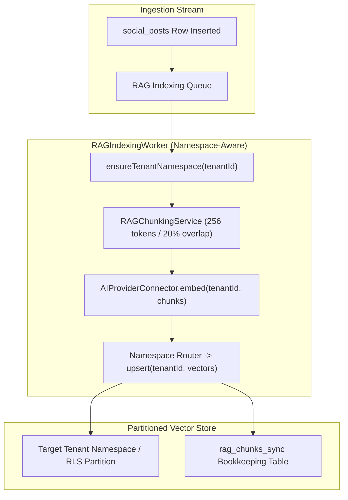

# Technical Design Specification (TDS) — RAG Post Chunking & Embedding Namespace Routing

## 1. Document Control & Traceability Linkage

### 1.1 Metadata
| Attribute | Value |
|---|---|
| **Document Title** | TDS-0137: RAG Post Chunking and Embedding — Target Namespace Routing & Partitioned Ingestion Pipeline |
| **Document ID** | `TDS-0137` |
| **Feature Name** | Partition-Aware Vector Chunking, Namespace Routing & Synchronized Deletions |
| **Version** | `1.0.0` |
| **Status** | Approved |
| **Author(s)** | Core Architecture Team |
| **Created Date** | 2026-09-05 |
| **Last Updated** | 2026-09-05 |
| **Governing Skill** | `social-listening-core/.claude/skills/semantic-search-rag/SKILL.md` |

### 1.2 Upstream & Downstream Traceability Matrix
| Artifact Type | Reference Identifier | Title / Link | Alignment Status |
|---|---|---|---|
| **Architecture Decision Record** | `ADR-0137` | [ADR-0137: RAG Post Chunking and Embedding — Namespace Routing](../../adr/0137-rag-post-chunking-and-embedding-namespace-routing.md) | Invariant Source |
| **Business Requirements Doc** | `BRD-0137` | [BRD-0137: RAG Post Chunking And Embedding Namespace Routing](../Business-Requirements/BRD-0137-RAG-Post-Chunking-And-Embedding-Namespace-Routing.md) | Fully Aligned |
| **Functional Design Doc** | `FDD-0137` | [FDD-0137: RAG Post Chunking And Embedding Namespace Routing](../Functional-Design/FDD-0137-RAG-Post-Chunking-And-Embedding-Namespace-Routing.md) | Fully Aligned |
| **Governing User Story** | `Story 19.2` | [Epic 19: ADRs 0136–0140](../../user-stories/epic-19-adr-0136-to-0140.md#story-192--rag-chunking-and-embedding-namespace-routing-backend) | Acceptance Target |
| **Related User Stories** | `Story 9.8`, `Story 19.1`, `Story 19.3` | Baseline Chunking, Namespace Interface, Vector Store RLS | Sibling Flows |
| **Related Architecture Decisions** | `ADR-0082`, `ADR-0136`, `ADR-0138` | Base Chunking, Namespace Provider, Vector Store Isolation | Core Precedents |
| **Executable Contract Tests** | `Story 19.2 Contract` | `social-listening-core/contracts/epic-19/story-19.2.rag-chunking-namespace-routing.contract.test.ts` | Ready for Suite Execution |

---

## 2. System Context & Architecture Topology

### 2.1 Context Diagram


### 2.2 Architectural Boundaries & Invariants
- **Direct Namespace Routing:** The indexing worker dispatches vector upsert batches directly into the target tenant's physical namespace (`tenant_${tenantId}`) or database partition, eliminating flat global index writes.
- **Lazy Namespace Provisioning:** Before dispatching the first vector upsert for a tenant, the worker invokes `connector.ensureTenantNamespace?(tenantId)` to guarantee physical partition readiness.
- **Namespace-Scoped Orphan Deletion:** When a post edit results in fewer chunks (`new_count < old_count`), the worker purges obsolete chunk indices specifically inside the tenant's namespace, preventing cross-tenant id collision.
- **Preserved Chunk Invariants:** Maintains all baseline chunking standards established in ADR-0082 (256-token target, 20% overlap, short post preservation $< 64$ tokens, and `Title: {title}\n\n` context prepending).

---

## 3. Data Architecture & Persistence Design

### 3.1 Synchronized Bookkeeping Update
`rag_chunks_sync` tracking table (from ADR-0082) records the active physical partition:
```sql
ALTER TABLE rag_chunks_sync
ADD COLUMN IF NOT EXISTS target_namespace TEXT;

UPDATE rag_chunks_sync
SET target_namespace = 'tenant_' || tenant_id::text
WHERE target_namespace IS NULL;
```

---

## 4. Application Logic & Workflows

### 4.1 Namespace-Aware Indexing Loop
```typescript
export async function processPostIndexingWithRouting(
  tenantId: string,
  post: SocialPost,
  chunkingService: RAGChunkingService,
  ragConnector: RAGConnector,
  client: PoolClient
): Promise<void> {
  // 1. Ensure tenant physical partition exists
  if (ragConnector.ensureTenantNamespace) {
    await ragConnector.ensureTenantNamespace(tenantId);
  }

  // 2. Segment and embed chunks
  const chunks = chunkingService.split(post);
  const embeddedChunks = await chunkingService.embed(tenantId, chunks);

  // 3. Clean up orphans within tenant partition
  const prevSync = await client.query(
    `SELECT chunk_count FROM rag_chunks_sync WHERE tenant_id = $1 AND post_id = $2`,
    [tenantId, post.id]
  );
  const oldChunkCount = prevSync.rows[0]?.chunk_count || 0;
  if (oldChunkCount > chunks.length) {
    for (let i = chunks.length; i < oldChunkCount; i++) {
      await ragConnector.deleteVector(tenantId, `${tenantId}:${post.id}:${i}`);
    }
  }

  // 4. Upsert routed to tenant namespace
  await ragConnector.upsert(tenantId, embeddedChunks);

  // 5. Update sync record
  await client.query(
    `INSERT INTO rag_chunks_sync (tenant_id, post_id, chunk_count, embedding_model, status, target_namespace, last_indexed_at)
     VALUES ($1, $2, $3, 'text-embedding-3-small', 'synced', $4, NOW())
     ON CONFLICT (tenant_id, post_id) DO UPDATE 
     SET chunk_count = EXCLUDED.chunk_count,
         status = 'synced',
         target_namespace = EXCLUDED.target_namespace,
         last_indexed_at = NOW()`,
    [tenantId, post.id, chunks.length, `tenant_${tenantId}`]
  );
}
```

---

## 5. Interface & API Contracts

### 5.1 Internal Service Methods
| Method | Input | Output | Invariant |
|---|---|---|---|
| `ensureTenantNamespace(tenantId)` | `tenantId: string` | `Promise<void>` | Idempotent physical partition provisioning |
| `upsert(tenantId, vectors)` | `tenantId`, `EmbeddedRAGChunk[]` | `Promise<void>` | Directly targeted to tenant namespace/shard |

---

## 6. Security, Tenancy & Isolation Model
- **Zero Cross-Partition Write Leaks:** The connector validates that every vector in the upsert batch matches the caller's `tenantId` prior to network transmission.

---

## 7. Performance, Scalability & Resource Caps
- **Targeted Upsert Throughput:** Partitioned writes in Pinecone / Weaviate achieve higher write concurrency because vector insertion locks are isolated per namespace/shard.

---

## 8. Resilience, Recovery & Failure Semantics
- **Re-Queue on Namespace Lock:** If namespace creation encounters an active initialization lock, the job is re-queued with 5-second backoff.

---

## 9. Observability, Telemetry & Auditability
- **Metrics Tracked:**
  - `rag_chunks_routed_total{tenant_id, namespace}`
  - `rag_namespace_provisioning_duration_ms`

---

## 10. Migration, Compatibility & Rollback Strategy
- **Compatibility:** Backward compatible with existing sync tables. Non-namespace connectors ignore the `target_namespace` parameter.

---

## 11. Verification, Testing & Quality Assurance
- **Contract Test Suite:** `social-listening-core/contracts/epic-19/story-19.2.rag-chunking-namespace-routing.contract.test.ts`:
  - (1) Proves `ensureTenantNamespace()` is invoked before initial vector write.
  - (2) Confirms vectors route directly to target namespace.
  - (3) Verifies orphan chunk deletion operates inside target namespace.

---

## 12. Open Questions & Future Enhancements

- [ ] **[Q-0137-1]** **Namespace Compaction:** Scheduling automated segment compaction for namespaces after high-volume post deletion.
