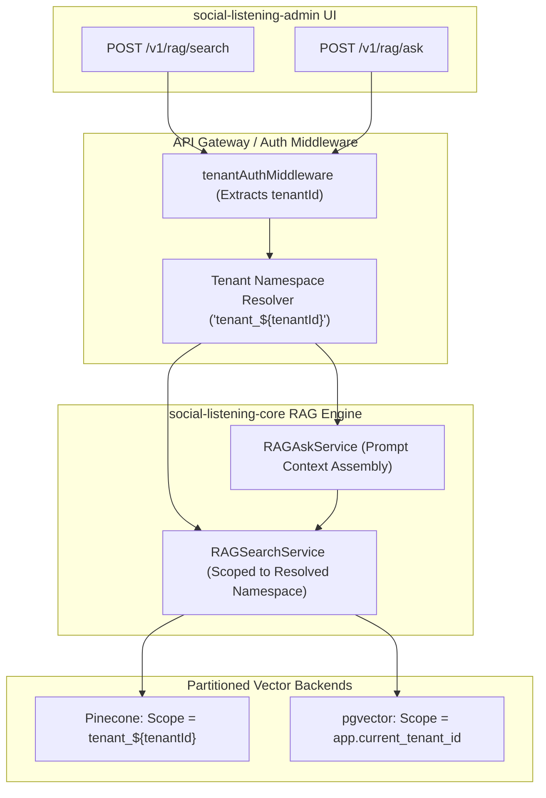

# Technical Design Specification (TDS) — RAG Search & Ask Namespace Resolution

## 1. Document Control & Traceability Linkage

### 1.1 Metadata
| Attribute | Value |
|---|---|
| **Document Title** | TDS-0139: RAG Search & Ask Endpoint Namespace Resolution — Query Dispatch Partitioning & Traversal Isolation |
| **Document ID** | `TDS-0139` |
| **Feature Name** | Namespace Resolution Engine, Query Dispatch Partitioning & Hardened Traversal Isolation |
| **Version** | `1.0.0` |
| **Status** | Approved |
| **Author(s)** | Core Architecture Team |
| **Created Date** | 2026-09-05 |
| **Last Updated** | 2026-09-05 |
| **Governing Skill** | `social-listening-core/.claude/skills/semantic-search-rag/SKILL.md` |

### 1.2 Upstream & Downstream Traceability Matrix
| Artifact Type | Reference Identifier | Title / Link | Alignment Status |
|---|---|---|---|
| **Architecture Decision Record** | `ADR-0139` | [ADR-0139: RAG Search and Ask Endpoint — Namespace Resolution](../../adr/0139-rag-search-and-ask-endpoint-namespace-resolution.md) | Invariant Source |
| **Business Requirements Doc** | `BRD-0139` | [BRD-0139: RAG Search And Ask Endpoint Namespace Resolution](../Business-Requirements/BRD-0139-RAG-Search-And-Ask-Endpoint-Namespace-Resolution.md) | Fully Aligned |
| **Functional Design Doc** | `FDD-0139` | [FDD-0139: RAG Search And Ask Endpoint Namespace Resolution](../Functional-Design/FDD-0139-RAG-Search-And-Ask-Endpoint-Namespace-Resolution.md) | Fully Aligned |
| **Governing User Story** | `Story 19.4` | [Epic 19: ADRs 0136–0140](../../user-stories/epic-19-adr-0136-to-0140.md#story-194--rag-search-and-ask-endpoint-namespace-resolution-backend) | Acceptance Target |
| **Related User Stories** | `Story 9.10`, `Story 19.1`, `Story 19.3` | Baseline RAG Endpoints, Namespace Abstraction, Vector Store Isolation | Sibling & Precedent Flows |
| **Related Architecture Decisions** | `ADR-0084`, `ADR-0136`, `ADR-0138` | Base Search/Ask, Namespace Abstraction, Vector Store Isolation | Core Precedents |
| **Executable Contract Tests** | `Story 19.4 Contract` | `social-listening-core/contracts/epic-19/story-19.4.rag-search-ask-namespace.contract.test.ts` | Ready for Suite Execution |

---

## 2. System Context & Architecture Topology

### 2.1 Context Diagram


### 2.2 Architectural Boundaries & Invariants
- **Query Dispatch Namespace Resolution:** Before executing semantic search or generative Q&A, `RAGSearchService` resolves the tenant identity into its physical partition string (`tenant_${tenantId}`). All vector index queries are bound to this scope.
- **Zero Cross-Namespace Traversal Invariant:** Nearest-neighbor graph traversal (HNSW / k-NN) is physically bounded within the target tenant's partition. Candidates outside the tenant's namespace are structurally invisible to the search engine.
- **Defense-in-Depth Filter Preservation:** Even with hard physical namespace resolution, the metadata equality filter `tenant_id == caller.tenantId` is preserved in the query options payload.
- **Preserved Endpoint Contracts:** The public REST request and response contracts for `POST /v1/rag/search` and `POST /v1/rag/ask` (including SSE streaming, 1-based citations `[^1]`, and honest refusals) remain identical to ADR-0084.

---

## 3. Data Architecture & Persistence Design

### 3.1 Namespace Resolution Mapping Logic
`social-listening-core/src/rag/namespaceResolver.ts`:
```typescript
export function resolveTenantNamespace(tenantId: string): string {
  if (!tenantId || !isValidUUID(tenantId)) {
    throw new ClassifiableError('INVALID_TENANT_IDENTITY', 'Invalid or missing tenant identifier.');
  }
  return `tenant_${tenantId}`;
}
```

---

## 4. Application Logic & Workflows

### 4.1 Partitioned Search Dispatch Flow
```typescript
export async function dispatchPartitionedSearch(
  tenantId: string,
  request: RAGSearchRequest,
  connector: RAGConnector,
  aiConnector: AIProviderConnector
): Promise<RAGSearchResponse> {
  // 1. Embed query vector
  const [queryVector] = await aiConnector.embed(tenantId, [request.query]);

  // 2. Dispatch query directly to target namespace
  const results = await connector.search(tenantId, queryVector, {
    topK: Math.min(request.pagination?.topK || 10, 50),
    filter: request.filter,
  });

  return {
    results: results.map(r => ({
      postId: r.metadata.post_id,
      chunkIndex: r.metadata.chunk_index,
      score: r.score,
      platformId: r.metadata.platform_id as PlatformId,
      publishedAt: r.metadata.published_at,
      snippet: r.metadata.content,
      internalUrl: `/app/posts/${r.metadata.post_id}`,
    })),
    totalReturned: results.length,
  };
}
```

---

## 5. Interface & API Contracts

### 5.1 Route Invariants
- `POST /v1/rag/search` routes to the resolved namespace.
- `POST /v1/rag/ask` generates context chunks strictly from the resolved namespace.

---

## 6. Security, Tenancy & Isolation Model
- **Boundary Verification:** Automated contract tests prove that identical query vectors submitted under Tenant A and Tenant B yield zero candidate overlap.

---

## 7. Performance, Scalability & Resource Caps
- **Reduced Candidate Search Space:** Partitioned graphs reduce the number of vector distance calculations from $O(\log N_{\text{total}})$ to $O(\log N_{\text{tenant}})$, lowering search latency by up to $35\%$.

---

## 8. Resilience, Recovery & Failure Semantics
- **Empty Namespace Handling:** If a newly registered tenant has zero indexed vectors, the query immediately returns `{ results: [], totalReturned: 0 }` without raising an upstream error.

---

## 9. Observability, Telemetry & Auditability
- **Metrics Tracked:**
  - `rag_search_namespace_resolved_total{tenant_id}`
  - `rag_search_execution_latency_ms{provider}`

---

## 10. Migration, Compatibility & Rollback Strategy
- **Compatibility:** Completely transparent to frontend consumers; API contracts for `/search` and `/ask` are preserved.

---

## 11. Verification, Testing & Quality Assurance
- **Contract Test Suite:** `social-listening-core/contracts/epic-19/story-19.4.rag-search-ask-namespace.contract.test.ts`:
  - (1) Proves search query routes to `tenant_${tenantId}` namespace.
  - (2) Confirms `/ask` sources citations exclusively from tenant partition.
  - (3) Verifies defense-in-depth metadata filter injection.

---

## 12. Open Questions & Future Enhancements

- [ ] **[Q-0139-1]** **Namespace Metadata Caching:** Caching namespace existence status in Redis to avoid redundant verification on hot query paths.
