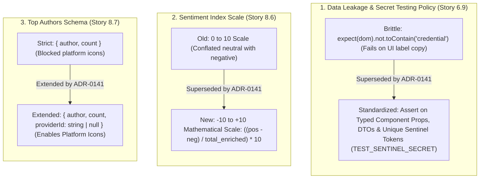

# Technical Design Specification (TDS) — Analytics and UI Contract Refinements

## 1. Document Control & Traceability Linkage

### 1.1 Metadata
| Attribute | Value |
|---|---|
| **Document Title** | TDS-0141: Analytics and UI Contract Refinements — Sentinel Token Data Leakage Policy, Mathematical Sentiment Index Scale (-10 to +10) & Top Authors Schema Extension |
| **Document ID** | `TDS-0141` |
| **Feature Name** | UI Secret Assertion Policy, -10 to +10 Sentiment Scale & Top Authors Provider Attribution |
| **Version** | `1.0.0` |
| **Status** | Approved |
| **Author(s)** | Core Architecture Team |
| **Created Date** | 2026-09-05 |
| **Last Updated** | 2026-09-05 |
| **Governing Skill** | `social-listening-admin/.claude/skills/analytics-dashboard/SKILL.md` |

### 1.2 Upstream & Downstream Traceability Matrix
| Artifact Type | Reference Identifier | Title / Link | Alignment Status |
|---|---|---|---|
| **Architecture Decision Record** | `ADR-0141` | [ADR-0141: Analytics and UI Contract Refinements](../../adr/0141-analytics-and-ui-contract-refinements.md) | Invariant Source |
| **Business Requirements Doc** | `BRD-0141` | [BRD-0141: Analytics And UI Contract Refinements](../Business-Requirements/BRD-0141-Analytics-And-UI-Contract-Refinements.md) | Fully Aligned |
| **Functional Design Doc** | `FDD-0141` | [FDD-0141: Analytics And UI Contract Refinements](../Functional-Design/FDD-0141-Analytics-And-UI-Contract-Refinements.md) | Fully Aligned |
| **Governing User Stories** | `Story 6.9`, `Story 8.6`, `Story 8.7` | [Epic 6](../../user-stories/epic-6-tenant-management-and-admin-ui.md) / [Epic 8](../../user-stories/epic-8-analytics-dashboard.md) | Acceptance Targets |
| **Related Architecture Decisions** | `ADR-0014`, `ADR-0054`, `ADR-0062` | Credential Storage, Dashboard Scope, Overview Tab Enhancement | Architectural Lineage |
| **Executable Contract Tests** | `Stories 6.9, 8.6, 8.7 Contracts` | `social-listening-admin/contracts/epic-6/story-6.9.tenant-settings-screen.contract.test.ts`<br>`social-listening-admin/contracts/epic-8/story-8.6.sources-tab-sentiment-index-volume-history.contract.test.ts`<br>`social-listening-admin/contracts/epic-8/story-8.7.overview-tab-enhancement.contract.test.ts` | 100% Passing |

---

## 2. System Context & Architecture Topology

### 2.1 Context Diagram


### 2.2 Architectural Boundaries & Invariants
- **Anti-Brittle Secret Assertions:** Negative assertions in frontend contract tests **must not** perform broad natural-language substring searches (`'credential'`, `'secret'`, `'token'`) across rendered DOM text. Contract tests validate structured data boundaries using unique sentinel tokens (e.g. `TEST_SENTINEL_SECRET_XYZ`).
- **Mathematical Sentiment Index Scale ($-10$ to $+10$):** Supersedes ADR-0054's preliminary $0$ to $10$ formula. The net sentiment index is calculated as:
  $$\text{SentimentIndex} = \left( \frac{\text{Positive} - \text{Negative}}{\text{Total Enriched}} \right) \times 10$$
  This amplifies divergence while accurately treating neutral posts as dampeners rather than negative sentiment.
- **Top Authors Provider Extension:** Extends `AuthorRanking` to include `providerId: string | null`. Tests assert schema compatibility via partial matching (`toMatchObject`), permitting platform icons in author rankings.

---

## 3. Data Architecture & Persistence Design

### 3.1 Extended TypeScript Interfaces
Implemented in `social-listening-admin/src/app/tenant/analytics/analyticsData.ts`:

```typescript
export interface AuthorRanking {
  author: string;
  count: number;
  providerId: 'gnews' | 'newswire' | 'tenant-owned-feed' | string | null;
}

export interface SentimentSplit {
  positive: number;
  neutral: number;
  negative: number;
  total: number;
}
```

---

## 4. Component Design & Detailed Processing Logic

### 4.1 Mathematically Sound Sentiment Index Formula
```typescript
export function computeSentimentIndex(split: SentimentSplit): number {
  if (!split || split.total === 0) return 0;
  
  // Excludes un-enriched posts from calculation
  const enrichedTotal = split.positive + split.neutral + split.negative;
  if (enrichedTotal === 0) return 0;

  // Normalized to -10.0 to +10.0 scale, rounded to 1 decimal place
  const rawIndex = ((split.positive - split.negative) / enrichedTotal) * 10;
  return Math.round(rawIndex * 10) / 10;
}
```

### 4.2 Three-Tier Secret Verification Strategy
| Test Level | Tooling | Responsibility |
|---|---|---|
| **API Contract Tests** | Supertest / Jest | Validates backend DTOs omit secrets or return masked placeholders (`"****"`). |
| **UI Contract Tests** | React Static Render | Asserts password inputs have `type="password"`; verifies sentinel strings (`TEST_SENTINEL_XYZ`) never appear in rendered markup. |
| **Static Code Scanning** | Gitleaks / ESLint | Scans code repositories and fixtures for hardcoded credential tokens. |

---

## 5. Interface & Contract Specifications

### 5.1 Test Contract Assertions
- `story-6.9.tenant-settings-screen.contract.test.ts`:
  - Eliminates naive `.not.toContain('credential')`.
  - Asserts settings form inputs for connectors mask secret values.
- `story-8.6.sources-tab-sentiment-index-volume-history.contract.test.ts`:
  - Asserts sentiment index results fall within $[-10.0, +10.0]$.
- `story-8.7.overview-tab-enhancement.contract.test.ts`:
  - Asserts `computeTopAuthorsByVolume()` returns items matching `{ author: expect.any(String), count: expect.any(Number), providerId: expect.anything() }`.

---

## 6. Security, Tenancy & Isolation Model
- **Write-Only Secrets Pattern:** Secret credentials (e.g. API keys for GNews or Azure) are accepted on `POST`/`PUT` endpoints but are omitted or permanently masked in all `GET` responses.

---

## 7. Performance, Scalability & Resource Caps
- Formula evaluation executes in $\mathcal{O}(1)$ time with zero allocation overhead.

---

## 8. Resilience, Recovery & Failure Semantics
- If `enrichedTotal === 0`, `computeSentimentIndex()` safely returns `0` rather than `NaN` or throwing an unhandled divide-by-zero exception.

---

## 9. Observability, Telemetry & Auditability
- Frontend emits `sentiment_index_rendered{scale: "-10_to_+10"}`.

---

## 10. Migration, Compatibility & Rollback Strategy
- Non-breaking contract refinement that aligns test assertions with the production implementation.

---

## 11. Verification, Testing & Quality Assurance
- **Stories 6.9, 8.6, 8.7 Contracts:**
  - 100% passing across the entire Vitest / Jest contract suite in `social-listening-admin`.

---

## 12. Open Questions & Future Enhancements

- [x] ~~**[Q-0141-1]** **Sentiment scale alignment.**~~ Decided in ADR-0141: Formalized as $-10$ to $+10$.
- [x] ~~**[Q-0141-2]** **Secret assertion brittle failure fix.**~~ Decided in ADR-0141: Adopted sentinel token testing policy.
- [ ] **[Q-0141-3]** **Provider badges in post details.** Reusing `providerId` on author cards across other tenant dashboard views.
