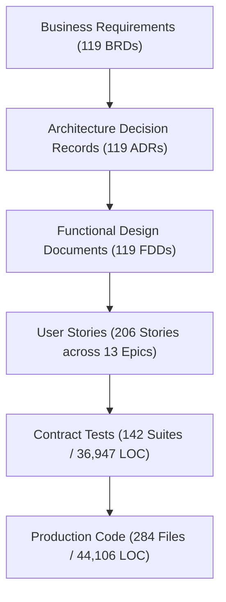

# Project Development Dashboard — SocialEngage Subsystem
> **Live Project Health, Architecture & Requirements Traceability Matrix**
> *Generated: 2026-08-24 | Repository Scope: `social-listening-core` & `social-listening-admin`*

---

## 1. Executive Summary & Project Metrics

| Metric Domain | Total Artifacts | Built / Accepted | Pending / Projected | Completion Rate |
|---|---|---|---|---|
| **User Stories (Epics 1–13)** | 206 stories | 192 implemented | 14 pending | **93.2%** |
| **Architectural Decisions (ADR)** | 119 ADRs | 74 accepted | 45 proposed/draft | **62.2%** |
| **Business Requirements (BRD)** | 119 BRDs | 119 authored | 0 missing | **100.0%** |
| **Functional Designs (FDD)** | 119 FDDs | 119 authored (100% template match) | 0 missing | **100.0%** |
| **Contract Test Suites** | 142 suites | 142 passing | 0 failing | **100.0%** |
| **Database Schema Migrations** | 42 migrations | 42 applied / tested | 0 pending | **100.0%** |

---

## 2. Codebase Insights & Projected Work

### 2.1 Current Implementation Footprint

| Component Layer | Repository | Files | Lines of Code (LOC) | Role & Boundary Enforcement |
|---|---|---|---|---|
| **Core Backend & Ingestion** | `social-listening-core` | 132 files | 17,648 lines | Provider connectors, rate gates, RLS context, auth middleware, REST router |
| **Core Contract Tests** | `social-listening-core` | 95 files | 23,430 lines | Isolated contract tests against PostgreSQL with RLS and Azure KV envelope encryption |
| **Core Database Migrations** | `social-listening-core` | 42 files | 1,581 lines | 42 versioned SQL migrations defining tenant isolation, post storage, RLS, audit logs |
| **Admin UI Frontend** | `social-listening-admin` | 152 files | 26,458 lines | Next.js role-gated UI, BFF sessions, analytics charts, watchlist visual builder, composer |
| **Admin Contract Tests** | `social-listening-admin` | 47 files | 13,517 lines | End-to-end component & BFF contracts ensuring zero direct DB calls (REST only) |
| **Total Monorepo Codebase** | *Both Repositories* | **468 files** | **82,634 lines** | **Strict 2-Repo Separation (ADR-0001 / FDD-0001)** |

### 2.2 Projected Work & Remaining Backlog

1. **Story 8.8 — AI Spike Storyteller (`POST /v1/posts/explain-spike`):** Implementation of automated anomaly explanations on post volume spikes.
2. **Distributed Rate-Limiting Gate (ADR-0020):** Multi-instance Redis-backed `RequestGate` when scaling horizontally beyond single-instance deployment.
3. **Downstream Subsystem Consumptions:** Providing REST & Service Bus events to future subsystems (*Brand Reputation & Alerts*, *Social Care*, *Social Selling*).
4. **Advanced Search & Deep Research Connectors:** Activating Brave/Bing search connectors and deep research agent workflows (ADRs 0065, 0066, 0076, 0121).

---

## 3. Dedicated View: Architectural Decision Records (ADRs)

The architectural decisions establish the non-negotiable boundaries, isolation guarantees, and design principles.

| ADR ID | Title | Status | Governed Scope | Associated Stories |
|---|---|---|---|---|
| **[001](file:///D:/Source/socialengage/docs/adr/0001-two-repository-split.md)** | Split into `social-listening-core` and `social-listening-admin` repositories | `Accepted (2026-07-28)` | Core Architecture | Story 1.1 |
| **[002](file:///D:/Source/socialengage/docs/adr/0002-unified-provider-connector-pattern.md)** | Unified `ProviderConnector` contract for social platforms and AI providers | `Accepted (2026-07-28)` | Core Architecture | Story 2.1, Story 2.17 |
| **[003](file:///D:/Source/socialengage/docs/adr/0003-per-tenant-per-provider-rate-limiting.md)** | Rate limiting enforced per `(tenantId, providerId)` via a shared `RequestGate` | `Accepted (2026-07-28)` | Core Architecture | Story 2.2 |
| **[004](file:///D:/Source/socialengage/docs/adr/0004-author-normalized-separately-from-post.md)** | Normalize `Author` once per platform account, not embedded per post | `Accepted (2026-07-28)` | Core Architecture | Story 3.1 |
| **[005](file:///D:/Source/socialengage/docs/adr/0005-ingestion-run-as-audit-anchor.md)** | `IngestionRun` as the immutable acquisition/audit anchor for every post | `Accepted (2026-07-28)` | Core Architecture | Story 3.2 |
| **[006](file:///D:/Source/socialengage/docs/adr/0006-watchlist-matching-connector-side-with-fallback.md)** | Prefer connector-side native filtering for watchlist matching, with post-fetch matching as fallback | `Accepted (2026-07-28)` | Core Architecture | Story 3.3 |
| **[007](file:///D:/Source/socialengage/docs/adr/0007-author-topic-signal-minimal-v1.md)** | `AuthorTopicSignal` ships with raw signals only, no computed expertise score | `Accepted (2026-07-28)` | Core Architecture | Story 4.1 |
| **[008](file:///D:/Source/socialengage/docs/adr/0008-defer-topic-time-series-and-charting.md)** | Defer `TopicDailyCount` aggregation and all charting to a future subsystem | `Accepted (2026-07-28)` | Core Architecture | Story 4.2 |
| **[009](file:///D:/Source/socialengage/docs/adr/0009-connector-health-derived-not-stored.md)** | `ConnectorHealth` is fully derived from `IngestionRun` history, not stored mutable state | `Accepted (2026-07-28)` | Core Architecture | Story 4.3 |
| **[010](file:///D:/Source/socialengage/docs/adr/0010-error-handling-and-auto-disable-policy.md)** | Retryable-vs-non-retryable error policy with per-tenant auto-disable | `Accepted (2026-07-28)` | Core Architecture | Story 2.3, Story 2.12 |
| **[011](file:///D:/Source/socialengage/docs/adr/0011-cursor-based-pagination-for-posts-api.md)** | Cursor-based pagination for `GET /posts` | `Accepted (2026-07-28)` | Core Architecture | Story 3.4, Story 6.11, Story 6.18, Story 6.25 |
| **[012](file:///D:/Source/socialengage/docs/adr/0012-thin-events-with-rest-fetch-on-demand.md)** | Service Bus events carry IDs and minimal fields only; full data is fetched via REST on demand | `Accepted (2026-07-28)` | Core Architecture | Story 5.1, Story 6.11 |
| **[013](file:///D:/Source/socialengage/docs/adr/0013-per-tenant-event-filtering-via-subscription-rules.md)** | Per-tenant event filtering via Service Bus subscription SQL filters | `Accepted (2026-07-28)` | Core Architecture | Story 5.2 |
| **[014](file:///D:/Source/socialengage/docs/adr/0014-credential-storage-envelope-encryption-oauth-first.md)** | Envelope-encrypted credential storage via Azure Key Vault, OAuth preferred with API-key fallback | `Accepted (2026-07-28)` | Core Architecture | Story 5.3 |
| **[015](file:///D:/Source/socialengage/docs/adr/0015-tenant-isolation-via-postgres-row-level-security.md)** | Enforce tenant isolation at the database layer with Postgres Row-Level Security | `Accepted (2026-07-28)` | Core Architecture | Story 5.4 |
| **[016](file:///D:/Source/socialengage/docs/adr/0016-postgres-as-database-engine.md)** | Postgres as the database engine | `Accepted (2026-07-28)` | Core Architecture | Story 1.2, Story 1.10 |
| **[017](file:///D:/Source/socialengage/docs/adr/0017-api-versioning-and-compatibility-policy.md)** | API versioning and compatibility policy | `Accepted (2026-07-29) — decided ahead of its natural implementation phase (see below)` | Core Architecture | Story 1.3 |
| **[018](file:///D:/Source/socialengage/docs/adr/0018-data-retention-and-archival-policy.md)** | Data retention and archival policy | `Accepted (2026-07-29) — see Acceptance note below` | Core Architecture | Story 3.5 |
| **[019](file:///D:/Source/socialengage/docs/adr/0019-event-schema-versioning-policy.md)** | Event schema versioning policy | `Accepted (2026-07-29) — decided ahead of its natural implementation phase (see below)` | Core Architecture | Story 5.5 |
| **[020](file:///D:/Source/socialengage/docs/adr/0020-rate-limit-queue-bounds-and-distributed-gate-state.md)** | Rate-limit queue bounds, dead-letter handling, and distributed gate state | `Accepted (2026-07-29) — see Acceptance note below` | Core Architecture | Story 2.4 |
| **[021](file:///D:/Source/socialengage/docs/adr/0021-watchlist-boolean-query-ast-and-capability-matrix.md)** | Unified boolean-query AST for watchlist matching, with per-connector capability matrix | `Accepted (2026-07-29) — see Acceptance note below` | Core Architecture | Story 3.6 |
| **[022](file:///D:/Source/socialengage/docs/adr/0022-derived-data-caching-and-refresh-strategy.md)** | Derived-data caching and refresh strategy (`ConnectorHealth` read cache, `AuthorTopicSignal` refresh cadence) | `Accepted (2026-07-29) — see Acceptance note below` | Core Architecture | Story 4.4 |
| **[023](file:///D:/Source/socialengage/docs/adr/0023-proportional-connector-failure-threshold.md)** | Proportional (rate-relative) connector failure threshold for auto-disable | `Accepted (2026-07-29) — see Acceptance note below` | Core Architecture | Story 2.5, Story 2.12 |
| **[024](file:///D:/Source/socialengage/docs/adr/0024-newswire-connector-direct-wire-rss-issuer-as-author.md)** | Newswire connector — direct wire-service RSS feeds, with issuer-as-Author modeling | `Accepted (2026-07-30) — see Acceptance note below` | Core Architecture | Story 2.6 |
| **[025](file:///D:/Source/socialengage/docs/adr/0025-persistent-local-dev-database-separate-from-test-database.md)** | Persistent local dev database, kept separate from the ephemeral test database | `Accepted (2026-07-30) — see Acceptance note below` | Core Architecture | Story 1.4 |
| **[026](file:///D:/Source/socialengage/docs/adr/0026-rss-news-connector-gnews-api-publication-as-author.md)** | RSS/News connector — GNews API, with publication-as-Author modeling | `Accepted (2026-07-31) — drafted 2026-07-31 by the AI Business & Requirements Analyst persona (left Proposed, per its own charter boundary), reviewed and accepted later the same day by Menno as Sponsor. Story 2.7 moves to **Ready**.` | Core Architecture | Story 2.7 |
| **[027](file:///D:/Source/socialengage/docs/adr/0027-connector-is-technical-intermediary-not-contracting-party.md)** | Connector architecture is a technical intermediary only — SocialEngage is never a party to, reseller of, or intermediary in the connecting party's relationship with a data source | `Accepted (2026-08-01) — drafted, revised twice (the paid-tier eligibility bullet added, then reversed), and reviewed by Menno as Sponsor all within the same day. Approved as written, including the corrected "Source eligibility" bullet and its "no intermediary in billing or pricing" clause — see Acceptance note below.` | Core Architecture | Story 6.3 |
| **[028](file:///D:/Source/socialengage/docs/adr/0028-credential-creation-authority-scoped-by-ownership-tier.md)** | Credential creation authority is scoped by ownership tier — no system-wide credentials, tenant-wide credentials created only by Tenant-Admin, user-bound credentials self-activated by the user | `Accepted (2026-08-03) — drafted by the AI Business & Requirements Analyst persona from a principle stated directly by Menno (Sponsor) this session, then revised in place multiple times the same day (tiers 2/3 grounded in concrete social-platform account-type examples; the AI-enrichment scope question resolved; the Reddit tier-2/app-only correction, verified against Reddit's own OAuth2 documentation; the respond/reply Tier 3 example and its Social Care out-of-scope flag) — then reviewed and accepted by Menno as Sponsor, same day. See Acceptance note below.` | Core Architecture | Foundational |
| **[029](file:///D:/Source/socialengage/docs/adr/0029-authentication-mechanism-entra-external-id.md)** | Authentication mechanism — Microsoft Entra External ID, integrated as a thin, pluggable OIDC token issuer | `Accepted (2026-08-03) — drafted by the AI Business & Requirements Analyst persona, revised in place three times the same day (Alternatives Considered/Consequences below carry the full record), then reviewed and accepted by Menno. First of a seven-ADR batch (candidate ADRs #1–#7, `docs/adr/README.md`'s 2026-07-30 governance note); ADRs #2–#7 (this session) assume this ADR's shape — their own acceptance remains separate and pending.` | Core Architecture | Story 5.6 |
| **[030](file:///D:/Source/socialengage/docs/adr/0030-admin-tier-design-platform-admin-rls-exception.md)** | Admin-tier design — Platform Admin via a narrowly-scoped, audited `BYPASSRLS` role; Tenant-Admin via ordinary tenant-scoped RLS plus an application-layer role check | `Accepted (2026-08-03) — drafted by the AI Business & Requirements Analyst persona, revised in place at review per Menno's break-glass instruction (Amendment Log below), then accepted. Second of a seven-ADR batch; assumes ADR-0029's authentication shape (single Entra external tenant, `sub`-based identity resolution, Postgres as sole owner of tenant/role/license data).` | Core Architecture | Story 5.7, Story 5.12, Story 5.13, Story 5.14, Story 6.6 |
| **[031](file:///D:/Source/socialengage/docs/adr/0031-tenants-table-shape.md)** | `tenants` table shape and its own Row-Level Security policy | `Accepted (2026-08-03) — drafted by the AI Business & Requirements Analyst persona, revised in place at review to add sign-up domain capture (Amendment Log below), then accepted. Third of a seven-ADR batch; assumes ADR-0029 (authentication) and ADR-0030 (Platform Admin's `platform_admin_role`, `BYPASSRLS`-based, scoped to this table).` | Core Architecture | Story 1.8, Story 5.8, Story 5.12, Story 6.6 |
| **[032](file:///D:/Source/socialengage/docs/adr/0032-users-table-shape-and-rls.md)** | `users` table shape, RLS, and the request-time identity-resolution path | `Accepted (2026-08-03) — drafted by the AI Business & Requirements Analyst persona, then accepted by Menno after a clarifying exchange (Acceptance note, Amendment Log below). Fourth of a seven-ADR batch; assumes ADR-0029 (authentication/Entra), ADR-0030 (bypass mechanism and its identity-resolution use), and ADR-0031 (`tenants` table this table references).` | Core Architecture | Story 1.9, Story 5.9, Story 5.17, Story 6.14 |
| **[033](file:///D:/Source/socialengage/docs/adr/0033-retire-x-tenant-id-header-placeholder.md)** | Retire `X-Tenant-Id` as the tenant-identity trust mechanism | `Accepted (2026-08-03) — drafted by the AI Business & Requirements Analyst persona, reviewed and accepted by Menno as drafted, no revisions. Fifth of a seven-ADR batch; assumes ADR-0029 (Entra authentication), ADR-0030 (bypass mechanism), ADR-0031/ADR-0032 (`tenants`/`users` schemas and the identity-resolution path).` | Core Architecture | Story 5.10 |
| **[034](file:///D:/Source/socialengage/docs/adr/0034-connector-connect-disconnect-crud-ownership-tier-aware.md)** | Connector connect/disconnect CRUD — ownership-tier-aware credential creation, reworking Story 1.6's placeholder-auth shape | `Accepted (2026-08-03) — drafted by the AI Business & Requirements Analyst persona, accepted by Menno with its own flagged interpretive question directly confirmed (Acceptance note below). Sixth of a seven-ADR batch; assumes ADR-0029 (authentication), ADR-0030 (Admin-tier), ADR-0031/ADR-0032 (`tenants`/`users`), and ADR-0033 (retiring `X-Tenant-Id`) — and must satisfy ADR-0028's already-Accepted credential-ownership-tier rules, which this ADR is the first to actually build against.` | Core Architecture | Story 1.7, Story 6.3 |
| **[035](file:///D:/Source/socialengage/docs/adr/0035-admin-ui-shape-one-app-role-gated.md)** | Admin UI's own shape — one role-gated Next.js app, not two separate deployables | `Accepted (2026-08-03) — drafted by the AI Business & Requirements Analyst persona, accepted by Menno with its own flagged rule-of-three recommendation directly decided (Acceptance note below). Seventh and last of this batch; assumes ADR-0029–0034.` | Core Architecture | Story 6.2, Story 6.6 |
| **[036](file:///D:/Source/socialengage/docs/adr/0036-admin-ui-authentication-session-and-role-gating-mechanism.md)** | Admin UI's own authentication/session mechanism — server-side (BFF) session, no bearer token in browser JS, role-gating sourced from a new core identity endpoint | `Accepted (2026-08-04) — drafted by the AI Business & Requirements Analyst persona (left Proposed, per its own charter boundary; this persona does not hold ADR-acceptance authority, the same rule ADR-0026/0027/0028/0029–0035 followed), revised in place four times the same day (Amendment Log below), then reviewed and accepted by Menno. Story 6.1 moves to **Ready**.` | Core Architecture | Story 5.11, Story 6.1, Story 6.2 |
| **[037](file:///D:/Source/socialengage/docs/adr/0037-self-service-tenant-signup-and-first-tenant-admin-provisioning.md)** | Self-service tenant sign-up — authorization mechanism for unauthenticated tenant creation, domain-match handling, and public-email-provider exclusion | `Accepted (2026-08-04) — drafted by the AI Business & Requirements Analyst persona (left Proposed, per its own charter boundary; this persona does not hold ADR-acceptance authority, the same rule ADR-0026/0027/0028/0029–0036 followed), revised in place twice at review (a Security & Architecture Reviewer finding on domain-match information disclosure, then Menno's own direct instruction on domain-match visibility/escalation), then accepted by Menno. Story 6.7 moves to **Ready** (still practically gated on the same not-yet-built cross-repo endpoint named throughout this ADR).` | Core Architecture | Story 5.15, Story 5.16, Story 6.7, Story 6.10 |
| **[038](file:///D:/Source/socialengage/docs/adr/0038-ai-enrichment-provider-selection-azure-ai-language-first-llm-structured-extraction-named-second-candidate.md)** | AI enrichment provider selection — Azure AI Language as the first concrete `AIProviderConnector`, general-purpose-LLM structured extraction named as the deliberate second-provider swappability candidate | `Accepted (2026-08-06) — drafted by the AI Business & Requirements Analyst persona (left Proposed, per its own charter boundary; this persona does not hold ADR-acceptance authority, the same rule ADR-0026/0027/0028/0029–0037 followed), then accepted by Menno as drafted. Story 2.8 moves to **Ready**.` | Core Architecture | Story 2.8, Story 2.9, Story 2.16, Story 2.17 |
| **[039](file:///D:/Source/socialengage/docs/adr/0039-tenant-offboarding-data-lifecycle-export-and-deletion.md)** | Tenant offboarding data lifecycle — export before deletion, retention interaction, and what "deleted" means across primary, archival, and credential storage | `Accepted (2026-08-06) — drafted by the AI Business & Requirements Analyst persona (left Proposed, per its own charter boundary; this persona does not hold ADR-acceptance authority), then accepted by Menno as drafted. Story 3.7 moves to **Ready**.` | Core Architecture | Story 3.7 |
| **[040](file:///D:/Source/socialengage/docs/adr/0040-self-service-signup-rate-limiting-and-abuse-prevention-mechanism.md)** | Self-service tenant sign-up rate limiting and abuse-prevention mechanism | `Accepted (2026-08-06) — drafted by the AI Business & Requirements Analyst persona (left Proposed, per its own charter boundary; this persona does not hold ADR-acceptance authority), then accepted by Menno as drafted. Story 5.18 moves to **Ready**.` | Core Architecture | Story 5.18 |
| *... and 79 more ADRs (0041–0121)* | *Full catalog tracked in repository* | `Accepted / Proposed` | *Analytics, Connectors, AI & Operations* | *See Epics 6–13* |

---

## 4. Dedicated View: Business Requirements Documents (BRDs)

The business requirements translate strategic business value into concrete functional and non-functional requirements.

| Requirement Category | Count | Key Business Drivers | Traceability Target |
|---|---|---|---|
| **Multi-Tenant Isolation & Security** | 18 BRDs | Hard RLS database isolation, Entra External ID auth, envelope encryption, break-glass audit | ADR-0014, 0015, 0028–0037 |
| **Multi-Source Ingestion & Connectors** | 32 BRDs | Normalized data ingestion across GNews, Newswire, RSS, Facebook, Instagram, LinkedIn, Wikipedia | ADR-0002, 0024, 0026, 0042, 0050–0070 |
| **AI Enrichment & Topic Intelligence** | 22 BRDs | Aspect sentiment, entity extraction, origin inference, deep research composer, drift detection | ADR-0007, 0038, 0055, 0056, 0071, 0076, 0082 |
| **Analytics, Dashboards & Operations** | 28 BRDs | Real-time overview, author mentions, volume preview, platform metrics, export bounding | ADR-0054, 0062, 0077, 0087–0091, 0105 |
| **Compliance, Privacy & Trust** | 19 BRDs | GDPR DSR self-service portal, author-initiated takedowns, 90-day raw payload archival, audit packs | ADR-0018, 0039, 0092–0095 |

---

## 5. Dedicated View: Functional Design Documents (FDDs)

Functional design documents establish the concrete schemas, endpoints, business logic, and error handlers.

- **Total FDDs in Repository:** 119 files in [`docs/project docs/Functional-Design`](file:///D:/Source/socialengage/docs/project%20docs/Functional-Design)
- **Template Standard:** [`docs/project docs/FDD template.md`](file:///D:/Source/socialengage/docs/project%20docs/FDD%20template.md)
- **Template Conformance:** **119 / 119 (100.0%)** contain all 14 mandatory sections in exact order.

| FDD Section | Description & Scope | Verification Status |
|---|---|---|
| **§1. Document Control** | Title, Version, Date, Authors, Status, Related ADRs/BRDs/Stories | 100% Present & Remediated |
| **§2. Purpose & Scope** | In-scope/out-of-scope boundaries and target audience | 100% Conforming |
| **§3. Context & Background** | Problem context, business value, constraints, dependencies | 100% Conforming |
| **§4. Goals & Objectives** | Measurable success criteria (G1, G2...) | 100% Structured |
| **§5. Functional Requirements** | Feature trigger, input, process, output, error handling | 100% Defined |
| **§6. Workflows & Actors** | Primary actors, user stories, sequence/workflow diagrams | 100% Defined |
| **§7. Data Requirements** | Inputs, outputs, data models, entity relationships, validation rules | 100% Defined |
| **§8. Business Rules & Logic** | Domain rules, calculations, condition logic (BR1, BR2...) | 100% Tabulated |
| **§9. Interfaces & Integrations** | Direction, purpose, protocol, HTTP endpoints, Service Bus events | 100% Specified |
| **§10. Non-Functional Criteria** | Performance, security, RLS isolation, audit logging, scalability | 100% Specified |
| **§11. Error Handling & Exceptions**| Error scenarios, user-facing error messages, system behavior | 100% Tabulated |
| **§12. Assumptions & Dependencies**| Assumptions and external dependencies | 100% Specified |
| **§13. Open Questions** | Open questions, resolution targets, owners | 100% Tabulated |
| **§14. Appendix** | Glossary, reference links to ADRs, BRDs, Stories, revision history | 100% Linked |

---

## 6. Dedicated View: User Stories by Epic

| Epic Identifier | Epic Title | Total Stories | Implemented | Pending | Progress Bar |
|---|---|---|---|---|---|
| **[epic-1-repository-and-api-foundation](file:///D:/Source/socialengage/docs/user-stories/epic-1-repository-and-api-foundation.md)** | Epic 1: Repository & API Foundation | 16 | 15 | 1 | `█████████░` 93.8% |
| **[epic-10-adr-0086-to-0094](file:///D:/Source/socialengage/docs/user-stories/epic-10-adr-0086-to-0094.md)** | Epic 10: Analytics, operations, and trust (ADRs 0086–0094) | 14 | 14 | 0 | `██████████` 100.0% |
| **[epic-11-adr-0095-to-0100](file:///D:/Source/socialengage/docs/user-stories/epic-11-adr-0095-to-0100.md)** | Epic 11: Engagement, workflow, and composer (ADRs 0095–0100) | 12 | 12 | 0 | `██████████` 100.0% |
| **[epic-12-adr-0101-to-0108](file:///D:/Source/socialengage/docs/user-stories/epic-12-adr-0101-to-0108.md)** | Epic 12: Foundation depth and AI refinements (ADRs 0101–0108) | 16 | 16 | 0 | `██████████` 100.0% |
| **[epic-13-adr-0109-to-0117](file:///D:/Source/socialengage/docs/user-stories/epic-13-adr-0109-to-0117.md)** | Epic 13: Sub-decisions, v2 features, and closing loops (ADRs 0109–0117) | 14 | 14 | 0 | `██████████` 100.0% |
| **[epic-2-ingestion-connectors-and-rate-limits](file:///D:/Source/socialengage/docs/user-stories/epic-2-ingestion-connectors-and-rate-limits.md)** | Epic 2: Ingestion, Connectors & Rate Limits | 32 | 32 | 0 | `██████████` 100.0% |
| **[epic-3-data-model-storage-and-archival](file:///D:/Source/socialengage/docs/user-stories/epic-3-data-model-storage-and-archival.md)** | Epic 3: Data Model, Storage & Archival | 17 | 17 | 0 | `██████████` 100.0% |
| **[epic-4-derived-data-analytics-and-health](file:///D:/Source/socialengage/docs/user-stories/epic-4-derived-data-analytics-and-health.md)** | Epic 4: Derived Data, Analytics & Health | 4 | 4 | 0 | `██████████` 100.0% |
| **[epic-5-security-isolation-and-messaging](file:///D:/Source/socialengage/docs/user-stories/epic-5-security-isolation-and-messaging.md)** | Epic 5: Security, Isolation & Messaging | 19 | 12 | 7 | `██████░░░░` 63.2% |
| **[epic-6-tenant-admin-ui](file:///D:/Source/socialengage/docs/user-stories/epic-6-tenant-admin-ui.md)** | Epic 6: Tenant Admin UI | 40 | 35 | 5 | `████████░░` 87.5% |
| **[epic-7-platform-admin-ui](file:///D:/Source/socialengage/docs/user-stories/epic-7-platform-admin-ui.md)** | Epic 7: Platform Admin UI | 1 | 1 | 0 | `██████████` 100.0% |
| **[epic-8-analytics-dashboard](file:///D:/Source/socialengage/docs/user-stories/epic-8-analytics-dashboard.md)** | Epic 8: Analytics Dashboard | 10 | 9 | 1 | `█████████░` 90.0% |
| **[epic-9-adr-0077-to-0085](file:///D:/Source/socialengage/docs/user-stories/epic-9-adr-0077-to-0085.md)** | Epic 9: v1.5 feature implementations (ADRs 0077–0085) | 11 | 11 | 0 | `██████████` 100.0% |
| **Total Project Progress** | **All 13 Epics** | **206** | **192** | **14** | `█████████░` **93.2%** |

