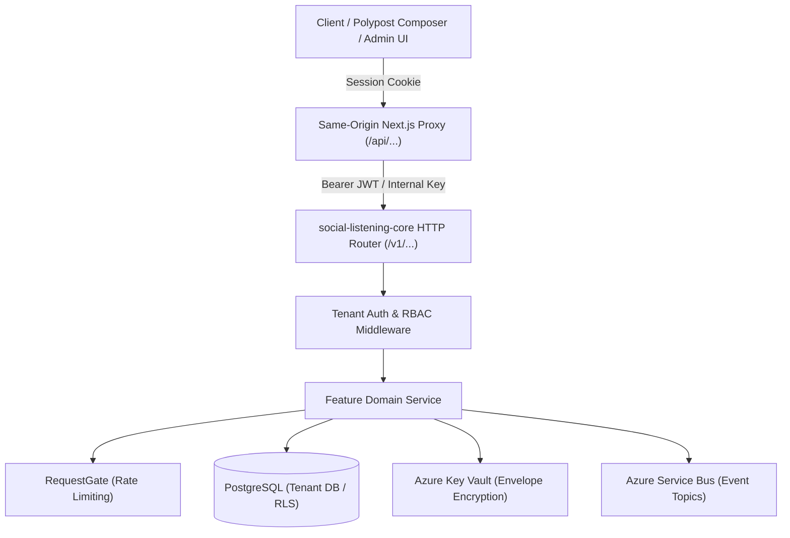

# Technical Design Specification (TDS) Template

> **Usage Guide:** Copy this template into `docs/project docs/Technical-Design/TDS-XXXX-<Feature-Slug>.md` when designing the technical implementation of any feature governed by the specification pyramid. 
> 
> **The Specification Path:**  
> $\text{ADR (Why \& What)} \longrightarrow \text{BRD (Business Rules)} \longrightarrow \text{FDD (Functional Workflows)} \longrightarrow \mathbf{\text{TDS (Technical Architecture)}} \longrightarrow \text{User Story (Acceptance Criteria)} \longrightarrow \text{Contract Test (Red/Green)}$.
>
> Every section below specifies the **minimum required technical details** that must be answered before writing code. Do not delete sections; if a category is not applicable to the feature, mark it `N/A — <explicit technical rationale why>`.

---

# TDS-XXXX: [Feature Name Technical Design Specification]

## 1. Document Control & Traceability Linkage

### 1.1 Document Metadata

| Field | Value |
|---|---|
| **Document ID** | `TDS-XXXX` |
| **Title** | [Full Technical Feature Title] |
| **Version** | `1.0.0` (SemVer) |
| **Date** | YYYY-MM-DD |
| **Author(s)** | [Author Name / Agent Persona] |
| **Technical Reviewer(s)** | Menno (Lead Solutions Architect) |
| **Target Repositories** | `social-listening-core` (backend) / `social-listening-admin` (frontend) / both |
| **Target Epic** | Epic [N]: [Epic Title] (`docs/user-stories/epic-[N]-*.md`) |
| **Status** | [Draft \| In Review \| Approved \| Implemented] |

### 1.2 Upstream Specification Traceability

| Artifact Tier | Document Reference | Governing Scope & Constraints |
|---|---|---|
| **Source ADR** | [ADR-XXXX](file:///d:/Source/socialengage/docs/adr/XXXX-*.md) | [Accepted architectural decision, key invariants, and superseded decisions] |
| **Business Requirements (BRD)** | [BRD-XXXX](file:///d:/Source/socialengage/docs/project%20docs/Business-Requirements/BRD-XXXX-*.md) | [Governing business rules (`BRU-xxx`), stakeholder metrics, permission boundaries] |
| **Functional Design (FDD)** | [FDD-XXXX](file:///d:/Source/socialengage/docs/project%20docs/Functional-Design/FDD-XXXX-*.md) | [Functional capabilities, trigger events, input/output contracts, user error flows] |
| **User Stories** | Story [X.Y] in `docs/user-stories/epic-[N]-*.md` | [Acceptance Criteria ($AC_0 \dots AC_n$) to be verified by contracts] |
| **Component Skill** | [SKILL.md](file:///d:/Source/socialengage/social-listening-core/.claude/skills/<slug>/SKILL.md) | [Target component skill file updated with invariants and call-site relationships] |

> [!IMPORTANT]
> **Hierarchy Rule:** $\text{ADR} > \text{BRD/FDD} > \text{TDS} > \text{User Story}$. If technical design investigation reveals a necessary conflict with an accepted ADR or BRD rule, work must stop immediately and an ADR Amendment or Sponsor review must be requested before proceeding.

---

## 2. System Context & Architectural Topology

### 2.1 Subsystem Placement & Component Topology

Describe where this feature lives inside the SocialEngage topology (Ingestion Pipeline, AI Enrichment, RAG Vector Search, Outbound Publishing, Tenant Administration, or Platform Operations).



### 2.2 Boundary Invariants & Coupling Rules

- **Multi-tenant Isolation:** How tenant boundary is preserved (`withTenant(tenantId, ...)` and PostgreSQL Row Level Security).
- **Frontend/Backend Separation:** The frontend UI must never bypass the Core REST API or access the database directly (ADR-0001 / ADR-0035).
- **Connector Neutrality:** No provider-specific branches in core ingestion or publishing engines (ADR-0048 / ADR-0027).

---

## 3. Data Architecture & Persistence Design

### 3.1 PostgreSQL DDL & Migration Specification

Specify exact table definitions, migrations, data types, column nullability, default values, and foreign keys.

```sql
-- Migration: migrations/00XX_create_<feature_table>.sql
-- Governed by: ADR-XXXX / TDS-XXXX

CREATE TABLE IF NOT EXISTS <feature_table> (
    id                  UUID            PRIMARY KEY DEFAULT gen_random_uuid(),
    tenant_id           UUID            NOT NULL,
    user_id             UUID            NULL,
    provider_id         TEXT            NOT NULL,
    status              TEXT            NOT NULL DEFAULT 'pending',
    payload             JSONB           NOT NULL DEFAULT '{}'::jsonb,
    created_at          TIMESTAMPTZ     NOT NULL DEFAULT now(),
    updated_at          TIMESTAMPTZ     NOT NULL DEFAULT now(),

    -- Domain check constraints
    CONSTRAINT <feature_table>_status_check 
        CHECK (status IN ('pending', 'processing', 'completed', 'failed')),
    CONSTRAINT <feature_table>_provider_check 
        CHECK (provider_id <> '')
);
```

### 3.2 Multi-Tenant Row Level Security (RLS) Policy

State the explicit RLS configuration and role grant statements.

```sql
-- Enforce RLS for tenant isolation
ALTER TABLE <feature_table> ENABLE ROW LEVEL SECURITY;
ALTER TABLE <feature_table> FORCE ROW LEVEL SECURITY;

DROP POLICY IF EXISTS tenant_isolation ON <feature_table>;
CREATE POLICY tenant_isolation ON <feature_table>
    FOR ALL
    USING (tenant_id = NULLIF(current_setting('app.tenant_id', true), '')::uuid)
    WITH CHECK (tenant_id = NULLIF(current_setting('app.tenant_id', true), '')::uuid);

-- Permissions
GRANT SELECT, INSERT, UPDATE, DELETE ON <feature_table> TO app_user;
GRANT SELECT ON <feature_table> TO platform_admin_role;
```

### 3.3 Indexing & Query Access Pattern Matrix

| Index Name | Table & Columns | Index Type | Query Access Pattern Supported | Performance Rationale |
|---|---|---|---|---|
| `idx_<table_name>_tenant_status` | `(tenant_id, status, created_at DESC)` | B-Tree | List filtered active items for tenant dashboard | Enables fast range scans without full table scans |
| `idx_<table_name>_payload_gin` | `(payload jsonb_path_ops)` | GIN | Ad-hoc attribute search within JSON metadata | Accelerated key/value matching |

### 3.4 Data Retention, Partitioning & Archival

- **Partitioning Strategy:** [None / Partitioned by month/day / Tenant-sharded]. If partitioned, state partition key.
- **Retention Tier:** [ADR-0017 / ADR-0019 compliant: Hot (Postgres) $\rightarrow$ Cool (Blob/Storage) $\rightarrow$ Purged].
- **Automated Cleanup Job:** [Cadence, query filter, batch ceiling (e.g. `DELETE ... LIMIT 500`)].

### 3.5 Caching & In-Memory State

| Cache Layer | Key Schema | Value Shape & Size | TTL | Invalidation Trigger |
|---|---|---|---|---|
| In-Memory / Redis | `<tenant_id>:<feature>:<id>` | JSON DTO ($< 5\text{ KB}$) | 3600s (1 hour) | Mutation on `PATCH /v1/...` |

---

## 4. API, Interface & Contract Design

### 4.1 Backend REST Endpoints (`social-listening-core`)

#### Endpoint 1: `[METHOD] /v1/[path]`
- **Handler Path:** `src/http/versions/v1/<feature>Router.ts`
- **Auth & Role Gate:** Authenticated session; Role: `[Platform-Admin | Tenant-Admin | Tenant-User]`
- **Feature Flag Gate:** `requireFeatureGate('<feature_flag_key>')` (if plan-tiered under ADR-0112)
- **Rate Limit Gate:** `RequestGate` key: `(tenantId, providerId, '<action>')`

**Request Headers & Parameters:**
```typescript
interface RequestHeaders {
  'authorization': string; // Bearer token
  'x-tenant-id'?: string;  // Explicit tenant header (if applicable)
}

interface QueryParameters {
  limit?: number;          // Default 20, max 100
  cursor?: string;         // ISO timestamp or opaque cursor (ADR-0011)
  status?: string;
}
```

**Request Body Schema:**
```typescript
export interface CreateFeatureRequest {
  providerId: string;
  name: string;
  options?: Record<string, unknown>;
}
```

**Response Schemas:**
- `200 OK` / `201 Created` / `202 Accepted`:
```typescript
export interface FeatureResponse {
  id: string;
  tenantId: string;
  status: 'pending' | 'processing' | 'completed' | 'failed';
  createdAt: string; // ISO 8601 UTC
}
```
- `400 Bad Request` / `422 Unprocessable Entity`:
```typescript
export interface ApiErrorResponse {
  error: {
    code: string;       // Machine-readable enum (e.g., 'INVALID_PAYLOAD', 'MISSING_ASSET_TARGET')
    message: string;    // Human-readable message
    details?: unknown;
  };
}
```

### 4.2 Frontend BFF Proxy & Client Contracts (`social-listening-admin`)

- **BFF Route Handler:** `src/app/api/<feature>/route.ts` (Same-Origin Proxy per ADR-0036).
- **Session Verification:** `getServerSession()` verifies active Entra session; injects backend bearer token.
- **Core API Client Method:** `src/lib/core-client.ts`:
```typescript
export async function getFeatureData(tenantId: string, id: string): Promise<FeatureResponse> {
  // Calls Core API with authorization headers and timeout
}
```

### 4.3 Event & Message Bus Contracts (`Azure Service Bus`)

If the feature emits or consumes asynchronous events:

- **Topic / Queue Name:** `social-listening-events`
- **Event Type (`eventType`):** `<domain>.<entity>.<action>` (e.g. `outbound.post.published`)
- **Schema Version (`schemaVersion`):** `1.0.0` (ADR-0012 / ADR-0013)
- **Application Properties (SQL Filter Keys):**
  - `tenant_id`: UUID (enables per-tenant subscription filtering)
  - `provider_id`: string
  - `event_type`: string
- **Event Payload Interface:**
```typescript
export interface FeatureDomainEvent {
  eventId: string;
  tenantId: string;
  eventType: string;
  schemaVersion: '1.0.0';
  timestamp: string;
  data: {
    entityId: string;
    status: string;
    metadata: Record<string, unknown>;
  };
}
```

---

## 5. Rate Limiting, Quota & Concurrency Gating (`RequestGate`)

### 5.1 Gate Key Architecture

Every external call, outbound dispatch, or intensive operation must declare its exact `RequestGate` key format:

| Operation Type | RequestGate Key Format | Window & Rate | Queue TTL | Max Queue Depth |
|---|---|---|---|---|
| Ingestion Poll | `${tenantId}:${providerId}` | Per-connector config | 6 hours | 1,000 requests |
| Outbound Post | `${tenantId}:${providerId}:outbound_post` | Provider post limits | 6 hours | 1,000 requests |
| Search / Research | `${tenantId}:${providerId}:search` | Per-search quota | 10 minutes | 100 requests |
| AI Enrichment | `${tenantId}:${providerId}:${modelId}` | TPM / RPM limits | 1 hour | 500 requests |

### 5.2 Concurrency & Availability Checking

- **Gate Method:** `acquireForOutboundPost(tenantId, connector)` or `acquire(key, config)`.
- **Pre-flight Quota Check:** `checkAvailability(key, config)` to raise early quota warnings without consuming rate-limit tokens.

---

## 6. Security, Identity & Credential Governance

### 6.1 Credential Ownership Tiering (ADR-0028 / ADR-0014 / ADR-0034)

Specify the required credential tier:
- [ ] **Tier 1 (Platform-held):** App registration credentials shared across all tenants (e.g. GNews API key, Azure AI Cognitive key).
- [ ] **Tier 2 (Tenant-wide):** Tenant-held credentials managed strictly by `Tenant-Admin` (`owner_type = 'tenant'`, `user_id = NULL`).
- [ ] **Tier 3 (User-bound):** Individual user OAuth tokens (`owner_type = 'user'`, `user_id = <caller_user_id>`). Personal posting & individual actions.

### 6.2 Key Vault & Envelope Encryption (AES-256-GCM)

- **Local DEK Generation:** Fresh AES-256 Data Encryption Key generated per secret.
- **Key Vault KEK Wrapping:** `wrapDek(keyVaultKeyId, dek)` wraps local DEK with Azure Key Vault HSM key.
- **Storage Invariant:** Plaintext secret and unwrapped DEK are never written to database, disk, or logs.

### 6.3 Authorization & RBAC Matrix

| Role | Permissions / Actions Allowed | Gating Mechanism |
|---|---|---|
| `Platform-Admin` | [System break-glass, tenant provisioning] | `requireRole('platform_admin')` / Database Role |
| `Tenant-Admin` | [Manage connectors, invite users, configure settings] | `requireRole('tenant_admin')` |
| `Tenant-User` | [Author posts, read feeds, create watchlists] | `requireRole('tenant_user')` |
| `Unauthenticated` | [Strictly rejected with 401] | `tenantAuthMiddleware` |

---

## 7. Error Handling, Resilience & Failure Classification

### 7.1 Error Classification Table (`ClassifiableError`)

Map all anticipated domain and platform failures to the standard `ErrorKind` taxonomy:

| Failure Mode | Raw Exception / Status | ErrorKind | Retryable? | Circuit Breaker Impact | HTTP Status |
|---|---|---|---|---|---|
| Invalid Token | HTTP 401 / OAuth expired | `credential_invalid` | No | Direct alert; do not auto-retry | 401 / 422 |
| Platform Rate Limit | HTTP 429 Too Many Requests | `rate_limit_exceeded` | Yes | Backoff to `reset_at` | 429 |
| Service Outage | HTTP 500 / 503 Service Unavailable | `network` | Yes | Exponential backoff (1s, 2s, 4s...) | 502 / 503 |
| Media Rejected | Unsupported format or size | `platform_asset_rejected` | No | Permanent failure on activity row | 422 |

### 7.2 Circuit Breaker & Health Transitions (ADR-0009 / ADR-0010 / ADR-0023 / ADR-0109)

- **Failure Threshold:** 5 consecutive failures triggers `failing` status (ADR-0109).
- **Auto-Disable:** After exceeding threshold with non-retryable errors, status flips to `disabled`.
- **Recovery / Half-Open Probe:** Single probe allowed after `PROBE_COOLDOWN_MS` (15 minutes).

---

## 8. Testing, Verification & Contract Gate Plan

### 8.1 Contract Test Specifications (RED $\rightarrow$ GREEN)

- **Contract Test Location:** `<repo>/contracts/epic-[N]/story-[X.Y].<slug>.contract.test.ts`
- **Isolation Harness:** Native PostgreSQL template cloning (`CREATE DATABASE test_run_<pid> TEMPLATE social_listening_template`) on port `5434`.

### 8.2 Acceptance Criteria to Test Verification Matrix

| AC # | Acceptance Criterion | Test Assertion Name | Verification Mechanism |
|---|---|---|---|
| $AC_1$ | [State criterion 1] | `AC1: verifies [behavior]` | [Real call-site assertion / DB query] |
| $AC_2$ | [State criterion 2] | `AC2: verifies [behavior]` | [Response code and payload schema assertion] |
| $AC_3$ | [State criterion 3] | `AC3: handles [error case]` | [Throws expected ClassifiableError] |

### 8.3 Real Call-Site Relationship Assertions

Identify the production integration point that must be exercised in the test (not just isolated helper functions):
- [ ] Live Express Route Handler (`supertest(app).post(...)`)
- [ ] Live Scheduler Tick (`runSchedulerTick(...)`)
- [ ] Live Event Subscription Dispatcher (`handleIncomingEvent(...)`)

---

## 9. Component Skill (`SKILL.md`) Documentation Updates

- **Target Skill File:** `<repo>/.claude/skills/<component-slug>/SKILL.md`
- **Governing Table Addition:** Add row for ADR-XXXX / Story X.Y.
- **Load-Bearing Constraints to Document:** State the non-obvious invariants introduced by this design.
- **Safe Extension Points:** Guide future engineers/agents on how to extend without regressions.

---

## 10. Observability, Metrics & Telemetry

### 10.1 Platform Metrics & Counter Dimensions (ADR-0114)

| Metric Name | Type | Granularity | Dimensions Recorded | PII / Tenant Content Stored? |
|---|---|---|---|---|
| `outbound.publish.count` | Counter | Hourly / Daily | `tenant_id`, `provider_id`, `status` | Strictly NO (tenant-confidential) |
| `connector.api.duration_ms` | Histogram | Hourly | `provider_id`, `endpoint` | Strictly NO |

### 10.2 Structured Logging Standards

- Must use structured JSON logger (`logger.info({ tenantId, providerId, action, durationMs })`).
- **Never Log:** Access tokens, refresh tokens, passwords, raw post bodies containing PII, or decryption keys.

---

## 11. Migration, Rollout & Feature Gating Strategy

### 11.1 Zero-Downtime Rollout Phases

1. **Phase 1: Additive DB Migration:** Deploy SQL migration adding nullable columns and tables. Running code continues to function unaffected.
2. **Phase 2: Core Backend Deployment:** Deploy backend services supporting new endpoints and contracts.
3. **Phase 3: Feature Gate Activation:** Enable feature flag in `tenant_settings.feature_gates` for beta tenants.
4. **Phase 4: Admin UI Frontend Deployment:** Ship user-facing screens and controls in `social-listening-admin`.
5. **Phase 5: General Availability & Cleanup:** Set flag default to `true`; remove legacy fallbacks in subsequent milestone.

### 11.2 Rollback Procedure

- Revert feature flag to `false` via `PATCH /v1/admin/tenants/:id/feature-gates`.
- If database rollback required, execute reverse migration script (`migrations/00XX_undo_*.sql`).

---

## 12. Technical Assumptions, Dependencies & Open Questions

### 12.1 Technical Assumptions & Upstream Dependencies

1. **Prerequisite Stories:** Story [A.B] must be committed and passing in `main`.
2. **Third-Party Service Dependencies:** [External API version, rate limits, availability SLAs].

### 12.2 Formal Technical Open Questions

Conform to the project's canonical Open Questions governance syntax:

- [ ] **[Q-XXXX-1]** [State unresolved technical question, options considered, and target resolution date/event]
- [ ] **[Q-XXXX-2]** [State unresolved technical question, options considered, and target resolution date/event]

---

## 13. Implementation Checklist & Sign-Off

- [ ] Specification pyramid cross-verified ($\text{ADR} \leftrightarrow \text{BRD} \leftrightarrow \text{FDD} \leftrightarrow \text{TDS} \leftrightarrow \text{Story}$)
- [ ] Database DDL and RLS policies verified against template database
- [ ] Contract test written and fails with missing implementation (RED phase)
- [ ] Component `SKILL.md` updated with load-bearing invariants
- [ ] Implementation completed (GREEN phase)
- [ ] Full accumulated contract suite and `npm run typecheck` passing
- [ ] Traceability records, Implementation Log, and progress dashboard synced
